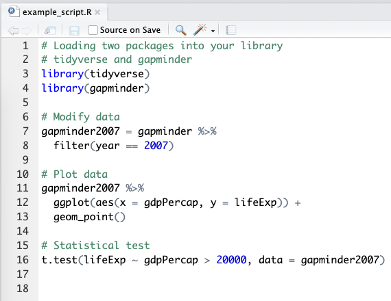
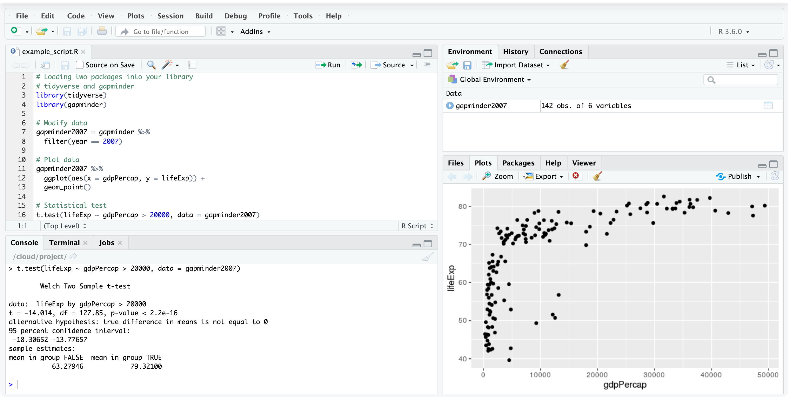

# (PART) Data wrangling and visualisation {-}

# Why we love R

We are extremely pleased that you have picked up this book to learn R for health data analysis.
Even if you're already familiar with the R language, you will probably find new approaches here as we make the most of the latest R packages and tools including some we've developed ourselves.
Those already familiar with R are encouraged to still skim through the first two chapters to familiarise with the style of R we recommend.

Here are the main reasons we love R are:

* R is versatile and powerful - use it for
    - graphics 
    - all the statistics you can dream of
    - machine learning, deep learning
    - automated reports 
    - websites 
    - books (yes, R can be used to make whole websites or books, this one is written in R)
* R scripts can be reused - gives you efficiency and reproducibility
* It is free to use by anyone, anywhere

{width=150px}

## Help, what's a script?

A script is a list of instructions. 
It is just a text file and no special software is required to view one.
An example R script is shown in Figure \@ref(fig:chap01-fig-rscript).

**Don't panic!**
The only thing you need to understand at this point is that what you're looking at is a list of instructions written in the R language.

You should also notice that some parts of the script looks like normal English.
These are the lines that start with a # and they are called "comments".
We can (and should) include these comments in everything we do.
These are notes of what we were doing, both for colleagues as well as our future self.

```{r chap01-fig-rscript, echo = FALSE, fig.cap="An example R script."}

```

Lines that do not start with a # are R code.
This is where the number crunching really happens.
We will cover the details of this R code in the next few chapters, the purpose of this chapter is to describe some of the terminology as well as the interface and tools we use.

For the impatient:

* We interface R using RStudio;
* We use the **tidyverse** packages that are a substantial extension to base R functionality (we repeat: extension, not replacement).

Even though R is a language, don't think that after reading this book you should be able to open a blank file and just start typing in R code like an evil computer genius from a movie. 
This is not what real world programming looks like.

Firstly, you should be copy-pasting and adapting existing R code examples - whether from this book or later from your own previous work.
Re-writing everything from scratch is not efficient.
Yes, you will understand and eventually remember a lot of it.
But to spend time memorising very specific things that can easily be looked up and copied is simply not necessary.

Secondly, R is an interactive language.
Meaning that we "run" R code line by line and get immediate feedback.
We would never write a whole script without trying everything out as we go along.

Thirdly, do not worry about making mistakes.
Celebrate them!
The whole point of R and reproducibility is that manipulations are not applied directly on a dataset but a copy of it. 
And that everything is in a script - so if we do make a wrong move (e.g. accidentally overwrite or remove some data) we can always reload it, rerun the steps that worked well and continue figuring our where we went wrong at the end.
And since all of these steps are written down in a script, R will redo everything with a single push of a button.
You do not have to redo anything, that's what R is for.

## What is RStudio?

RStudio is a free program that makes working with R easier.
An example screen shot of RStudio is shown in Figure \@ref(fig:chap01-fig-rstudio).
We have already introduced the top-left pane - the **Script**.

```{r chap01-fig-rstudio, echo = FALSE, fig.cap = "We use RStudio to work with R."}

```

Now, look at the little **Run** and **Source** buttons at the top-right corner of the script pane.
Clicking **Run** executes a line of R code. 
Clicking **Source** executes all lines of R code in the script (it is essentially 'Run all lines').
When you run R code, it gets sent to the **Console** which is the bottom-left panel.
This is where R really lives.

> Keyboard Shortcuts!  
> Run line: Ctrl+Enter  
> Run all lines (Source): Ctrl+Shift+Enter  
> (On a Mac, both Ctrl or Command work)

The Console is also where R speaks to us. 
When we're lucky, we get results in there - in this example the results of a *t*-test (last line of the script).
When we're less lucky, this where also where Errors or Warnings appear.

R Errors are a lot less scary than they seem!
Yes, if you're using using a regular computer program where all you do is click on some buttons, then getting a proper red error that stops everything is quite unusual.
But in programming, Errors are just a way for R to communicate with us.
We see Errors in our own work every single day, they are very normal and do not mean that everything is wrong or that you should give up. 
Try to reframe the word Error to mean "feedback", as in "Hello, this is R. I can't continue, this is the feedback I am giving you."
The most common Errors you'll see are along the lines of "Error: something not found". 
This almost always means there's a typo or you've misspelled something.
Furthermore, R is case sensitive so capitalisation matters (variable name `lifeExp` is not the same as `lifeexp`).

The Console can only print text, so any plots your create in your script appear in the **Plots** pane (bottom-right).

Similarly, datasets that you've loaded or created appear in the **Environment** tab.
When you click on a dataset, it pops up in a really nice and fast viewer. 
This means you can have a look and scroll through your rows and columns the same way you would in a spreadsheet.

## Getting started

To start using R, you should do these two things:

* Install R (from https://www.r-project.org/)
* Install RStudio Desktop (from https://www.rstudio.com/)

When you first open up RStudio, you'll also want to install some extra packages to extend the base R functionality.
You can do this in the **Packages** tab (next to the Plots tab in the bottom-right in Figure \@ref(fig:chap01-fig-rstudio)).

A lot of the functionality introduced in this book comes from the **tidyverse** family of R packages (http://tidyverse.org).
So when you go to **Packages**, click **Install**, type in **tidyverse**, a whole collection of useful and modern packages will be installed. 

Even though you've installed the **tidyverse** packages, you'll still need to tell R when you're about to use them.
We usually include `library(tidyverse)` at the top of every script:

```{r}
library(tidyverse)
```

We can see that it has loaded 8 packages (**ggplot2**, **tibble**, **tidyr**, **readr**, **purrr**, **dplyr**, **stringr**, **forcats**), the number behind a package name is its version.

The "Conflicts" message is expected and can safely be ignored.
^[It just means that when we use `filter` or `lag`, they will come from the `dplyr` package, rather than the `stats` package.
We've never needed to use `filter` and `lag` from `stats`, but if you do, then use the double colon, i.e., `stats::filter()` or `stats::lag()`, as just `filter()` will use the `dplyr` one.]

There are a few other R packages that we use and are not part of the tidyverse, but we will introduce them as we go along. 
If you are incredibly curious, take a peak at Chapter \@ref(install) for a full list.
