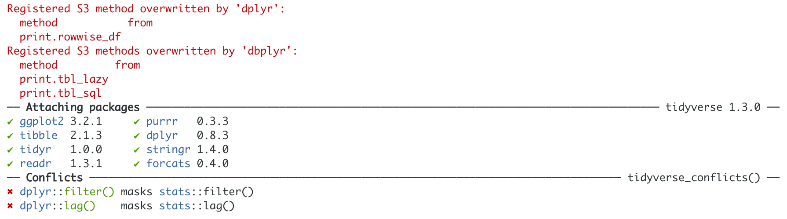

# (PART) Data wrangling and visualisation {-}

# Why we love R

Thank you for choosing this book on using R for health data analysis.
Even if you're already familiar with the R language, we hope you will find some new approaches here as we make the most of the latest R tools including some we've developed ourselves.
Those already familiar with R are encouraged to still skim through the first few chapters to familiarise yourself with the style of R we recommend.

R can be used for all the health data science applications we can think of. 
From bioinformatics and computational biology, to administrative data analysis and natural language processing, through internet-of-things and wearable data, to machine learning and artificial intelligence, and even public health and epidemiology. 
R has it all. 

Here are the main reasons we love R:

* R is versatile and powerful - use it for
    - graphics;
    - all the statistical tests you can dream of;
    - machine learning and deep learning;
    - automated reports;
    - websites;
    - and even books (yes, this book was written entirely in R).
* R scripts can be reused - gives you efficiency and reproducibility.
* It is free to use by anyone, anywhere.

<!-- {width=150px} -->

{width=150px}

## Help, what's a script? {#chap01-what-script}
\index{RStudio@\textbf{RStudio}!script}

A script is a list of instructions. 
It is just a text file and no special software is required to view one.
An example R script is shown in Figure \@ref(fig:chap01-fig-rscript).

**Don't panic!**
The only thing you need to understand at this point is that what you're looking at is a list of instructions written in the R language.

\index{comments}
You should also notice that some parts of the script look like normal English.
These are the lines that start with a # and they are called "comments".
We can (and should) include these comments in everything we do.
These are notes of what we were doing, both for colleagues as well as our future selves.

```{r chap01-fig-rscript, echo = FALSE, fig.cap="An example R script from RStudio."}
knitr::include_graphics("images/chapter01/example_script.png")
```

Lines that do not start with # are R code.
This is where the number crunching really happens.
We will cover the details of this R code in the next few chapters.
The purpose of this chapter is to describe some of the terminology as well as the interface and tools we use.

For the impatient:

* We interface R using RStudio
* We use the **tidyverse** packages that are a substantial extension to base R functionality (we repeat: extension, not replacement)

Even though R is a language, don't think that after reading this book you should be able to open a blank file and just start typing in R code like an evil computer genius from a movie. 
This is not what real world programming looks like.

Firstly, you should be copy-pasting and adapting existing R code examples - whether from this book, the internet, or later from your existing work.
Re-writing everything from scratch is not efficient.
Yes, you will understand and eventually remember a lot of it, but to spend time memorising specific functions that can easily be looked up and copied is simply not necessary.

Secondly, R is an interactive language.
Meaning that we "run" R code line by line and get immediate feedback.
We do not write a whole script without trying each part out as we go along.

Thirdly, do not worry about making mistakes.
Celebrate them!
The whole point of R and reproducibility is that manipulations are not applied directly on a dataset, but a copy of it. 
Everything is in a script, so you can't do anything wrong. 
If you make a mistake like accidentally overwriting your data, we can just reload it, rerun the steps that worked well and continue figuring our what went wrong at the end.
And since all of these steps are written down in a script, R will redo everything with a single push of a button.
You do not have to repeat a set of mouse clicks from dropdown menus as in other statistical packages, which quickly becomes a blessing. 

## What is RStudio?
\index{RStudio}

RStudio is a free program that makes working with R easier.
An example screenshot of RStudio is shown in Figure \@ref(fig:chap01-fig-rstudio).
We have already introduced what is in the top-left pane - the **Script**.

```{r chap01-fig-rstudio, echo = FALSE, fig.cap = "We use RStudio to work with R."}
knitr::include_graphics("images/chapter01/rstudio_interface.png")
```

Now, look at the little **Run** and **Source** buttons at the top-right corner of the script pane.
Clicking **Run** executes a line of R code. 
Clicking **Source** executes all lines of R code in the script (it is essentially 'Run all lines').
When you run R code, it gets sent to the **Console** which is the bottom-left panel.
This is where R really lives.

> Keyboard Shortcuts!  
> Run line: Control+Enter  
> Run all lines (Source): Control+Shift+Enter  
> (On a Mac, both Control or Command work)

The Console is where R speaks to us. 
When we're lucky, we get results in there - in this example the results of a *t*-test (last line of the script).
When we're less lucky, this where also where Errors or Warnings appear.

R Errors are a lot less scary than they seem!
Yes, if you're using using a regular computer program where all you do is click on some buttons, then getting a proper red error that stops everything is quite unusual.
But in programming, Errors are just a way for R to communicate with us.

We see Errors in our own work every single day, they are very normal and do not mean that everything is wrong or that you should give up. 
Try to re-frame the word Error to mean "feedback", as in "Hello, this is R. I can't continue, this is the feedback I am giving you."
The most common Errors you'll see are along the lines of "Error: something not found". 
This almost always means there's a typo or you've misspelled something.
Furthermore, R is case sensitive so capitalisation matters (variable name `lifeExp` is not the same as `lifeexp`).

The Console can only print text, so any plots your create in your script appear in the **Plots** pane (bottom-right).

Similarly, datasets that you've loaded or created appear in the **Environment** tab.
When you click on a dataset, it pops up in a nice viewer that is fast even when there is a lot of data. 
This means you can have a look and scroll through your rows and columns, the same way you would with a spreadsheet.

## Getting started
\index{installation@\textbf{installation}!tidyverse}
\index{installation@\textbf{installation}!packages}
\index{installation@\textbf{installation}!RStudio}

To start using R, you should do these two things:

* Install R (from https://www.r-project.org/)
* Install RStudio Desktop (from https://www.rstudio.com/)

When you first open up RStudio, you'll also want to install some extra packages to extend the base R functionality.
You can do this in the **Packages** tab (next to the Plots tab in the bottom-right in Figure \@ref(fig:chap01-fig-rstudio)).

A Package is just a collection of functions (commands) that are not included in the standard R installation, called base-R. 

A lot of the functionality introduced in this book comes from the `tidyverse` family of R packages (http://tidyverse.org).
So when you go to Packages, click **Install**, type in `tidyverse`, and a whole collection of useful and modern packages will be installed. 

Even though you've installed the `tidyverse` packages, you'll still need to tell R when you're about to use them.
We include `library(tidyverse)` at the top of every script we write:

```{r message=FALSE, warning=FALSE}
library(tidyverse)
```


```{r, echo = FALSE}

```

We can see that it has loaded 8 packages (`ggplot2`, `tibble`, `tidyr`, `readr`, `purrr`, `dplyr`, `stringr`, `forcats`), the number behind a package name is its version.

The "Conflicts" message is expected and can safely be ignored.
^[It just means that when we use `filter` or `lag`, they will come from the `dplyr` package, rather than the `stats` package.
We've never needed to use `filter` and `lag` from `stats`, but if you do, then use the double colon, i.e., `stats::filter()` or `stats::lag()`, as just `filter()` will use the `dplyr` one.]

There are a few other R packages that we use and are not part of the tidyverse, but we will introduce them as we go along. 
If you are incredibly curious, take a peak at Chapter \@ref(install) for a full list.

## Getting help
\index{help}
\index{errors}

The best way to troubleshoot R Errors is to copy-paste them into a search engine (e.g., Google).
Searching online is also a great way to learn how to do new specific things or to find code examples.
You should copy-paste solutions into your R script to then modify to match what you're trying to do.
We are constantly copying code from online forums and our own existing scripts.

However, there a many different ways to achieve the same thing in R.
Sometimes you'll search for help and come across R code that looks nothing like what you've seen in this book. 
The `tidyverse` packages are relatively new and use the pipe (` %>%`), something we'll come on to. 
But search engines will often prioritise older results that use a more traditional approach. 

So older solutions may come up at the top. 
Don't get discouraged if you see R code that looks completely different to what you were expecting.
Just keep scrolling down or clicking through different answers until you find something that looks a little bit more familiar.


If you're working offline, then RStudio's built in **Help** tab is useful.
To use the Help tab, click your cursor on something in your code (e.g. `read_csv()`) and press F1.
This will show you the definition and some examples. 
F1 can be hard to find on some keyboards, an alternative is to type, e.g. `?read_csv`. 
This will also open the Help tab for this function.

However, the Help tab is only useful if you already know what you are looking for but can't remember exactly how it works. 
For finding help on things you have not used before, it is best to Google it. 

R has about 2 million users so someone somewhere has probably had the same question or problem.

RStudio also has a Help drop-down menu at the very top (same row where you find "File", "Edit, ...). 
The most notable thing in the Help drop-down menu are the Cheatsheets. 
These tightly packed two-pagers include many of the most useful functions from `tidyverse` packages. 
They are not particularly easy to learn from, but invaluable as an *aide-mémoire*. 


## Notation throughout this book

When mentioned in the text, the names of R packages, functions, and variable names are printed with mono-spaced font, e.g `tidyverse`, `mean()`, `lifeExp`.

Otherwise, R code lives in the grey areas known as 'code chunks'.
Lines of R *output* start with a double ## - this will be the numbers or text that R gives us after executing code. 
R also adds a counter at the beginning of every new line, look at the numbers in the square brackets [] below:

```{r}
# colon between two numbers creates a sequence
1001:1017
```

Remember, lines of R code that start with # are called comments.
We already introduced comments as notes about the R code earlier in this chapter (Section \@ref(chap01-what-script) "Help, what's a script?"), however, there is a second use case for comments. 

When you make R code a comment, by adding a # in front of it, it gets 'commented out'.
For example, let's say your R script does two things, prints number from 1 to 4, and then numbers from 1001 to 1004:

```{r}
# Let's print small numbers:
1:4

# Now we're printing bigger numbers:
1001:1004
```


If you decide to 'comment out' the printing of big numbers, the code will look like this:

```{r, results='hold'}
# Let's print small numbers:
1:4

# Now we're printing bigger numbers:
# 1001:1004
```

You may even want to add another real comment to explain why the latter was commented out:

```{r}
# Now commented out as not required any more
# Now we're printing bigger numbers:
# 1001:1004
```

You could of course delete the line altogether, but commenting out is useful as you might want include the lines later by removing the # from the beginning of the line.

> Keyboard Shortcut for commenting out/commenting in multiple lines at a time:
> Control+Shift+C  
> (On a Mac, both Control or Command work)

Finally, we use **bold** to highlight a new term we are introducing for the first time. The same term will not be bold in future occurrences.
**Bold** is also used when you need to click on a specific menu item, e.g. click **Install**. 
