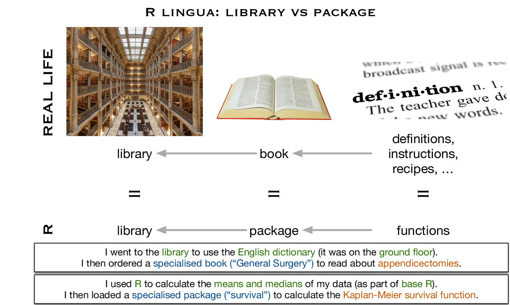

# (PART) Data wrangling and visualisation {-}

# Why we love R

We are extremely pleased that you have picked up this book to learn R for health data analysis.
Even if you're already somewhat familiar with the R language, know that we are using the latest R packages and tools that extend R to be more user friendly than ever (including some we've developed ourselves).
Those already familiar with R should at least least flick through the first two chapters to familiarise with the style of R used in this book.

The main reasons we love R are:

* R is versatile and powerful - use it for
    - graphics 
    - all the statistics you can dream of
    - automated reports 
    - websites 
    - books (yes, R can be used to make whole websites or books, this one is written in R)
* R scripts can be reused - gives you efficiency and reproducibility
* It is free to use by anyone, anywhere

{width=150px}

## Help, what's a script

A script is a list of instructions. 
It is a basically just a text file and no special software is required to view one.
An example R script is shown in Figure \@ref(fig:chap01-fig-rscript).

**Do not panic!**
The only thing you need to understand at this point is that what you're looking at is a list of instructions written in the R language.

You should also notice that some parts of the script looks like normal English.
These are the lines that start with a # and they are called "comments".
We can (and should) include these so called comments in everything we do.
These are notes of what we were doing both for colleagues as well as our future self.

```{r chap01-fig-rscript, echo = FALSE, fig.cap="An example R script."}
knitr::include_graphics("images/chapter01/example_script.png")
```

Lines that do not start with a # are R code.
This is where the number crunching really happens.
We will cover the details of this R code in the next few chapters, the purpose of this chapter is to describe some of the terminology as well as the interface and tools we use.

For the impatient:

* We interface R using RStudio
* We use the tidyverse packages that are a substantial extension (we repeat, extension, not replacement) to base R functionality

Even though R is a language, don't think that after reading this book you should be able to create a new blank file and just start typing in R code like an evil computer genius from a move. This is not how programming works.

Firstly, you should be copy-pasting and adapting existing R code examples - whether from this book or your own previous scripts. Re-writing everything from scratch is simply not efficient. Yes, you will understand and eventually remember a lot of it. But to spend time memorising very specific things that can easily be looked up/copied is simply not necessary.

Secondly, R is an interactive language.
Meaning that we "run" R code line by line and can get immediate feedback.
We would never write a whole script without trying everything out as we go along.

Thirdly, do not worry about making mistakes. In programming, we get infinite re-do's.
The whole point of R and reproducibility is that manipulations are not applied directly on a dataset but a copy of it. 
And that everything is in a script - so if we do make a wrong move (i.e. accidentally overwrite or remove some data) we can always reload it, rerun the steps that worked well and continue figuring our where we went wrong at the end.
And since all of these steps are written down in a script, R will redo everything with a single push of a button (Run All).
You do not have to redo anything, that's what R is for.

## What is RStudio

```{r, out.width = "10cm", echo = FALSE}
knitr::include_graphics("images/rstudio_vs_r.png")
```

The part of RStudio that you are working in/editing is the script (top left in the standard layoout but feel free to rearrange the sections as you like).

We have already explained what a script is, so we will now explain what some of the other panels do.

* Console (this is where R talks to us)
* what is the Environment tab,
* where do your plots appear.

**Data**

Load the example dataset which is already saved as an R-Data file (recognisable by the file extension .rda or .RData):

```{r, message=F}
library(ggplot2)

source("1_source_theme.R")

load("global_burden_disease_long.rda")

```

After loading the datasets, investigate your Environment tab (top-right). You will see two things listed: `mydata` and `mydata2013`, which is a subset of mydata.


Click on the name `mydata` and it will pop up next to where your script is.
Clicking on the blue button is not as useful (in this session), but it doesn't do any harm either.
Try it.

```{r}

mydata %>% #press Control-Shift-M to insert this symbol (pipe)
  ggplot(aes(x      = year,
             y      = deaths_millions,
             fill   = cause,
             colour = cause)) +
  geom_col()


```


`ggplot()` stands for **grammar of graphics plot** - a user friendly yet flexible alternative to `plot()`.

`aes()` stands for **aesthetics** - things we can see.

`geom_()` stands for **geometric**.

### Exercise

Plot the number of deaths in Developed and Developing countries for the year 2013:

```{r, echo = FALSE}

mydata2013 %>% 
  ggplot(aes(x      = location,
             y      = deaths_millions,
             fill   = cause,
             colour = cause)) +
  geom_col()

```


## Tidyverse packages: ggplot2, dplyr, tidyr, etc.

Most of the functions introduced in this book come from the tidyverse family (http://tidyverse.org/), rather than Base R. Including `library(tidyverse)` in your script loads a list of packages: ggplot2, dplyr, tidry, forcats, etc.


```{r, echo = FALSE}

```

```{r , message=F}

library(tidyverse)

```


## Getting started


