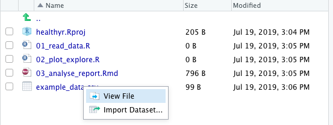
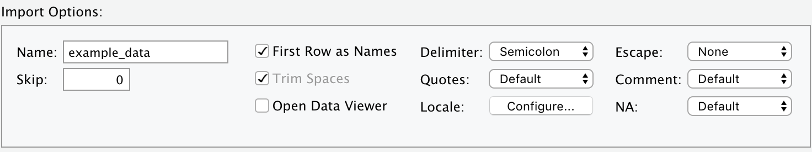
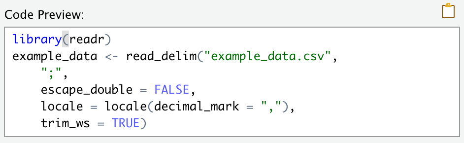

# R Basics

```{r setup, include = FALSE}
knitr::opts_chunk$set(fig.align = 'center')
library(tidyverse)
library(kableExtra)

```

Throughout this book, we are conscious of the balance between theory and practice.
Some learners may prefer to see all definitions laid out before being shown an example of a new concept.
Others, would rather see practical examples and explanations build up to a full understanding over time.
We strike a balance between these two approaches that works well for most people in the audience.

Sometimes we will show you an example that may use words that have not been formally introduced yet.
For example, we start this chapter with data import -  R is nothing without data.

In so doing, we have to use the word "argument", which is only defined two sections later (in \@ref(chap02-objects-functions) "Objects and functions").
A few similar instances arise around statistical concepts in the Data Analysis part of the book. 
You will come across sentences along the lines of "this concept will become clearer in the next section".
Trust us and just go with it.

The aim of this chapter is to familiarise you with how R works. 
We will read in data and start basic manipulations. You may want to skip parts of this chapter if you already:

* have found the Import Dataset interface;
* know what numbers, characters, factors, and dates look like in R;
* are familiar with the terminology around objects, functions, arguments;
* have used the pipe: `%>%`;
* know how to filter data with operators such as `==, >, <, &, |`;
* know how to handle missing data (NAs), and why they can behave weirdly in a filter;
* have used `mutate()`, `c()`, `paste()`, `if_else()`, and the joins.


## Reading data into R{#chap02-h2-reading-data-into-r}
\index{import data}
\index{reading data}

Data usually comes in the form of a table, such as a spreadsheet or database. 
In the world of the `tidyverse`, a table read into R gets called a `tibble`. 

A common format in which to receive data is CSV (comma separated values). 
CSV is an uncomplicated spreadsheet with no formatting.
It is just a single table with rows and columns (no worksheets or formulas).
Furthermore, you don't need special software to quickly view a CSV file - a text editor will do, and that includes RStudio.

For example, look at "example_data.csv" in the healthyr project's folder in Figure \@ref(fig:chap2-fig-examplecsv) (this is the Files pane at the bottom-right corner of your RStudio).

```{r chap2-fig-examplecsv, echo = FALSE, fig.cap="View or import a data file.", out.width="70%"}

```

Clicking on a data file gives us two options: "View File" or "Import Dataset". 

We will show you how to use the Import Dataset interface in a bit, but for standard CSV files, we don't usually bother with the Import interface and just type in (or copy from a previous script):
\index{functions@\textbf{functions}!read\_csv}

```{r, eval=FALSE}
library(tidyverse)
example_data <- read_csv("example_data.csv")
View(example_data)
```

There are a couple of things to say about the first R code chunk of this book. 
First and foremost: do not panic.
Yes, if you're used to interacting with data by double-clicking on a spreadsheet that just opens up, then the above R code does seem a bit involved.

However, running the example above also has an immediate visual effect.
As soon as you click Run (or press Ctrl+Enter/Command+Enter), the dataset immediately shows up in your Environment and opens in a Viewer. 
You can have a look and scroll through the same way you would in Excel or similar.

So what's actually going on in the R code above:

* We load the `tidyverse` packages (as covered in the first chapter of this book).
* We have a CSV file called "example_data.csv" and are using `read_csv()` to read it into R.
* We are using the assignment arrow `<-` to save it into our Environment using the same name: `example_data`.
* The `View(example_data)` line makes it pop up for us to view it. Alternatively, click on `example_data` in the Environment to achieve the exact same thing.

More about the assignment arrow (`<-`) and naming things in R are covered later in this chapter. 
Do not worry if everything is not crystal clear just now. 

### Import Dataset interface

In the `read_csv()` example above, we read in a file that was in a specific (but common) format. 

However, if your file uses semicolons instead of commas, or commas instead of dots, or a special number for missing values (e.g., 99), or anything else weird or complicated, then we need a different approach. 

RStudio's **Import Dataset** interface (Figure \@ref(fig:chap2-fig-examplecsv)) can handle all of these and more.

```{r chap02-fig-import-tool, echo = FALSE, fig.cap="Import: Some of the special settings your data file might have.", out.width="70%"}

```

```{r chap02-fig-import-code, echo = FALSE, fig.cap="After using the Import Dataset window, copy-paste the resulting code into your script.", out.width="50%"}

```

After selecting the specific options to import a particular file, a friendly preview window will show whether R properly understands the format of the your data.

DO NOT BE tempted to press the **Import** button.

Yes, this will read in your dataset once, but means you have to reselect the options every time you come back to RStudio.
Instead, copy-paste the code (e.g., Figure \@ref(fig:chap02-fig-import-code)) into your R script.
This way you can use it over and over again. 

Ensuring that all steps of an analysis are recorded in scripts makes your workflow reproducible by your future self, colleagues, supervisors, and extraterrestrials. 

>The `Import Dataset` button can also help you to read in Excel, SPSS, Stata, or SAS files (instead of `read_csv()`, it will give you `read_excel()`, `read_sav()`, `read_stata()`, or `read_sas()`).

If you've used R before or are using older scripts passed by colleagues, you might see `read.csv()` rather than `read_csv()`. 
Note the dot rather than the underscore. 

In short, `read_csv()` is faster and more predictable and in all new scripts is to be recommended. 

In existing scripts that work and are tested, we do not recommend that you start replacing `read.csv()` with `read_csv()`. 
For instance, `read_csv()` handles categorical variables differently ^[It does not silently convert strings to factors, i.e., it defaults to `stringsAsFactors = FALSE`. For those not familiar with the terminology here - don't worry, we will cover this in just a few sections.]. 
An R script written using the `read.csv()` might not work as expected any more if just replaced with `read_csv()`.

> Do not start updating and possibly breaking existing R scripts by replacing base R functions with the tidyverse equivalents we show here. Do use the modern functions in any new code you write. 


### Reading in the Global Burden of Disease example dataset

In the next few chapters of this book, we will be using the Global Burden of Disease datasets. 
The Global Burden of Disease Study (GBD) is the most comprehensive worldwide observational epidemiological study to date. 
It describes mortality and morbidity from major diseases, injuries and risk factors to health at global, national and regional levels.
^[Global Burden of Disease Collaborative Network.
Global Burden of Disease Study 2017 (GBD 2017) Results.
Seattle, United States: Institute for Health Metrics and Evaluation (IHME), 2018.
Available from http://ghdx.healthdata.org/gbd-results-tool.]

GBD data are publicly available from the website. 
Table \@ref(tab:chap2-tab-gbd) and Figure \@ref(fig:chap2-fig-gbd) show a high level version of the project data with just 3 variables: `cause`, `year`, `deaths_millions` (number of people who die of each cause every year). 
Later, we will be using a longer dataset with different subgroups and we will show you how to summarise comprehensive datasets yourself.

```{r, message=F}
library(tidyverse)
gbd_short <- read_csv("data/global_burden_disease_cause-year.csv")
```

```{r chap2-tab-gbd, echo = FALSE}
gbd_short %>% 
  knitr::kable(booktabs = TRUE,
               linesep = c("", "", "\\addlinespace"),
               align = c("l", "c", "r", "l", "c", "r"),
               caption = "Deaths per year from three broad disease categories (short version of the Global Burden of Disease example dataset).") %>% 
  kableExtra::kable_styling(latex_options = c("hold_position"),
                            font_size = 10)
```

```{r chap2-fig-gbd, echo = FALSE, fig.cap="Line and bar charts: Cause of death by year (GBD). Data in (B) are the same as (A) but stacked to show the total of all causes.", fig.height=6, fig.width=6}
source("1_source_theme.R")
library(patchwork)
p1 <- gbd_short %>% 
  ggplot(aes(x = year, y = deaths_millions, fill = cause, colour = cause)) +
  geom_point() +
  geom_line() +
  labs(x = "Year", y = "Deaths per year (millions)") +
  facet_wrap(~cause) +
  theme(legend.position = "none") +
  scale_y_continuous(limits = c(0, 50), expand = c(0, 0)) +
  geom_text(aes(label = (deaths_millions %>% round(0))), colour = "#525252", size = 3, vjust = -0.5)

p2 <- gbd_short %>% 
  ggplot(aes(x = year, y = deaths_millions, fill = cause, colour = cause)) +
  geom_col() +
  labs(x = "Year", y = "Deaths per year (millions)") +
  theme(legend.position = "top") +
  scale_y_continuous(limits = c(0, 60), expand = c(0, 0)) +
  # another hardcoded tibble name here:
  scale_x_continuous(breaks = unique(gbd_short$year)) +
  guides(fill=guide_legend(ncol=3))

p1/p2 + plot_annotation(tag_levels = "A")
```

## Variable types and why we care
\index{variable types@\textbf{variable types}}
\index{continuous data@\textbf{continuous data}!variable types}
\index{categorical data@\textbf{categorical data}!variable types}
\index{date-time@\textbf{date-time}}

There are three broad types of data: 

* continuous (numbers), in R: numeric, double, or integer; 
* categorical, in R: character, factor, or logical (TRUE/FALSE); 
* date/time, in R: POSIXct date-time^[Portable Operating System Interface (POSIX) is a set of computing standards. There's nothing more to understand about this other than when R starts shouting "POSIXct this or POSIXlt that" at you, check your date and time variables].

Values within a column all have to be the same type, but a tibble can of course hold columns of different types.
Generally, R is good at figuring out what type of data you have (in programming, this 'figuring out' is called 'parsing').

For example, when reading in data, it will tell you what was assumed for each column:

```{r}
library(tidyverse)
typesdata <- read_csv("data/typesdata.csv")

typesdata
```

This means that a lot of the time you do not have to worry about those little `<chr>` vs `<dbl>` vs `<S3: POSIXct>` labels.
But in cases of irregular or faulty input data, or when doing a lot of calculations and modifications to your data, we need to be aware of these different types to be able to find and fix mistakes.

For example, consider a similar file as above but with some data entry issues introduced:

```{r}
typesdata_faulty <- read_csv("data/typesdata_faulty.csv")

typesdata_faulty
```

Notice that R parsed both the measurement and date variables as characters. 
Measurement has been parsed as a character because of a data entry issue: the person taking the measurement couldn't decide which value to note down (maybe the scale was shifting between the two values) so they included both values and text "or" in the cell. 

A numeric variable will also get parsed as a categorical variable if it contains certain typos, e.g., if entered as "3..7" instead of "3.7". 

The reason R didn't automatically make sense of the date column is that it couldn't tell which is the date and which is the year: __02-Jan-17__ could stand for _02-Jan-2017_ as well as _2002-Jan-17_.

Therefore, while a lot of the time you do not have to worry about variable types and can just get on with your analysis, it is important to understand what the different types are to be ready to deal with them when issues arise. 

>Since health datasets are generally full of categorical data, it is crucial to understand the difference between characters and factors (both are types of categorical variables in R with pros and cons).

So here we go.

### Numeric variables (continuous)
\index{variable types@\textbf{variable types}!continuous / numeric}

Number are straightforward to handle and don't usually cause trouble. 
R usually refers to numbers as `numeric` (or `num`), but sometimes it really gets its nerd on and calls numbers `integer` or `double`.
Integers are numbers without decimal places (e.g., `1, 2, 3`), whereas `double` stands for "Double-precision floating-point" format (e.g., `1.234, 5.67890`).

It doesn't usually matter whether R is classifying your continuous data `numeric/num/double/int`, but it is good to be aware of these different terms as you will see them in R messages.

> FRIENDLY WARNING: What's about to follow is a bit dry. Furthermore, it is not essential for complete beginners - you might want to continue reading from __Characters variables__.
Before you leave, take a mental note that sometimes numbers in R have more decimal places than it seems, and that can cause funny behaviour when using the double equals operator (`==`).

Something to note about numbers is that R doesn't usually print more than 6 decimal places, but that doesn't mean they don't exist.
For example, from the `typedata` tibble, we're taking the `measurement` column and sending it to the `mean()` function. 
R then calculates the mean and tells us what it is with 6 decimal places:


```{r}
typesdata$measurement %>% mean()
```
Let' save that in a new object:

```{r}
measurement_mean <- typesdata$measurement %>% mean()
```

But when using the double equals operator to check if this is equivalent to a fixed value (you might do this when comparing to a threshold, or even another mean value), R returns `FALSE`:


```{r}
measurement_mean == 3.333333
```

Now this doesn't seem right, does it - R clearly told us just above that the mean of this variable is 3.333333 (reminder: the actual values in the measurement column are `r typesdata$measurement`). 
The reason the above statement is `FALSE` is because `measurement_mean` is quietly holding more than 6 decimal places.
 
One way to go about this is to round the mean to a reasonable number of decimal places:

\index{functions@\textbf{functions}!round}

```{r}
round(measurement_mean, 3)
```

The second argument of `round()` specifies the number of decimal places you want your number(s) rounded to.
So when using `round()` in the equality statement like this, we get the expected `TRUE`:

```{r}
round(measurement_mean, 3) == 3.333
```

Which is usually fine, especially if you've finished applying calculations on that number. 
But when you indent to use it if further calculations, then rounding should be left to the very end - to minimise rounding errors. 
This is where the `near()` function comes in handy:

\index{functions@\textbf{functions}!near}

```{r}
library(tidyverse)
near(measurement_mean, 3.333, 0.001)
```

The first two arguments for `near()` are the numbers you are comparing, the third argument is the precision you are interested in. So if the numbers are equal within that precision, it returns `TRUE`. 
This means you get the expected result without having to round the numbers off.

### Character variables
\index{variable types@\textbf{variable types}!character}

<!-- May need reference to factors / strings / regex etc. -->

**Characters** (sometimes referred to as *strings* or *character strings*) in R are letters, words, or even whole sentences (an example of this may be free text comments). 
Characters are displayed in-between `""` (or `''`).

A useful function for quickly investigating categorical variables is the `count()` function:

```{r}
library(tidyverse)
typesdata %>%
  count(group)
```

`count()` can accept multiple variables and will count up the number of observations in each subgroup, e.g., `mydata %>% count(var1, var2)`.

Another helpful option to count is `sort = TRUE`, which will order the result putting the highest count (`n`) to the top.

```{r}
typesdata %>%
  count(group, sort = TRUE)
```

`count()`with the `sort = TRUE` option is also useful for identifying duplicate IDs or misspellings in your data.
With this example `tibble` (`typesdata`) that only has three rows, it is easy to see that the `id` column is a unique identifier whereas the `group` column is a categorical variable.

You can check everything by just eyeballing the `tibble` using the built in Viewer tab (click on the dataset in the Environment tab).

But for larger datasets, you need to know how to check and then clean data programmatically - you can't go through thousands of values checking they are all as intended without unexpected duplicates or typos.

For most variables (categorical or numeric), we recommend always plotting your data before starting analysis.
But to check for duplicates in a unique identifier, use `count()` with `sort = TRUE`:

```{r}
# all ids are unique:
typesdata %>% 
  count(id, sort = TRUE)

# we add in a duplicate row where id = ID3,
# then count again:
typesdata %>% 
  add_row(id = "ID3") %>% 
  count(id, sort = TRUE)

```


### Factor variables (categorical)
\index{variable types@\textbf{variable types}!categorical / factor}

**Factors** are fussy characters. 
Factors are fussy because they include something called **levels**. 
Levels are all the unique values a factor variable could take, e.g. like when we looked at `typesdata %>% count(group)`.
Using factors rather than just characters can be useful because:

* The values factor levels can take is fixed. 
For example, once you tell R that `typesdata$group` is a factor with two levels: Control and Treatment, combining it with other datasets with different spellings or abbreviations for the same variable will generate a warning.
This can be helpful but can also be a nuisance when you really do want to add in another level to a `factor` variable.
* Levels have an order. 
When running statistical tests on grouped data (e.g., Control vs Treatment, Adult vs Child) and the variable is just a character, not a factor, R will use the alphabetically first as the reference (comparison) level. 
Converting a character column into a factor column enables us to define and change the order of its levels. 
Level order affects many things including regression results and plots: by default, categorical variables are ordered alphabetically. 
If we want a different order in say a bar plot, we need to convert to a factor and reorder before we plot it. 
The plot will then order the groups correctly. 

So overall, since health data is often categorical and has a reference (comparison) level, then factors are an essential way to work with these data in R.
Nevertheless, the fussiness of factors can sometimes be unhelpful or even frustrating.
A lot more about factor handling will be covered later (\@ref(chap08-h1)).

### Date/time variables
\index{variable types@\textbf{variable types}!date-time}
\index{functions@\textbf{functions}!dmy}
\index{functions@\textbf{functions}!ymd}

R is good for working with dates. 
For example, it can calculate the number of days/weeks/months between two dates, or it can be used to find a future date is (e.g., "what's the date exactly 60 days from now?").
It also knows about time zones and is happy to parse dates in pretty much any format - as long as you tell R how your date is formatted (e.g., day before month, month name abbreviated, year in 2 or 4 digits, etc.).
Since R displays dates and times between quotes (""), they look similar to characters. 
However, it is important to know whether R has understood which of your columns contain date/time information, as which are just normal characters.

```{r, message = FALSE}
library(lubridate) # lubridate makes working with dates easier
current_datetime <- Sys.time()
current_datetime

my_datetime <- "2020-12-01 12:00"
my_datetime
```

When printed, the two objects - `current_datetime` and `my_datetime` seem to have the a similar format.
But if we try to calculate the difference between these two dates, we get an error:

```{r, error = TRUE}
my_datetime - current_datetime
```

That's because when we assigned a value to `my_datetime`, R assumed the simpler type for it - so a character.
We can check what the type of an object or variable is using the `class()` function:

```{r}
current_datetime %>% class()
my_datetime %>% class()
```

So we need to tell R that `my_datetime` does indeed include date/time information so we can then use it in calculations:

```{r}
my_datetime_converted <- ymd_hm(my_datetime)
my_datetime_converted
```

Calculating the difference will now work:
```{r}
my_datetime_converted - current_datetime
```

Since R knows this is a difference between two date/time objects, it prints the in a nicely readable way.
Furthermore, the result has its own type, it is a "difftime".
```{r}
my_datesdiff <- my_datetime_converted - current_datetime
my_datesdiff %>% class()
```

This is useful if we want to apply this time difference on another date, e.g.:

```{r}
ymd_hm("2021-01-02 12:00") + my_datesdiff
```

But if we want to use the number of days in a normal calculation, e.g., what if a measurement increased by 560 arbitrary units during this time period.
We might want to calculate the increase per day like this:

```{r, error = TRUE}
560/my_datesdiff
```

Doesn't work, does it.
We need to convert `my_datesdiff` (which is a difftime value) into a numeric value by using the `as.numeric()` function:

```{r}
560/as.numeric(my_datesdiff)
```

The lubridate package comes with several convenient functions for parsing dates, e.g., `ymd()`, `mdy()`, `ymd_hm()`, etc. - for a full list see [lubridate.tidyverse.org](lubridate.tidyverse.org).

However, if your date/time variable comes in an extra special format, then use the `parse_date_time()` function where the second argument specifies the format using these helpers:

| Notation | Meaning             | Example |
|----------|---------            |---------|
|`%d`        |day as number        |01-31|
|`%m`        |month as number      |01-12|
|`%B`        |month name           |January-December|
|`%b`        |abbreviated month    |Jan-Dec|
|`%Y`        |4-digit year         |2019|
|`%y`        |2-digit year         |19|
|`%H`        |hours                |12|
|`%M`        |minutes              |01|
|`%A`        |weekday              |Monday-Sunday|
|`%a`        |abbreviated weekday  |Mon-Sun|


For example:

```{r}
parse_date_time("12:34 07/Jan'20", "%H:%M %d/%b'%y")
```

Furthermore, the same date/time helpers can be used to rearrange your date and time for printing:

```{r}
Sys.time()
Sys.time() %>% format("%H:%M on %B-%d (%Y)")
```
You can even add plain text into the `format()` function, R will know to put the right date/time values where the `%` are:

```{r}
Sys.time() %>% format("Happy days, the current time is %H:%M %B-%d (%Y)!")
```

## Objects and functions {#chap02-objects-functions}
\index{objects}
\index{functions@\textbf{functions}}

There are two fundamental concepts in statistical programming that are important to get straight - objects and functions. 
The most common object you will be working with is a dataset.
This is usually something with rows and columns much like the example in Table \@ref(tab:chap2-tab-examp1).

```{r chap2-tab-examp1, echo = FALSE}

# TIBBLE hardcoded again in the next chunk, make sure to change in both places!
mydata <- tibble(
  id   = 1:4,
  sex  = c("Male", "Female", "Female", "Male"),
  var1 = c(4, 1, 2, 3),
  var2 = c(NA, 4, 5, NA),
  var3 = c(2, 1, NA, NA)
)

mydata %>% 
  knitr::kable(booktabs = TRUE, caption = "Example of data in columns and rows, including missing values denoted `NA` (Not applicable/Not available). Once this dataset has been read into R it gets called dataframe/tibble.") %>% 
  kableExtra::kable_styling(font_size=8)
```

\FloatBarrier

To get the small and made-up "dataset" into your Environment, copy and run this code^[`c()` stands for combine and will be introduced in more detail later in this chapter]:

```{r}
library(tidyverse)
mydata <- tibble(
  id   = 1:4,
  sex  = c("Male", "Female", "Female", "Male"),
  var1 = c(4, 1, 2, 3),
  var2 = c(NA, 4, 5, NA),
  var3 = c(2, 1, NA, NA)
)
```

Data can live anywhere: on paper, in a spreadsheet, in an SQL database, or in your R Environment. 
We usually initiate and interface with R using RStudio, but everything we talk about here (objects, functions, environment) also work when RStudio is not available, but R is.
This can be the case if you are working on a supercomputer that can only serve the R Console and not RStudio. 

### `data frame/tibble` 

So, regularly shaped data in rows and columns is called a table when it lives outside R, but once you read/import it into R it gets called a tibble.
If you've used R before, or get given a piece of code that uses `read.csv()` instead of `read_csv()`, you'll have come across the term `data frame`.^[`read.csv()` comes with base R, whereas `read_csv()` comes from the `readr` package within the `tidyverse`. We recommend using `read_csv()`.]

A `tibble` is the modern/`tidyverse` version of a data frame in R. 
In most cases, `data frames` and `tibbles` work interchangeably, but `tibbles` often work better. 
Another great alternative to base R `data frames` are `data tables`. 
In this book, and for most of our day-to-day work these days, we will use `tibbles`.

### Naming objects

When you read data into R, you want it to show up in the Environment tab. 
Everything in your Environment needs to have a name. 
You will likely have many objects such as tibbles going on at the same time. 
Note that tibble is what the thing is, rather than its name. 
This is the 'class' of an object. 

To keep our code examples easy to follow, we call our example tibble `mydata`. 
In a real analysis, you should give your tibbles meaningful names, e.g., `patient_data`, `lab_results`, `annual_totals`, etc.
Object names can't have spaces in it, which is why we use the underscore (`_`) to separate words.
Object names can include numbers, but they can't start with a number: so `labdata2019` works, `2019labdata` does not.

So, the tibble named `mydata` is example of an object that can be in the Environment of your R Session:

```{r}
mydata
```

### Function and its arguments

A function is a procedure which takes some information (input), does something to it, and passes back the modified information (output).

A simple function that can be applied to numeric data is `mean()`. 

R functions always have round brackets after their name. 
This is for two reasons. 
First, it easily differentiates them as functions - you will get used to reading them like this.  
Second, and more importantly, we can put **arguments** in these brackets. 

Arguments can also be thought of as input.
In data analysis, the most common input for a function is data. 
For instance, we need to give `mean()` some data to average over. 
It does not make sense (nor will it work) to feed `mean()` the whole tibble with multiple columns, including patient IDs and a categorical variable (`sex`). 

To quickly extract a single column, we use the `$` symbol like this:
\index{symbols@\textbf{symbols}!select column \texttt{\$}}

```{r}
mydata$var1
```

You can ignore the `## [1]` at the beginning of the extracted values - this is something that becomes more useful when printing multiple lines of data as the number in the square brackets keeps count on how many values we are seeing.

We can then use `mydata$var1` as the first argument of `mean()` by putting it inside its brackets:

```{r}
mean(mydata$var1)
```

which tells us that the mean of `var1` (`r mydata$var1`) is `r mean(mydata$var1)`.
In this example, `mydata$var1` is the first and only argument to `mean()`.

But what happens if we try to calculate the average value of `var2` (`r mydata$var2`) (remember, `NA` stands for Not Applicable/Available and is used to denote missing data):

```{r}
mean(mydata$var2)
```

So why does `mean(mydata$var2)` return `NA` ("not available") rather than the mean of the values included in this column?
That is because the column includes missing values (`NAs`), and R does not want to average over `NAs` implicitly.
It is being cautious - what if you didn't know there were missing values for some patients?
If you wanted to compare the means of `var1` and `var2` without any further filtering, you would be comparing samples of different sizes. 

We might expect to see an `NA` if we tried to, for example, calculate the average of `sex`. 
And this is indeed the case:

```{r, error=TRUE}
mean(mydata$sex)
```

Furthermore, R also gives us a pretty clear Warning suggesting it can't compute the mean of an argument that is not numeric or logical. 
The sentence actually reads pretty fun, as if R was saying it was not logical to calculate the mean of something that is not numeric. 

But, R is actually saying that it is happy to calculate the mean of two types of variables: numerics or logicals, but what you have passed is neither.

If you decide to ignore the NAs and want to calculate the mean anyway, you can do so by adding this argument to `mean()`:

\index{missing values remove \texttt{na.rm}}

```{r}
mean(mydata$var2, na.rm = TRUE)
```

Adding `na.rm = TRUE` tells R that you are happy for it to calculate the mean of any existing values (but to remove - `rm` - the `NA` values).
This 'removal' excludes the NAs from the calculation, it does not affect the actual tibble (`mydata`) holding the dataset. 

R is case sensitive, so `na.rm`, not `NA.rm` etc. 
There is, however, no need to memorize how the arguments of functions are exactly spelled - this is what the Help tab is for (press `F1` when the cursor is on the name of the function). 
Help pages are built into R, so an internet connection is not required for this.

> Make sure to separate multiple arguments with commas or R will give you an error of `Error: unexpected symbol`.

Finally, some functions do not need any arguments to work.
A good example is the `Sys.time()` which returns the current time and date. 
This is useful when using R to generate and update reports automatically.
Including this means you can always be clear on when the results were last updated.

\index{functions@\textbf{functions}!Sys.time}
\index{system time}

```{r}
Sys.time()
```


### Working with objects

To save an object in our Environment we use the assignment arrow:
\index{symbols@\textbf{symbols}!assignment \texttt{<-}}

```{r}
a <- 103

```

This reads: the object `a` is assigned value `r a`.
`<-` is called "the arrow assignment operator", or "assignment arrow" for short.

> Keyboard shortcuts to insert `<-`:  
> Windows: Alt-  
> macOS: Option-  

You know that the assignment worked when it shows up in the Environment tab.
If we now run `a` just on its own, it gets printed back to us:

```{r}
a
```

Similarly, if we run a function without assignment to an object, it gets printed but not saved in your Environment:
\index{functions@\textbf{functions}!seq}

```{r}
seq(15, 30)
```

`seq()` is a function that creates a sequence of numbers (+1 by default) between the two arguments you pass to it in its brackets. 
We can assign the result of `seq(15, 30)` into an object, let's call it `example_sequence`:

```{r}
example_sequence <- seq(15, 30)
```

Doing this creates `example_sequence` in our Environment, but it does not print it.
To get it printed, run it on a separate line like this:

```{r}
example_sequence
```


> If you save the results of an R function in an object, it does not get printed. 
> If you run a function without the assignment (`<-`), its results get printed, but not saved as an object.


Finally, R doesn't mind overwriting an existing object, for example: 

```{r}
example_sequence <- example_sequence/2

example_sequence
```

Notice how we then include the variable on a new line to get it printed as well as overwritten.

### `<-` and `=`

Note that many people use `=` instead of `<-`.
Both `<-` and `=` can save what is on the right into an object with named on the left. 
Although `<-` and `=` are interchangeable when saving an object into your Environment, they are not interchangeable when used as function argument.
For example, remember how we used the `na.rm` argument in the `mean()` function, and the result got printed immediately.
If we want to save the result into an object, we'll do this, where `mean_result` could be any name you choose:

```{r}
mean_result <- mean(mydata$var2, na.rm = TRUE)
```


Note how the example above uses both operators: the assignment arrow for saving the result to the Environment, the `=` equals operator for setting an argument in the `mean()` function (`na.rm = TRUE`).

### Recap: object, function, input, argument

* To summarise, objects and functions work hand in hand. 
Objects are both an input as well as the output of a function (what the function returns). 

* When passing data to a function, is is usually the first argument, with further arguments used to specify behaviour. 

* When we say "the function returns", we are referring to its output (or an Error if it's one of those days).

* The returned object can be different to its input object.
In our `mean()` examples above, the input object was a column (`mydata$var1`: `r mydata$var1`), whereas the output was a single value: `r mean(mydata$var1)`.

* If you've written a line of code that doesn't include the assignment arrow (`<-`), its results would get printed.
If you use the assignment arrow, an object holding the results will get saved into the Environment.

## Pipe - `%>%` 
\index{symbols@\textbf{symbols}!pipe \texttt{\%>\%}}
\index{pipe@\textbf{pipe}}

The pipe - denoted `%>%` - is probably the oddest looking thing you'll see in this book. 
But please bear with, it is not as scary as it looks! 
Furthermore, it is super useful. 
We use the pipe to send objects into functions.

In the above examples, we calculated the mean of column `var1` from `mydata` by `mean(mydata$var1)`. With the pipe, we can rewrite this as:

```{r}
library(tidyverse)
mydata$var1 %>% mean()
```

Which reads: "Working with `mydata`, we select a single column called `var1` (with the `$`) **and then** calculate the `mean()`." 
The pipe becomes especially useful once the analysis includes multiple steps applied one after another. 
A good way to read and think of the pipe is "and then".


<!-- I think it would help to have an example of a longer piped function vs nested brackets to show why the pipe is needed. It may not be that clear to beginners what this is all about.   -->


This piping business is not standard R functionality and before using it in a script, you need to tell R this is what you will be doing.
The pipe comes from the `magrittr` package (Figure \@ref(fig:chap2-fig-pipe)), but loading the `tidyverse` will also load the pipe.
So `library(tidyverse)` initialises everything you need.

>To insert a pipe `%>%`, use the keyboard shortcut `Ctrl+Shift+M`.

With or without the pipe, the general rule "if the result gets printed it doesn't get saved" still applies. 
To save the result of the function into a new object (so it shows up in the Environment), you need to add the name of the new object with the assignment arrow (`<-`):

```{r}
mean_result <- mydata$var1 %>% mean()
```

```{r chap2-fig-pipe, out.width="70%", echo = FALSE, fig.cap="This is not a pipe. René Magritte inspired artwork, by Stefan Milton Bache."}
knitr::include_graphics("images/chapter02/magrittr.png")
```

### Using . to direct the pipe

By default, the pipe sends data to the beginning of the function brackets (as most of the functions we use expect data as the first argument). 
So `mydata %>% lm(dependent~explanatory)` is equivalent to `lm(mydata, dependent~explanatory)`. 
`lm()` - linear model - will be introduced in detail in Chapter \@ref(chap07-h1). 

However, the `lm()` function does not expect data as its first argument. 
`lm()` wants us to specify the variables first (`dependent~explanatory`), and then wants the tibble these columns are in.
So we have to use the `.` to tell the pipe to send the data to the second argument of `lm()`, not the first, e.g.,

```{r, eval = FALSE}
mydata %>% 
  lm(var1~var2, data = .)
```


## Operators for filtering data
\index{operators}
\index{functions@\textbf{functions}!filter}
\index{symbols@\textbf{symbols}!less than \texttt{<}}
\index{symbols@\textbf{symbols}!greater than \texttt{>}}
\index{symbols@\textbf{symbols}!less or equal \texttt{<=}}
\index{symbols@\textbf{symbols}!greater or equal \texttt{>=}}
\index{symbols@\textbf{symbols}!equal \texttt{=}}
\index{symbols@\textbf{symbols}!not \texttt{"!}}
\index{symbols@\textbf{symbols}!AND \texttt{\&}}
\index{symbols@\textbf{symbols}!OR \texttt{"|}}

Operators are symbols that tell R how to handle different pieces of data or objects.
We have already introduced three: `$` (selects a column), `<-` (assigns values or results to a variable), and the pipe - `%>%` (sends data into a function).

Other common operators are the ones we use for filtering data - these are arithmetic comparison and logical operators.
This may be for creating subgroups, or for excluding outliers or incomplete cases.

The comparison operators that work with numeric data are relatively straightforward: `>, <, >=, <=`.
The first two check whether your values are greater or less than another value, the last two check for "greater than or equal to" and "less than or equal to. 
These operators are most commonly spotted inside the `filter()` function:

```{r}
gbd_short %>% 
  filter(year < 1995)
```

Here we send the data (`gbd_short`) to the `filter()` and ask it to retain all years that are less than 1995.
The resulting tibble only includes the year 1990.
Now, if we use the `<=` (less than or equal to) operator, both 1990 and 1995 pass the filter:

```{r}
gbd_short %>% 
  filter(year <= 1995)
```

Furthermore, the values either side of the operator could both be variables, e.g., `mydata %>% filter(var2 > var1)`.

To filter for values that are equal to something, we use the `==` operator. 

```{r}
gbd_short %>% 
  filter(year == 1995)
```

This reads, take the GBD dataset, send if to the filter and keep rows where year is equal to 1995.

Accidentally using the single equals `=` when double equals is necessary `==` is a common mistake and still happens to the best of us. 
It happens so often that the error the `filter()` function gives when using the wrong one also reminds us what the correct one was:

```{r, error = TRUE}
gbd_short %>% 
  filter(year = 1995)
```

> The answer to 'do you need ==?" is almost always, "Yes R, I do, thank you".

But that's just because `filter()` is a clever cookie and is used to this common mistake. 
There are other useful functions we use these operators in, but they don't always know to tell us that we've just confused `=` for `==`.
So if you get an error when checking for an equality between variables, always check your `==` operators first.

R also has two operators for combining multiple comparisons: & and |, which stand for AND and OR, respectively.
For example, we can filter to only keep the earliest and latest years in the dataset:

```{r}
gbd_short %>% 
  filter(year == 1995 | year == 2017)
```

This reads: take the GBD dataset, send it to the filter and keep rows where year is equal to 1995 OR year is equal to 2017.

Using specific values like we've done here (1995/2017) is called "hard-coding", which is fine if we know for sure that we will not want to use the same script on an updated dataset. 
But a cleverer way of achieving the same thing is to use the `min()` and `max()` functions:

```{r}
gbd_short %>% 
  filter(year == max(year) | year == min(year))
```

```{r chap2-tab-filtering-operators, echo = FALSE}
Operators = c("==", "!=" ,"<", ">", "<=", ">=", "&", "|")
Meaning   = c("Equal to", "Not equal to", "Less than", "Greater than", "Less than or equal to", "Greater then or equal to", "AND", "OR")

testdata = tibble(Operators, Meaning)

testdata %>% 
    knitr::kable(booktabs = TRUE,
               linesep = c(rep("", 6), "\\addlinespace"),
               align = c("l", "c", "r"),
               caption = "Filtering operators.") %>% 
  kableExtra::kable_styling(font_size=8)
```

### Worked examples

Filter the dataset to only include the year 2000. 
Save this in a new variable using the assignment operator.

```{r, echo = TRUE}
mydata_year2000 <- gbd_short %>% 
  filter(year == 2000)
```

Let's practice combining multiple selections together.

Reminder: '|' means OR and '&' means AND.

From `gbd_short`, select the lines where year is either 1990 or 2017 and cause is "Communicable diseases":

```{r}
new_data_selection <- gbd_short %>% 
  filter((year == 1990 | year == 2013) & cause == "Communicable diseases")

# Or we can get rid of the extra brackets around the years
# by moving cause into a new filter on a new line:

new_data_selection <- gbd_short %>% 
  filter(year == 1990 | year == 2013) %>% 
  filter(cause == "Communicable diseases")
```

\index{symbols@\textbf{symbols}!comment \texttt{\#}}
The hash symbol (`#`) is used to add free text comments to R code. 
R will not try to run these lines, they will be ignored.
Comments are an essential part of any programming code and these are "Dear Diary" notes to your future self.

## The combine function: `c()`
\index{functions@\textbf{functions}!c() combine}

The combine function as it's name implies is used to combine several values. 
It is especially useful when used with the `%in%` operator to filter for multiple values. 
Remember how the gbd_short cause column had three different causes in it:

```{r}
gbd_short$cause %>% unique()
```

Say we wanted to filter for communicable and non-communicable diseases.
^[In this example, it would just be easier to used the "not equal" operator, filter(cause `!=` "Injuries"), but imagine your column had more than just three different values in it.] We could use the OR operator `|` like this:

```{r}
gbd_short %>% 
  # also filtering for a single year to keep the result concise
  filter(year == 1990) %>% 
  filter(cause == "Communicable diseases" | cause == "Non-communicable diseases")
```

But that means we have to type in `cause` twice (and more if we had other values we wanted to include).
This is where the `%in%` operator together with the `c()` function come in handy:

```{r}
gbd_short %>% 
  filter(year == 1990) %>% 
  filter(cause %in% c("Communicable diseases", "Non-communicable diseases"))
```

## Missing values (NAs) and filters
\index{missing values}

Filtering for missing values (NAs) needs special attention and care.
Remember the small example tibble from Table \@ref(tab:chap2-tab-examp1) - it has some NAs in columns `var2` and `var3`:

```{r}
mydata
```

If we now want to filter for rows where `var2` is missing, `filter(var2 == NA)` is not the way to do it, it will not work. 

Since R is a programming language, it can be a bit stubborn with things like these.
When you ask R to do a comparison using `==` (or `<`, `>`, etc.) it expects a value on each side, but NA is not a value, it is the lack thereof.
The way to filter for missing values is using the `is.na()` function:

```{r}
mydata %>% 
  filter(is.na(var2))
```
We send `mydata` to the filter and keep rows where `var2` is `NA`. 
Note the double brackets at the end: that's because the inner one belongs to `is.na()`, and the outer one to `filter()`.
Missing out a closing bracket is also a common source of errors, and still happens to the best of us.

If filtering for rows where `var2` is not missing, we do this^[In this simple example, `mydata %>% filter(! is.na(var2))` could be replace by a shorthand: `mydata %>% drop_na(var2)`, but it is important to understand how the ! and `is.na()` work as there will be more complex situations where using these is necessary.]

```{r}
mydata %>% 
  filter(!is.na(var2))
```

In R, the exclamation mark (!) means "not".

Sometimes you want to drop a specific value (e.g., an outlier) from the dataset like this. 
The small example tibble `mydata` has 4 rows, with the values for `var2` as follows: `r mydata$var2`. 
We can exclude the row where `var2` is equal to 5 by using the "not equals" (`!=`)^[ `filter(var2 != 5) is equivalent to filter(! var2 == 5)`]:

```{r}
mydata %>% 
  filter(var2 != 5)
```

However, you'll see that by doing this, R drops the rows where `var2` is NA as well, as it can't be sure these missing values were not equal to 5.

If you want to keep the missing values, you need to make use of the OR (`|`) operator and the `is.na()` function:

```{r}
mydata %>% 
  filter(var2 != 5 | is.na(var2))
```

Being caught out by missing values, either in filters or other functions is common (remember `mydata$var2 %>% mean()` returns NA unless you add `na.rm = TRUE`). 
This is also why we insist that you always plot your data first - outliers will reveal themselves and NA values usually become obvious too.

Another thing we do to stay safe around filters and missing values is saving the results and making sure the number of rows still add up:

```{r}
subset1 <- mydata %>% 
  filter(var2 == 5)

subset2 <- mydata %>% 
  filter(! var2 == 5)

subset1
subset2
```

If the numbers are small, you can now quickly look at RStudio's Environment tab and figure out whether the number of observations (rows) in `subset1` and `subset2` add up to the whole dataset (`mydata`). Or use the `nrow()` function to as R to tell you what the number of rows is in each dataset:

Rows in `mydata`:

```{r}
nrow(mydata)
```

Rows in `subset1`:
```{r}
nrow(subset1)
```

Rows in `subset2`:
```{r}
nrow(subset2)
```

Asking R whether adding these two up equals the original size:

```{r}
nrow(subset1) + nrow(subset2) == nrow(mydata)
```

As expected, this returns FALSE - because we didn't add special handling for missing values.
Let's create a third subset only including rows where `var3` is NA:

Rows in `subset2`:
```{r}
subset3 <- mydata %>% 
  filter(is.na(var2))

nrow(subset1) + nrow(subset2) + nrow(subset3) == nrow(mydata)
```


## Creating new columns - `mutate()`
\index{column, create}
\index{functions@\textbf{functions}!mutate}

The function for adding new columns (or making changes to existing ones) to a tibble is called `mutate()`.
As a reminder, this is what `typesdata` looked like:

```{r}
typesdata
```

Let's say we decide to divide the column `measurement` by 2.
A quick way to see these values would be to pull them out using the `$` operator and then divide by 2:

```{r}
typesdata$measurement
typesdata$measurement/2
```

But this becomes cumbersome once we want to combine multiple variables from the same tibble in a calculation. So the `mutate()` is the way to go here:

```{r}
typesdata %>% 
  mutate(measurement/2)
```

Notice how the `mutate()` above returns the whole tibble with a new column called `measurement/2`. 
This is quite nice of `mutate()`, but it would be best to give columns names that don't include characters other than underscores (`_`) or dots (`.`). 
So let's assign a more standard name for this new column:

```{r}
typesdata %>% 
  mutate(measurement_half = measurement/2)
```

Better. 
You can see that R likes the name we gave it a bit better as it's now removed the back-ticks from around it.
Overall, back-ticks can be used to call out non-standard column names, so if you are forced to read in data with, e.g., spaces in column names, then the back-ticks enable calling column names that would otherwise error^[If this happens to you a lot, then check out `library(janitor)` and its function `clean_names()` for automatically tidying non-standard column names.]:

```{r, eval = FALSE}
mydata$`Nasty column name`

# or

mydata %>% 
  select(`Nasty column name`)
```

But as usual, if it gets printed, it doesn't get saved.
We have two options - we can either overwrite the `typesdata` tibble (by changing the first line to `typesdata = typesdata %>% `), or we can create a new one (that appears in your Environment):

```{r}
typesdata_modified <- typesdata %>% 
  mutate(measurement_half = measurement/2)

typesdata_modified
```

The `mutate()` function can also be used to create a new column with a single constant value, which in return can be used to calculate a difference for each of the existing dates:

```{r}
library(lubridate)
typesdata %>% 
  mutate(reference_date   = ymd_hm("2020-01-01 12:00"),
         dates_difference = reference_date - date) %>% 
  select(date, reference_date, dates_difference)
```

(We are then using the `select()` function to only choose the three relevant columns.)

Finally, the mutate function can be used to create a new column with a summarised value in it, e.g., the mean of another column:

```{r}
typesdata %>% 
  mutate(mean_measurement = mean(measurement))
```

Which in return can be useful for calculating a standardized measurement (i.e. relative to the mean):

```{r}
typesdata %>% 
  mutate(mean_measurement     = mean(measurement)) %>% 
  mutate(measurement_relative = measurement/mean_measurement) %>% 
  select(matches("measurement"))
```

### Worked example/exercise

Round the difference to 0 decimal places using the `round()` function inside a `mutate()`. 
Then add a clever `matches("date")` inside the `select()` function to choose all matching columns.

\index{functions@\textbf{functions}!matches}

Solution:
```{r}
typesdata %>% 
  mutate(reference_date   = ymd_hm("2020-01-01 12:00"),
         dates_difference = reference_date - date) %>% 
  mutate(dates_difference = round(dates_difference)) %>% 
  select(matches("date"))
```

You can shorten this by adding the `round()` function directly around the subtraction, so the third line becomes `dates_difference = round(reference_date - date)) %>%`. 
But sometimes writing calculations out longer than the absolute minimum can make them easier to understand when you return to an old script months later.

Furthermore, we didn't have to save the `reference_date` as a new column, the calculation could have used the value directly: `mutate(dates_difference = ymd_hm("2020-01-01 12:00") - date) %>%`.
But again, defining it makes it clearer for future self what was done. And it makes `reference_date` available for reuse in more complicated calculations within the tibble.

## Conditional calculations - `if_else()`
And finally, we combine the filtering operators (`==`, `>`, `<`, etc) with the `if_else()` function to create new columns based on a condition.

```{r}
typesdata %>% 
  mutate(above_threshold = if_else(measurement > 3,
                                   "Above three",
                                   "Below three"))
```

We are sending `typesdata` into a `mutate()` function, we are creating a new column called `above_threshold` based on whether `measurement` is greater or less than 3. 
The first argument to `if_else()` is a condition (in this case that measurement is greater than 3), the second argument is the value if the condition is TRUE, and the third argument is the value if the condition is FALSE.

It reads, "if this condition is met, return this, else return that". 

Look at each line in the tibble above and convince yourself that the `threshold` variable worked as expected. 
Then look at the two closing brackets - `))` - at the end and convince yourself that they are both needed. 

>`if_else()` and missing values tip: for rows with missing values (NAs), the condition returns neither TRUE nor FALSE, it returns NA. 
And that might be fine, but if you want to assign a specific group/label for missing values in the new variable, you can add a fourth argument to `if_else()`, e.g., `if_else(measurement > 3, "Above three", "Below three", "Value missing")`.

## Create labels - `paste()`
\index{functions@\textbf{functions}!paste}
\index{paste}
\index{labels}

The `paste()` function is used to add characters together.
It also works with numbers and dates which will automatically be converted to characters before being pasted together into a single label.
See this example where we use all variables from `typesdata` to create a new column called `plot_label` (we `select()` for printing space):

```{r}
typesdata %>% 
  mutate(plot_label = paste(id,
                            "was last measured at", date,
                            ", and the value was",    measurement)) %>% 
  select(plot_label)
```

The paste is also useful when pieces of information are stored in different columns. 
For example, consider this made-up tibble:

```{r}
pastedata <- tibble(year  = c(2007, 2008, 2009),
                   month = c("Jan", "Feb", "March"),
                   day   = c(1, 2, 3))

pastedata
```

We can use `paste()` to combine these into a single column:

```{r}
pastedata %>% 
  mutate(date = paste(day, month, year, sep = "-"))
```

By default, `paste()` adds a space between the each value, but we can use the `sep = ` argument to specify a different separator. 
Sometimes it is useful to use `paste0()` which does not add anything between the values (no space, no dash, etc.).

We can now tell R that the date column should be parsed as such:

```{r}
library(lubridate)

pastedata %>% 
  mutate(date = paste(day, month, year, sep = "-")) %>% 
  mutate(date = dmy(date))
```

## Joining multiple datasets
\index{functions@\textbf{functions}!join}
\index{functions@\textbf{functions}!full\_join}
\index{functions@\textbf{functions}!inner\_join}
\index{functions@\textbf{functions}!left\_join}
\index{functions@\textbf{functions}!right\_join}
\index{join datasets@\textbf{join datasets}}

It is common for different pieces of information to be kept in different files or tables and you often want to combine them together.
For example, consider you have some demographic information (`id`, `sex`, `age`) in one file:

```{r, message = FALSE}
library(tidyverse)
patientdata <- read_csv("data/patient_data.csv")
patientdata
```

And another one with some lab results (`id`, `measurement`):

```{r, message = FALSE}
labsdata <- read_csv("data/labs_data.csv")
labsdata
```

Notice how these datasets are not only different size (`r nrow(patientdata)` rows in `patientdata`, `r nrow(labsdata)` rows in `labsdata`), but include information on different patients: `patiendata` has ids `r patientdata$id`, `labsdata` has ids `r labsdata$id`.

A comprehensive way to join these is to use `full_join()` retaining all information from both tibbles (and matching up rows by shared columns, in this case `id`):

```{r}
full_join(patientdata, labsdata)
```

However, if we are only interested in matching information, we use the inner join:

```{r}
inner_join(patientdata, labsdata)
```

And finally, if we want to retain all information from one tibble, we use either the `left_join()` or the `right_join()`:


```{r}
left_join(patientdata, labsdata)
right_join(patientdata, labsdata)
```

### Further notes about joins

* The joins functions (`full_join()`, `inner_join()`, `left_join()`, `right_join()`) will automatically look for matching column names. You can use the `by = ` argument to specify by hand. This is especially useful if the columns are named differently in the datasets, e.g., `left_join(data1, data2, by = c("id" = "patient_id"))`.

* The rows do not have to be ordered, the joins match on values within the rows, not the order of the rows within the tibble.

* Joins are used to combine different variables (columns) into a single tibble. __If you are getting more data of the same variables, use `bind_rows()` instead__:

```{r, message = FALSE}
patientdata_new <- read_csv("data/patient_data_updated.csv")
patientdata_new
bind_rows(patientdata, patientdata_new)
```

Finally, it is important to understand how joins behave if there are multiple matches within the tibbles. For example, if patient id 4 had a second measurement as well:

```{r}
labsdata_updated <- labsdata %>% 
  add_row(id = 5, measurement = 2.49)
labsdata_updated
```

When we now do a `left_join()` with our main `tibble` - `patientdata`:

```{r}
left_join(patientdata, labsdata_updated)
```

We get 7 rows, instead of 6 - as patient id 5 now appears twice with the two different measurements. So it is important to keep either know your datasets well or keep an eye on the number of rows to make sure any increases/decreases in the tibble sizes are as you expect them to be.


