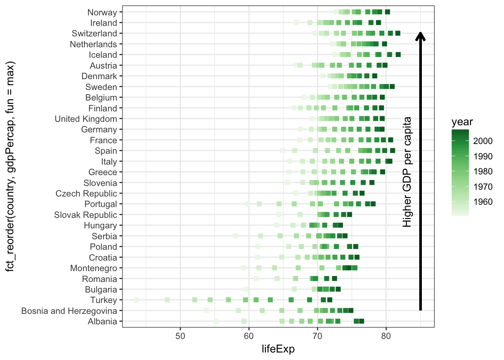

# Different types of plots
\index{plots@\textbf{plots}}
\index{plots@\textbf{plots}!ggplot2}

> What I cannot create, I do not understand.  
> Richard Feynman

There are a few different plotting packages in R, but the most elegant and versatile one is **ggplot2**^[The name of the package is **ggplot2**, but the function is called `ggplot()`. For everything you've ever wanted to know about the grammar of graphics in R, see @wickham2016.].
**gg** stands for **g**rammar of **g**raphics which means that we can make a plot by describing it one component at a time. 
In other words, we build a plot by adding layers to it.

This does not have to be many layers, the simplest `ggplot()` consists of just two components:

* the variables to be plotted;
* a geometrical object (e.g., point, line, bar, box, etc.).

`ggplot()` calls geometrical objects **geoms**.

Figure \@ref(fig:chap04-fig-steps) shows some example steps for building a scatter plot, including changing its appearance ('theme') and faceting - an efficient way of creating separate plots for subgroups.


\index{functions@\textbf{functions}!ggplot}

<div class="figure">

<p class="caption">(\#fig:chap04-fig-steps)Example steps for building and modiyfing a ggplot. (1) initialising the canvas and defining variables, (2) adding points, (3) colouring points by continent, (4) changing point type, (5) faceting, (6) changing the plot theme and the scale of the x variable.</p>
</div>

\clearpage 

## Get the data {#chap04-data}

We are using the gapminder dataset (https://www.gapminder.org/data) that has been put into an R package by @bryan2017 so we can load it with `library(gapminder)`.


```r
library(tidyverse)
library(gapminder)

glimpse(gapminder)
```

```
## Observations: 1,704
## Variables: 6
## $ country   <fct> Afghanistan, Afghanistan, Afghanistan, Afghanistan, Afghani…
## $ continent <fct> Asia, Asia, Asia, Asia, Asia, Asia, Asia, Asia, Asia, Asia,…
## $ year      <int> 1952, 1957, 1962, 1967, 1972, 1977, 1982, 1987, 1992, 1997,…
## $ lifeExp   <dbl> 28.801, 30.332, 31.997, 34.020, 36.088, 38.438, 39.854, 40.…
## $ pop       <int> 8425333, 9240934, 10267083, 11537966, 13079460, 14880372, 1…
## $ gdpPercap <dbl> 779.4453, 820.8530, 853.1007, 836.1971, 739.9811, 786.1134,…
```

The dataset includes 1704 observations (rows) of 6 variables (columns: country, continent, year, lifeExp, pop, gdpPercap).
`country`, `continent`, and `year` could be thought of as grouping variables, whereas lifeExp (life expectancy), pop (population), and gdpPercap (Gross Domestic Product per capita) are values.

The years in this dataset span 1952 to 2007 with 5-year intervals (so a total of 12 different years).
It includes 142 countries from 5 continents (Asia, Europe, Africa, Americas, Oceania).

You can check that all of the numbers quoted above are correct by running these lines:


```r
library(tidyverse)
library(gapminder)
gapminder$year %>% unique()
gapminder$country %>% n_distinct()
gapminder$continent %>% unique()
```

Let's create a new shorter tibble called `gapminder2007` that only includes data for the year 2007.


```r
gapminder2007 = gapminder %>% 
  filter(year == 2007)

gapminder2007
```

```
## # A tibble: 142 x 6
##    country     continent  year lifeExp       pop gdpPercap
##    <fct>       <fct>     <int>   <dbl>     <int>     <dbl>
##  1 Afghanistan Asia       2007    43.8  31889923      975.
##  2 Albania     Europe     2007    76.4   3600523     5937.
##  3 Algeria     Africa     2007    72.3  33333216     6223.
##  4 Angola      Africa     2007    42.7  12420476     4797.
##  5 Argentina   Americas   2007    75.3  40301927    12779.
##  6 Australia   Oceania    2007    81.2  20434176    34435.
##  7 Austria     Europe     2007    79.8   8199783    36126.
##  8 Bahrain     Asia       2007    75.6    708573    29796.
##  9 Bangladesh  Asia       2007    64.1 150448339     1391.
## 10 Belgium     Europe     2007    79.4  10392226    33693.
## # … with 132 more rows
```

The new tibble - `gapminder2007` - now shows up in your **Environment** tab, whereas `gapminder` does not. 
Running `library(gapminder)` makes it available to use (so the funny line below is not necessary for any of the code in this chapter to work), but to have it appear in your normal **Environment** tab you'll need to run this funny looking line:


```r
# loads the gapminder dataset from the package environment
# into your Global Environment
gapminder = gapminder
```

Both `gapminder` and `gapminder2007` now show up in the **Environment** tab and can be clicked on/quickly viewed as usual.

## Anatomy of ggplot explained {#chap04-gganatomy}
\index{plots@\textbf{plots}!anatomy of a plot}
\index{plots@\textbf{plots}!aes}

We will now explain the six steps shown in Figure \@ref(fig:chap04-fig-steps).
Note that you only need the first two to make a plot, the rest are just to show you further functionality and optional customisations.

**(1)** Start by defining the variables, e.g., `ggplot(aes(x = var1, y = var2))`:


```r
gapminder2007 %>% 
  ggplot(aes(x = gdpPercap, y = lifeExp))
```

This creates the first plot in Figure \@ref(fig:chap04-fig-steps).

Although the above code is equivalent to:


```r
ggplot(gapminder2007, aes(x = gdpPercap, y = lifeExp))
```

We tend to put the data first and then use the pipe (`%>%`) to send it to the `ggplot()` function.
This becomes useful when we add further data wrangling functions between the data and the `ggplot()`.
For example, our plotting pipelines often look like this:


```r
data %>% 
  filter(...) %>% 
  mutate(...) %>% 
  ggplot(aes(...)) +
  ...
```

The lines that come before the `ggplot()` function are piped, whereas from `ggplot()` onwards you have to use +.
This is because we are now adding different layers and customisations to the same plot.

`aes()` stands for **aes**thetics - things we can see. 
Variables are always inside the `aes()` function, which in return is inside a `ggplot()`.
Take a moment to appreciate the double closing brackets `))` - the first one belongs to `aes()`, the second one to `ggplot()`. 

**(2)** Choose and add a geometrical object

Let's ask `ggplot()` to draw a point for each observation by adding `geom_point()`:


```r
gapminder2007 %>% 
  ggplot(aes(x = gdpPercap, y = lifeExp)) +
  geom_point()
```

We have now created the second plot in Figure \@ref(fig:chap04-fig-steps), a scatter plot.

If we copy the above code and change just one thing - the `x` variable from `gdpPercap` to `continent` (which is a categorical variable) - we get what's called a strip plot.
This means we are now plotting a continuous variable (`lifeExp`) against a categorical one (`continent`).
But the thing to note is that the rest of the code stays exactly the same, all we did was change the `x = `.


```r
gapminder2007 %>% 
  ggplot(aes(x = continent, y = lifeExp)) +
  geom_point()
```

<div class="figure">

<p class="caption">(\#fig:chap04-fig-stripplot)A stip plot using `geom_point()`.</p>
</div>

**(3)** specifying further variables inside `aes()`

Going back to the scatter plot (`lifeExp` vs `gdpPercap`), let's use `continent` to give the points some colour.
We can do this by adding `colour = continent` inside the `aes()`:


```r
gapminder2007 %>% 
  ggplot(aes(x = gdpPercap, y = lifeExp, colour = continent)) +
  geom_point()
```

This creates the third plot in Figure \@ref(fig:chap04-fig-steps). It uses the default colour scheme and will automatically include a legend.
Still with just two lines of code (`ggplot(...)` + `geom_point()`).

**(4)** specifying aesthetics outside `aes()`

It is very important to understand the difference between including `ggplot` arguments inside or outside of the `aes()` function.

<!-- Graphical example of the following suggested by SK in comments -->

The main aesthetics (things we can see) are: **x**, **y**, **colour**, **fill**, **shape**, **size**, and any of these could appear inside or outside the `aes()` function.
Press F1 on, e.g., `geom_point()`, to see see the full list of aesthetics that can be used with this geom (this opens the **Help** tab).

Variables  (so columns of your dataset) have to be defined inside `aes()`. Whereas to apply a modification on everything, we can set an aesthetic to a constant value outside of `aes()`.

For example, Figure \@ref(fig:chap04-fig-shapes) shows a selection of the point shapes built into R. The default shape used by `geom_point()` is number 16.

<div class="figure">

<p class="caption">(\#fig:chap04-fig-shapes)A selection of shapes for plotting. Shapes 0, 1, and 2 are hollow, whereas for shapes 21, 22, and 23 we can define both a colour and a fill (for thes shapes, colour is the border around the fill).</p>
</div>

To make all of the points in our figure hollow, let's set their shape to 1.
We do this by adding `shape = 1` inside the `geom_point()`:


```r
gapminder2007 %>% 
  ggplot(aes(x = gdpPercap, y = lifeExp, colour = continent)) +
  geom_point(shape = 1)
```

This creates the fourth plot in Figure \@ref(fig:chap04-fig-steps).

<!-- This doesn't flow nicely to my eye, perhaps an extra space before (5)? SK -->

**(5)** From one plot to multiple with a single extra line

Faceting is a way to efficiently create the same plot for subgroups within the dataset.
For example, we can separate each continent into its own facet by adding `facet_wrap(~continent)` to our plot:


```r
gapminder2007 %>% 
  ggplot(aes(x = gdpPercap, y = lifeExp, colour = continent)) +
  geom_point(shape = 1) +
  facet_wrap(~continent)
```

This creates the fifth plot in Figure \@ref(fig:chap04-fig-steps).
Note that we have to use the tilde (~) in `facet_wrap()`.
There is a similar function called `facet_grid()` that will create a grid of plots based on two grouping variables, e.g, `facet_grid(var1~var2)`.
Furthermore, facets are happy to quickly separate data based on a condition (so something you would usually use in a filter).


```r
gapminder2007 %>% 
  ggplot(aes(x = gdpPercap, y = lifeExp, colour = continent)) +
  geom_point(shape = 1) +
  facet_wrap(~pop > 50000000)
```

<div class="figure">

<p class="caption">(\#fig:chap04-fig-facetcond)Using a filtering condition (e.g., population > 50 million) directly inside a `facet_wrap()`.</p>
</div>

On this plot, the facet `FALSE` includes countries with a population less than 50 million people, and the facet `TRUE` includes countries with a population greater than 50 million people.

The tilde (~) in R denotes dependency. 
It is mostly used by statistical models to define dependent and explanatory variables and you will see it a lot in the second part of this book.

**(6)** Grey to white background - changing the theme

Overall, we can customise every single thing on a ggplot.
Font type, colour, size or thickness or any lines or numbers, background, you name it.
But a very quick way to change the appearance of a ggplot is to apply a different theme.
The signature ggplot theme has a light grey background and white grid lines (Figure \@ref(fig:chap04-fig-themes)). 

<div class="figure">

<p class="caption">(\#fig:chap04-fig-themes)Some of the built-in ggplot themes (1) default (2) `theme_bw()`, (3) `theme_dark()`, (4) `theme_classic()`.</p>
</div>

As a final step, we are adding `theme_bw()` ("background white") to give the plot a different look. 
We have also divided the gdpPercap by 1000 (making the units "thousands of dollars per capita").
Note that you can apply calculations directly on ggplot variables (so how we've done `x = gdpPercap/1000` here).


```r
gapminder2007 %>% 
  ggplot(aes(x = gdpPercap/1000, y = lifeExp, colour = continent)) +
  geom_point(shape = 1) +
  facet_wrap(~continent) +
  theme_bw()
```

This creates the last plot in Figure \@ref(fig:chap04-fig-steps).

This is how `ggplot()` works - you can build a plot by adding or modifying things one by one.

## Set your theme - grey vs white

If you find yourself always adding the same theme to your plot (i.e. we really like the `+ theme_bw()`), you can use `theme_set()` so your chosen theme is applied to every plot you draw:


```r
theme_set(theme_bw())
```

In fact, we usually have these two lines at the top of every script:


```r
library(tidyverse)
theme_set(theme_bw())
```

Furthermore, we can customise anything that appears in a `ggplot()` from axis fonts to the exact grid lines, and much more. 
That's what Chapter \@ref(finetuning): Fine tuning plots is all about, but in here we are focussing on the basic functionality and how different geoms work. 
But from now on,`+ theme_bw()` is automatically applied on everything we make.

## Scatter plots/bubble plots
\index{plots@\textbf{plots}!scatter}
\index{plots@\textbf{plots}!bubble}

The ggplot anatomy (Section \@ref(chap04-gganatomy)) covered both scatter and strip plots (both created with `geom_point()`).
Another cool thing about this geom is that adding a size aesthetic makes it into a bubble plot.
For example, let's size the points by population. 

As you would expect from a "grammar of graphics plot", this is as simple as adding `size = pop` as an aesthetic:


```r
gapminder2007 %>% 
  ggplot(aes(x = gdpPercap/1000, y = lifeExp, size = pop)) +
  geom_point()
```

With increased bubble sizes, there is some overplotting, so let's make the points hollow (`shape = 1`) and slightly transparent (`alpha = 0.5`):


```r
gapminder2007 %>% 
  ggplot(aes(x = gdpPercap/1000, y = lifeExp, size = pop)) +
  geom_point(shape = 1, alpha = 0.5)
```

The resulting bubble plots are shown in Figure \@ref(fig:chap04-fig-bubble).

<div class="figure">

<p class="caption">(\#fig:chap04-fig-bubble)Turn the scatter plot from Figure \@ref(fig:chap04-fig-steps):(2) to a bubble plot by (1) adding `size = pop` inside the `aes()`, (2) make the points hollow and transparent.</p>
</div>

Alpha is an aesthetic to make geoms transparent, its values can range from 0 (invisible) to 1 (solid).

## Line plots/time series plots
\index{plots@\textbf{plots}!line}
\index{plots@\textbf{plots}!path}
\index{plots@\textbf{plots}!time-series}

Let's plot the life expectancy in the United Kingdom over time:


```r
gapminder %>% 
  filter(country == "United Kingdom") %>% 
  ggplot(aes(x = year, y = lifeExp)) +
  geom_line()
```



As a recap, the steps in the code above are:

* Using the `gapminder` data send into a `filter()`;
* inside the `filter()`, our condition is `country == "United Kingdom"`;
* We initialise `ggplot()` and define our main variables: `aes(x = year, y = lifeExp)`;
* we are using a new geom - `geom_line()`.

This is identical to how we used `geom_point()`.
In fact, by just changing `line` to `point` in the code above works - and instead of a continuous line you'll get a point at every 5 years as in the dataset.

But what if we want to draw multiple lines, e.g., for each country in the dataset. 
Let's send the whole dataset to `ggplot()` and `geom_line()`:


```r
gapminder %>% 
  ggplot(aes(x = year, y = lifeExp)) +
  geom_line()
```

<!-- EMH: I've used A, B, C for plot facet labels. Please can we change here as mine are in Illustrator -->

The reason you see this weird zigzag in Figure \@ref(fig:chap04-fig-zigzag) (1) is that, using the above code, `ggplot()` does not know which points to connect with which.
Yes, you know you want a line for each country, but you haven't told it that.
So for drawing multiple lines, we need to add a `group` aesthetic, in this case `group = country`:


```r
gapminder %>% 
  ggplot(aes(x = year, y = lifeExp, group = country)) +
  geom_line()
```

<div class="figure">

<p class="caption">(\#fig:chap04-fig-zigzag)The 'zig-zag plot' is a common mistake: using `geom_line()` (1) without a `group` specified, (2) after adding `group = country`.</p>
</div>

This code works as expected (Figure \@ref(fig:chap04-fig-zigzag) (2)) - yes there is a lot of overplotting but that's just because we've included 142 lines on a single plot.

### Exercise

Follow the step-by-step instructions to transform (Figure \@ref(fig:chap04-fig-zigzag):2) into this:


* Colour lines by continents: add `colour = continent` inside `aes()`;
* Continents on separate facets: `+ facet_wrap(~continent)`;
* Use a nicer colour scheme: `+ scale_colour_brewer(palette = "Paired")`.

## Bar plots
\index{plots@\textbf{plots}!bar}
\index{plots@\textbf{plots}!column}

<!-- Could the below be clearer- SK -->

There are two geoms for making bar plots - `geom_col()` and `geom_bar()`. 
In short: `geom_col()` plots values from your data directly (you define the `x` and `y` values), whereas `geom_bar()` will only take `x` values, the height of the bar (`y`) is the subgroups within `x` counted up. 
`geom_bar()` is basically a histogram for a categorical variable. 

**`geom_col()`**:

* requires two variables `aes(x = , y = )`
* `x` is categorical, `y` is continuous (numeric)

Let's plot the life expectancies in 2007 in these three countries:


```r
gapminder2007 %>% 
  filter(country %in% c("United Kingdom", "France", "Germany")) %>% 
  ggplot(aes(x = country, y = lifeExp)) +
  geom_col() 
```

This gives us Figure \@ref(fig:chap04-fig-col):1.
We have also created another cheeky one using the same code but changing the scale of the y axis to be more dramatic (Figure \@ref(fig:chap04-fig-col):2).

<div class="figure">

<p class="caption">(\#fig:chap04-fig-col)Bar plots using `geom_col()`: (1) using the code example, (2) same plot but with `+ coord_cartesian(ylim=c(79, 81))` to manipulate the scale into something a lot more dramatic.</p>
</div>

\FloatBarrier

**`geom_bar()`**:

* requires a single variable `aes(x = )`
* this `x` should be a categorical variable
* `geom_bar()` then counts up the number of observations (rows) for this variable and plots them as bars.

Our `gapminder2007` tibble has a row for each country (see end of Section \@ref(chap04-data) to remind yourself). 
Therefore, if we use the `count()` function on the `continent` variable, we are counting up the number of countries on each continent (in this dataset^[The number of countries in this dataset is 142, whereas the United Nations have 193 member states]):


```r
gapminder2007 %>% 
  count(continent)
```

```
## # A tibble: 5 x 2
##   continent     n
##   <fct>     <int>
## 1 Africa       52
## 2 Americas     25
## 3 Asia         33
## 4 Europe       30
## 5 Oceania       2
```

So `geom_bar()` basically runs the `count()` function and plots it (see how the bars on Figure \@ref(fig:chap04-fig-bar) are the same height as the values from `count(continent)`).

<div class="figure">

<p class="caption">(\#fig:chap04-fig-bar)`geom_bar()` counts up the number of observations for each group. (1) `gapminder2007 %>% ggplot(aes(x = continent)) + geom_bar()`, (2) same + a little bit of magic to reveal the underlying data.</p>
</div>

The first barplot in Figure \@ref(fig:chap04-fig-bar) is produced with just this:


```r
gapminder2007 %>% 
  ggplot(aes(x = continent)) +
  geom_bar()
```

Whereas on the second one, we've asked `geom_bar()` to reveal the components (countries) in a colourful way:


```r
gapminder2007 %>% 
  ggplot(aes(x = continent, colour = country)) +
  geom_bar(fill = NA) +
  theme(legend.position = "none")
```

We have added `theme(legend.position = "none")` to remove the legend - it includes all 142 countries and is not very informative in this case.
We're only including the colours for a bit of fun.

We're also removing the fill by setting it to NA (`fill = NA`). 
Note how we defined `colour = country` inside the `aes()` (as it's a variable), but we put the fill inside `geom_bar()` as a constant.
This was explained in more detail in steps (3) and (4) in the ggplot anatomy Section (\@ref(chap04-gganatomy)).

### colour vs fill
\index{plots@\textbf{plots}!colour}
\index{plots@\textbf{plots}!fill}

Figure \@ref(fig:chap04-fig-bar) also reveals the difference between a colour and a fill.
Colour is the border around a geom, whereas fill is inside it.
Both can either be set based on a variable in your dataset (this means `colour = ` or `fill = ` needs to be inside the `aes()` function), or they could be set to a fixed colour.

R has an amazing knowledge of colour.
In addition to knowing what is "white", "yellow", "red", "green" etc. (meaning we can simply do `geom_bar(fill = "green")`) it also knows what "aquamarine", "blanchedalmond", "coral", "deeppink", "lavender", "deepskyblue" look like (amongst many many others, search the internet for "R colours" for a full list).

<!-- HEX code website for reference include? -->

We can also use HEX colour codes, for example, `geom_bar(fill = "#FF0099")` is a very pretty pink.

### Proportions {#chap04-proportions}

Whether using `geom_bar()` or `geom_col()`, we can use fill to display proportions within bars.
Furthermore, sometimes it's useful to set the x value to a constant - to get everything plotted together rather than separated by a variable.
So we are using `aes(x = "Global", fill = continent)`, note that "Global" could be any word - since it's quoted `ggplot()` won't go looking for it in the dataset:


```r
gapminder2007 %>% 
  ggplot(aes(x = "Global", fill = continent)) + 
  geom_bar()
```


There are more examples of bar plots in Chapter \@ref(chap08-h1).

### Exercise

Create Figure \@ref(fig:chap04-fig-bar-exercise) of life expectancies in European countries (year 2007).

<div class="figure">

<p class="caption">(\#fig:chap04-fig-bar-exercise)Barplot Exercise. Life expectancies in European countries in year 2007 from the Gapmminder dataset.</p>
</div>

Hints:

* If `geom_bar()` doesn't work try `geom_col()` or vice versa.
* `coord_flip()` to make the bars horizontal (it flips the `x` and `y` axes).
* `x = country` gets the country bars plotted in the alphabetical order, use `x = fct_reorder(country, lifeExp)` still inside the `aes()` to order the bars by their `lifeExp` values. Or try one of the other variables (`pop`, `gdpPercap`) as the second argument to `fct_reorder()`.
* when using `fill = NA`, you also need to include a colour, we're using `colour = "deepskyblue"` inside the `geom_col()`.

\FloatBarrier

## Histograms
\index{plots@\textbf{plots}!histogram}

A histogram displays the distribution of values within a continuous variable. 
In the example below, we are taking the life expectancy (`aes(x = lifeExp)`) and telling the histogram to count the observations up in "bins" of 10 years (`geom_histogram(binwidth = 10)`): 


```r
gapminder2007 %>% 
  ggplot(aes(x = lifeExp)) +
  geom_histogram(binwidth = 10)
```


We can see that most countries in the world have a life expectancy of ~70-80 years (in 2007), and that the distribution of life expectancies globally is not normally distributed.
Setting the binwidth is optional, using just `geom_histogram()` works well too -by default, it will divide your data into 30 bins.

There are more examples of histograms in Chapter \@ref(chap06-h1). There are two other geoms that are useful for plotting distributions: `geom_density()` and `geom_freqpoly()`.

## Box plots
\index{plots@\textbf{plots}!boxplot}

Box plots are our go to method for quickly visualising summary statistics of a continuous outcome variable (such as life expectancy in the gapminder dataset).

Box plots include:

* the median (middle line in the box)
* inter-quartile range (IQR, top and bottom parts of the boxes - this is where 50% of your data is)
* whiskers (the black lines extending to the lowest and highest values that are still within 1.5*IQR)
* outliers (any observations out with the whiskers)


```r
gapminder2007 %>% 
  ggplot(aes(x = continent, y = lifeExp)) +
  geom_boxplot()
```


## Multiple geoms, multiple `aes()`?

One of the coolest things about `ggplot()` is that we can plot multiple geoms on top of each other!

Let' add individual data points on top of the box plots:


```r
gapminder2007 %>% 
  ggplot(aes(x = continent, y = lifeExp)) +
  geom_boxplot() +
  geom_point()
```

This makes Figure \@ref(fig:chap04-fig-multigeoms):1.

<div class="figure">

<p class="caption">(\#fig:chap04-fig-multigeoms)Multiple geoms together. (1) `geom_boxplot() + geom_point()`, (2) `geom_boxplot() + geom_jitter()`, (3) colour aesthetic inside `ggplot(aes())`, (4) colour aesthetic inside `geom_jitter(aes())`.</p>
</div>

The only thing we've changed in (2) is replacing `geom_point()` with `geom_jitter()` - this spreads the points out to reduce overplotting.

But what's really exciting is the difference between (3) and (4) in Figure \@ref(fig:chap04-fig-multigeoms). Spot it!

\index{plots@\textbf{plots}!jitter}


```r
# (3)
gapminder2007 %>% 
  ggplot(aes(x = continent, y = lifeExp, colour = continent)) +
  geom_boxplot() +
  geom_jitter()

# (4)
gapminder2007 %>% 
  ggplot(aes(x = continent, y = lifeExp)) +
  geom_boxplot() +
  geom_jitter(aes(colour = continent))
```

This is new: `aes()` inside a geom, not just at the top!
In the code for (4) you can see `aes()` in two places - at the top and inside the `geom_jitter()`.
And `colour = continent` was only included in the second `aes()`.
This means that the jittered points get a colour, but the box plots will be drawn without (so just black).

This is exactly what we see on \@ref(fig:chap04-fig-multigeoms)^[Nerd alert: the variation added by `geom_jitter()` is random, which means that when you recreate the same plots the points will appear in slightly different locations to ours. To make identical ones, add `position = position_jitter(seed = 1)` inside `geom_jitter()`.].

### Worked example - three geoms together

Let's combine three geoms by including text labels on top of the box plot + points from above.

We are creating a new tibble called `label_data` filtering for the maximum life expectancy countries at each continent (`group_by(continent)`):


```r
label_data = gapminder2007 %>% 
  group_by(continent) %>% 
  filter(lifeExp == max(lifeExp)) %>% 
  select(country, continent, lifeExp)

# since we filtered for lifeExp == max(lifeExp)
# these are the maximum life expectancy countries at each continent:
label_data
```

```
## # A tibble: 5 x 3
## # Groups:   continent [5]
##   country   continent lifeExp
##   <fct>     <fct>       <dbl>
## 1 Australia Oceania      81.2
## 2 Canada    Americas     80.7
## 3 Iceland   Europe       81.8
## 4 Japan     Asia         82.6
## 5 Reunion   Africa       76.4
```

The first two geoms are from the previous example (`geom_boxplot()` and `geom_jitter()`).
Note that `ggplot()` plots them in the order they are in the code  - so box plots at the bottom, jittered points on the top.
We are then adding `geom_label()` with its own data option (`data = label_data`) as well as a new aesthetic (`aes(label = country)`):


```r
gapminder2007 %>% 
  ggplot(aes(x = continent, y = lifeExp)) +
  # First geom - boxplot
  geom_boxplot() +
  # Second geom - jitter with its own aes(colour = )
  geom_jitter(aes(colour = continent)) +
  # Third geom - label, with its own dataset (label_data) and aes(label = )
  geom_label(data = label_data, aes(label = country))
```


A few suggested experiments to try with the 3-geom plot code above:

* remove `data = label_data, ` from `geom_label()` and you'll get all 142 labels (so it will plot a label for the whole `gapminder2007` dataset);
* change from `geom_label()` to `geom_text()` - it works similarly but doesn't have the border and background behind the country name;
* change `label = country` to `label = lifeExp`, this plots the maximum value, rather than the country name.

## All other types of plots

In this chapter we have introduced some of the most common geoms, as well as explained how `ggplot()` works.
In fact, ggplot has 52 different geoms for you to use, see its documentation for a full list: https://ggplot2.tidyverse.org.

With the ability of combining multiple geoms together on the same plot, the possibilities really are endless.
Furthermore, the plotly Graphic Library (https://plot.ly/ggplot2/) can make some of your ggplots interactive, meaning you can use your mouse to hover over the point or zoom and subset interactively.

The two most important things to understand about `ggplot()` are:

* Variables (columns in your dataset) need to be inside `aes()`;
* `aes()` can be both at the top  - `data %>% ggplot(aes())` - as well as inside a geom (e.g., `geom_point(aes())`). 
This distinction is useful when combining multiple geoms. 
All your geoms will "know about" the top-level `aes()` variables, but including `aes()` variables inside a specific geom means it only applies to that one.

## Solutions

**4.4.1**


```r
library(tidyverse)
library(gapminder)

gapminder %>% 
  ggplot(aes(x      = year,
             y      = lifeExp,
             group  = country,
             colour = continent)) +
  geom_line() +
  facet_wrap(~continent) + 
  theme_bw() +
  scale_colour_brewer(palette = "Paired")
```

**4.5.3**


```r
library(tidyverse)
library(gapminder)

gapminder %>% 
  filter(year == 2007) %>%
  filter(continent == "Europe") %>% 
  ggplot(aes(x = fct_reorder(country, lifeExp), y = lifeExp)) +
  geom_col(colour = "deepskyblue", fill = NA) +
  coord_flip() +
  theme_classic()
```

## Extra: Advanced examples

There are two examples of how just a few lines of `ggplot()` code and the basic geoms introduced in this chapter can be used to make very different things.
Let your imagination fly free when using `ggplot()`!

The first one shows how the life expectancies in European countries have increased by plotting a square (`geom_point(shape = 15)`) for each observation (year) in the dataset. 

<!-- Explain `fun=max` below? -->


```r
gapminder %>% 
  filter(continent == "Europe") %>% 
  ggplot(aes(y      = fct_reorder(country, lifeExp, .fun=max),
             x      = lifeExp,
             colour = year)) +
  geom_point(shape = 15, size = 2) +
  scale_colour_distiller(palette = "Greens", direction = 1) +
  theme_bw()
```


In the second example, we're using `group_by(continent)` followed by `mutate(country_number = seq_along(country))` to create a new column with numbers 1, 2, 3, etc for countries within continents. 
We are then using these as `y` coordinates for the text labels (`geom_text(aes(y = country_number...`).


```r
gapminder2007 %>% 
  group_by(continent) %>% 
  mutate(country_number = seq_along(country)) %>% 
  ggplot(aes(x = continent)) +
  geom_bar(aes(colour = continent), fill = NA, show.legend = FALSE) +
  geom_text(aes(y = country_number, label = country), vjust = 1)+
  geom_label(aes(label = continent), y = -1) +
  theme_void()
```


