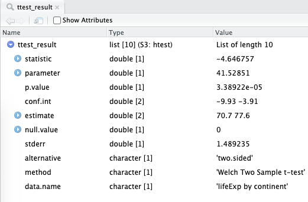

# (PART) Data analysis {-}


In the second part of this book, we focus specifically on the business of data analysis.
That is, formulating clear questions and seeking to answer them using available datasets. 

Again, we emphasise the importance of understanding the underlying data through visualisation, rather than relying on statistical tests or, heaven forbid, the p-value alone. 

There are five chapters. 
Testing for continuous outcome variables (6) leads naturally into Linear regression (7). 
We would expect the majority of actual analysis done by readers to be using the methods in chapter 7 rather than 6. 
Similarly, Testing for categorical outcome variables (8) leads naturally to Logistic regression (9), where we would expect the majority of work to focus. 
Chapters 6 and 8 however do provide helpful reminders of how to prepare data for these analyses and shouldn't be skipped.
Time-to-event data introduces survival analysis and includes sections on the manipulation of dates. 

# Working with continuous outcome variables{#chap06-h1}
\index{continuous data@\textbf{continuous data}}

> Continuous data can be measured.  
> Categorical data can be counted.

## Continuous data

Continuous data is everywhere in healthcare. 
From physiological measures in patients such as systolic blood pressure or pulmonary function tests, through to populations measures like life expectancy or disease incidence, the analysis of continuous outcome measures is common and important.

Our goal in most health data questions, is to draw a conclusion on a comparison between groups. 
For instance, understanding differences in life expectancy between the year 2002 and 2007 is more useful than simply describing the average life expectancy across all of time. 

The basis for comparisons between continuous measures is the *distribution* of the data. 
That word, as many which have a statistical flavour, brings on the sweats in a lot of people. 
It needn't. 
By distribution, we are simply referring to the shape of the data. 

## The Question

The examples in this chapter all use the data introduced previously from the amazing [Gapminder project](https://www.gapminder.org/). 
We will start by looking at the life expectancy of populations over time and in different geographical regions. 

## Get the data


```r
# Load packages
library(tidyverse)
library(finalfit)
library(gapminder)

# Create object mydata from object gapminder
mydata = gapminder
```

## Check the data {#chap06-h2-check}

It is vital that data is carefully inspected when first read (for help reading data into R see \@ref(chap02-h2-reading-data-into-r)).
The three functions below provide a clear summary allowing errors or miscoding to be quickly identified. 
It is particularity important to ensure that any missing data is identified (see Chapter \@ref(chap14-h1)). 
If you don't do this you will regret it! 
There are many times when an analysis has got to a relatively advanced stage before the researcher realised the dataset was incomplete. 


```r
glimpse(mydata) # each variable as line, variable type, first values
```

```
## Observations: 1,704
## Variables: 6
## $ country   <fct> Afghanistan, Afghanistan, Afghanistan, Afghanistan, Afghani…
## $ continent <fct> Asia, Asia, Asia, Asia, Asia, Asia, Asia, Asia, Asia, Asia,…
## $ year      <int> 1952, 1957, 1962, 1967, 1972, 1977, 1982, 1987, 1992, 1997,…
## $ lifeExp   <dbl> 28.801, 30.332, 31.997, 34.020, 36.088, 38.438, 39.854, 40.…
## $ pop       <int> 8425333, 9240934, 10267083, 11537966, 13079460, 14880372, 1…
## $ gdpPercap <dbl> 779.4453, 820.8530, 853.1007, 836.1971, 739.9811, 786.1134,…
```

```r
missing_glimpse(mydata) # missing data for each variable
```

```
##               label var_type    n missing_n missing_percent
## country     country    <fct> 1704         0             0.0
## continent continent    <fct> 1704         0             0.0
## year           year    <int> 1704         0             0.0
## lifeExp     lifeExp    <dbl> 1704         0             0.0
## pop             pop    <int> 1704         0             0.0
## gdpPercap gdpPercap    <dbl> 1704         0             0.0
```


```r
ff_glimpse(mydata) # summary statistics for each variable
```

\index{functions@\textbf{functions}!glimpse}
\index{functions@\textbf{functions}!missing\_glimpse}
\index{functions@\textbf{functions}!ff\_glimpse}


```
## Continuous
##               label var_type    n missing_n missing_percent       mean
## year           year    <int> 1704         0             0.0     1979.5
## lifeExp     lifeExp    <dbl> 1704         0             0.0       59.5
## pop             pop    <int> 1704         0             0.0 29601212.3
## gdpPercap gdpPercap    <dbl> 1704         0             0.0     7215.3
##                    sd     min quartile_25    median quartile_75          max
## year             17.3  1952.0      1965.8    1979.5      1993.2       2007.0
## lifeExp          12.9    23.6        48.2      60.7        70.8         82.6
## pop       106157896.7 60011.0   2793664.0 7023595.5  19585221.8 1318683096.0
## gdpPercap      9857.5   241.2      1202.1    3531.8      9325.5     113523.1
## 
## Categorical
##               label var_type    n missing_n missing_percent levels_n
## country     country    <fct> 1704         0             0.0      142
## continent continent    <fct> 1704         0             0.0        5
##                                                      levels
## country                                                   -
## continent "Africa", "Americas", "Asia", "Europe", "Oceania"
##                     levels_count               levels_percent
## country                        -                            -
## continent 624, 300, 396, 360, 24 36.6, 17.6, 23.2, 21.1,  1.4
```

<table class="table" style="margin-left: auto; margin-right: auto;">
<caption>(\#tab:unnamed-chunk-6)Gapminder dataset, ff\_glimpse: continuous</caption>
 <thead>
  <tr>
   <th style="text-align:left;"> label </th>
   <th style="text-align:left;"> var_type </th>
   <th style="text-align:left;"> n </th>
   <th style="text-align:right;"> missing_n </th>
   <th style="text-align:right;"> mean </th>
   <th style="text-align:right;"> sd </th>
   <th style="text-align:right;"> median </th>
  </tr>
 </thead>
<tbody>
  <tr>
   <td style="text-align:left;width: 4cm; "> year </td>
   <td style="text-align:left;"> &lt;int&gt; </td>
   <td style="text-align:left;"> 1704 </td>
   <td style="text-align:right;"> 0 </td>
   <td style="text-align:right;"> 1979.5 </td>
   <td style="text-align:right;"> 17.3 </td>
   <td style="text-align:right;"> 1979.5 </td>
  </tr>
  <tr>
   <td style="text-align:left;width: 4cm; "> lifeExp </td>
   <td style="text-align:left;"> &lt;dbl&gt; </td>
   <td style="text-align:left;"> 1704 </td>
   <td style="text-align:right;"> 0 </td>
   <td style="text-align:right;"> 59.5 </td>
   <td style="text-align:right;"> 12.9 </td>
   <td style="text-align:right;"> 60.7 </td>
  </tr>
  <tr>
   <td style="text-align:left;width: 4cm; "> pop </td>
   <td style="text-align:left;"> &lt;int&gt; </td>
   <td style="text-align:left;"> 1704 </td>
   <td style="text-align:right;"> 0 </td>
   <td style="text-align:right;"> 29601212.3 </td>
   <td style="text-align:right;"> 106157896.7 </td>
   <td style="text-align:right;"> 7023595.5 </td>
  </tr>
  <tr>
   <td style="text-align:left;width: 4cm; "> gdpPercap </td>
   <td style="text-align:left;"> &lt;dbl&gt; </td>
   <td style="text-align:left;"> 1704 </td>
   <td style="text-align:right;"> 0 </td>
   <td style="text-align:right;"> 7215.3 </td>
   <td style="text-align:right;"> 9857.5 </td>
   <td style="text-align:right;"> 3531.8 </td>
  </tr>
</tbody>
</table>

<table class="table" style="margin-left: auto; margin-right: auto;">
<caption>(\#tab:unnamed-chunk-6)Gapminder dataset, ff\_glimpse: categorical</caption>
 <thead>
  <tr>
   <th style="text-align:left;"> label </th>
   <th style="text-align:left;"> var_type </th>
   <th style="text-align:left;"> n </th>
   <th style="text-align:right;"> missing_n </th>
   <th style="text-align:right;"> levels_n </th>
   <th style="text-align:right;"> levels </th>
   <th style="text-align:right;"> levels_count </th>
  </tr>
 </thead>
<tbody>
  <tr>
   <td style="text-align:left;"> country </td>
   <td style="text-align:left;"> &lt;fct&gt; </td>
   <td style="text-align:left;"> 1704 </td>
   <td style="text-align:right;"> 0 </td>
   <td style="text-align:right;"> 142 </td>
   <td style="text-align:right;width: 3cm; "> - </td>
   <td style="text-align:right;width: 3cm; "> - </td>
  </tr>
  <tr>
   <td style="text-align:left;"> continent </td>
   <td style="text-align:left;"> &lt;fct&gt; </td>
   <td style="text-align:left;"> 1704 </td>
   <td style="text-align:right;"> 0 </td>
   <td style="text-align:right;"> 5 </td>
   <td style="text-align:right;width: 3cm; "> "Africa", "Americas", "Asia", "Europe", "Oceania" </td>
   <td style="text-align:right;width: 3cm; "> 624, 300, 396, 360, 24 </td>
  </tr>
</tbody>
</table>


As can be seen, there are 6 variables, 4 are continuous and 2 are categorical. The categorical variables are already identified as `factors`. There are no missing data. 

## Plot the data

We will start by comparing life expectancy between the 5 continents of the world in two different years. 
Always plot your data first. 
Never skip this step!
We are particularly interested in the distribution. 
There's that word again. 
The shape of the data. 
Is it normal? 
Is it skewed? 
Does it differ between regions and years?

There are three useful plots which can help here: 

- Histograms: examine shape of data and compare groups;
- Q-Q plots: are data normally distributed?
- Box-plots: identify outliers, compare shape and groups.

### Histogram{#chap06-h3-hist-plot}


```r
mydata %>% 
  filter(year %in% c(2002, 2007)) %>%
  ggplot(aes(x = lifeExp)) +       # remember aes()
  geom_histogram(bins = 20) +      # histogram with 20 bars
  facet_grid(year ~ continent)     # optional: add scales="free"                                 
```

<div class="figure">

<p class="caption">(\#fig:chap06-fig-hist-life-year)Histogram: country life expectancy by continent and year</p>
</div>

What can we see? 
That life expectancy in Africa is lower than in other regions. 
That we have little data for Oceania given there are only two countries included, Australia and New Zealand. 
That Africa and Asia have greater variability in life expectancy by country than in the Americas or Europe. 
That the data follow a reasonably normal shape, with Africa 2002 a little right skewed. 

### Q-Q plot{#chap06-h3-qq-plot}

Quantile-quantile sounds more complicated than it really is. 
It is a graphical method for comparing the distribution (think shape) of our own data to a theoretical distribution, such as the normal distribution. 
In this context, quantiles are just cut points which divide our data into bins each containing the same number of observations.
For example, if we have the life expectancy for 100 countries, then quartiles (note the quar-) for life expectancy are the three ages which split the observations into 4 groups each containing 25 countries. 
A Q-Q plot simply plots the quantiles for our data against the theoretical quantiles for a particular distributions (the default shown below is the normal distribution). 
If our data follow that distribution (e.g. normal), then our data points fall on the theoretical straight line.


```r
mydata %>% 
  filter(year %in% c(2002, 2007)) %>%
  ggplot(aes(sample = lifeExp)) +      # Q-Q plot requires 'sample'
  geom_qq() +                          # defaults to normal distribution
  geom_qq_line(colour = "blue") +      # add the theoretical line
  geom_abline(intercept = 0, slope = 1) +
  facet_grid(year ~ continent)
```

<div class="figure">

<p class="caption">(\#fig:chap06-fig-qq-life-year)Q-Q plot: country life expectancy by continent and year</p>
</div>

\index{plotting@\textbf{plotting}!geom\_qq}
\index{plotting@\textbf{plotting}!geom\_qq\_line}

What can we see?
We are looking to see if the data follow the 45 degree line which is included in the plot.
These do reasonably, except for Africa which is curved upwards at each end. 
This is the right skew we could see on the histograms too.
If your data is not follow a normal distribution, then you can not use the t-test or the ANOVA, but have to use a non-parametric test as shown in Section \@ref(chap06-non-param-tests).

We are frequently asked about performing a hypothesis test to check the assumption of normality, such as the Shapiro-Wilk normality test. 
We do not recommend this, simply because it is often non-significant when the number of observations is small but the data look skewed, and often significant when the number of observations is high but the data look reasonably normal on inspection of plots. 
It is therefore not useful in practice - common sense should prevail.

### Boxplot
\index{plotting@\textbf{plotting}!geom\_boxplot}
\index{plotting@\textbf{plotting}!boxplot}

Boxplots are our preferred method for comparing a continuous variable such as life expectancy across a categorical explanatory variable. 
For continuous data, box plots are a lot more appropriate than bar plots with error bars (also known as dynamite plots).
We intentionally do not even show you how to make dynamite plots.

The box represents the median (bold horizontal line in the middle) and interquartile range (where 50% of the data sits). 
The lines (whiskers) extend to the lowest and highest values that are still within 1.5 times the interquartile range.
Outliers (anything outwidth the whiskers) are represented as points. 

Thus it contains information, not only on central tendency (median), but on the variation in the data and the distribution of the data, for instance a skew should be obvious. 


```r
mydata %>% 
  filter(year %in% c(2002, 2007)) %>%
  ggplot(aes(x = continent, y = lifeExp)) +
  geom_boxplot() +
  facet_wrap(~ year)
```

<div class="figure">

<p class="caption">(\#fig:chap06-fig-boxplot-life-year)Boxplot: country life expectancy by continent and year</p>
</div>


What can we see?
The median life expectancy is lower in Africa than in any other continent. 
The variation in life expectancy is greatest in Africa and smallest in Oceania. 
The data in Africa looks skewed, particularly in 2002 - the lines/whiskers are unequal lengths. 


\FloatBarrier

We can add further arguments:


```r
mydata %>%  
  filter(year %in% c(2002, 2007)) %>%
  ggplot(aes(x = factor(year), y = lifeExp)) +
  geom_boxplot(aes(fill = continent)) +     # add colour to boxplots
  geom_jitter(alpha = 0.4) +                # alpha = transparency
  facet_wrap(~ continent, ncol = 5) +       # spread by continent
  theme(legend.position = "none") +         # remove legend
  xlab("Year") +                            # label x-axis
  ylab("Life expectancy (years)") +         # label y-axis
  ggtitle(
    "Life expectancy by continent in 2002 v 2007") # add title
```

<div class="figure">

<p class="caption">(\#fig:chap06-fig-boxplot-jitter)Boxplot with jitter points: country life expectancy by continent and year</p>
</div>

## Compare the means of two groups

### *t*-test
\index{t-test@\textbf{t-test}}
A *t*-test is used to compare the means of two groups of continuous variables. 
Volumes have been written about this elsewhere, and we won't rehearse it here. 

There are a few variations of the *t*-test.
We will use two here. 
The most useful in our context is a two-sample test of independent groups. 
Repeated-measures data, such as comparing the same countries in different years, can be analysed using a paired *t*-test.

<!-- Any more here? -->


### Two-sample *t*-tests
\index{t-test@\textbf{t-test}!two-sample}

Referring to Figure \@ref(fig:chap06-fig-boxplot-life-year), let's compare life expectancy between Asia and Europe for 2007. 
What is imperative, is that you decide what sort of difference exists by looking at the boxplot, rather than relying on the *t*-test output. 
The median for Europe is clearly higher than in Asia. 
The distributions overlap, but it looks likely that Europe has a higher life expectancy than Asia. 

By running the the two-sample t-test on these data we assume that each country is an independent measurement of the life expectancy of that continent.
You could also imagine two rooms full of people - and you measure the height of each person.
You then run a two-sample t-test to see if the mean height of people in one room is statistically significantly different to the mean height of people in the other room.
Each measurement has to be independent of each other.
For example, none of the people can be related to each other.

So in our example of countries and continents, you have to assume that the mean life expectancy of each country does not depend on the life expectancies of other countries in the group. In other words, that each measurement is independent.


```r
ttest_data = mydata %>%                      # save as object ttest_data
  filter(year == 2007) %>%                   # 2007 only
  filter(continent %in% c("Asia", "Europe")) # Asia/Europe only

ttest_result = 
  t.test(lifeExp ~ continent, data = ttest_data)
ttest_result
```

```
## 
## 	Welch Two Sample t-test
## 
## data:  lifeExp by continent
## t = -4.6468, df = 41.529, p-value = 3.389e-05
## alternative hypothesis: true difference in means is not equal to 0
## 95 percent confidence interval:
##  -9.926525 -3.913705
## sample estimates:
##   mean in group Asia mean in group Europe 
##             70.72848             77.64860
```


\index{functions@\textbf{functions}!t.test}

The Welch two-sample *t*-test is the most flexible and copes with differences in variance (variability) between groups, as in this example. 
The difference in means is provided at the bottom of the output. 
The *t*-value, degrees of freedom (df) and p-value are all provided. 
The p-value is 0.00003. 

We used the assignent operator to save the results of the t-test into a new object called `ttest_result`.
If you look at the Environment tab, you should see `ttest_result there`.
If you click on it - to view it - you'll realise that it's not structured like a table, but a list of different pieces of information.
The structure of the t-test object is shown in Figure \@ref(fig:chap06-ttest-object).


<div class="figure">

<p class="caption">(\#fig:chap06-ttest-object)A list object that is the result of a t-test in R. We will show you ways to access these numbers and how to wrangle them more familiar tables/tibbles.</p>
</div>

The p-value, for instance, can be accessed like this:


```r
ttest_result$p.value # Extracted element of result object
```

```
## [1] 3.38922e-05
```

The confidence interval of the difference in mean life expectancy between the two continents:


```r
ttest_result$conf.int # Extracted element of result object
```

```
## [1] -9.926525 -3.913705
## attr(,"conf.level")
## [1] 0.95
```


The `broom` package provides useful methods for 'tidying' common model outputs into a `tibble`. 
So instead of accessing the various bits of information by checking the `names()` and then using the `$` operator, we can use functions called `tidy()` and `glance()` to wrangle the statistical output into a table:


<table class="table" style="font-size: 9px; margin-left: auto; margin-right: auto;">
<caption style="font-size: initial !important;">(\#tab:chap06-tab-ttest)Results of a t-test wrangled into a table using library(broom).</caption>
 <thead>
  <tr>
   <th style="text-align:right;"> estimate </th>
   <th style="text-align:right;"> estimate1 </th>
   <th style="text-align:right;"> estimate2 </th>
   <th style="text-align:right;"> statistic </th>
   <th style="text-align:right;"> p.value </th>
   <th style="text-align:right;"> parameter </th>
   <th style="text-align:right;"> conf.low </th>
   <th style="text-align:right;"> conf.high </th>
  </tr>
 </thead>
<tbody>
  <tr>
   <td style="text-align:right;"> -6.920115 </td>
   <td style="text-align:right;"> 70.72848 </td>
   <td style="text-align:right;"> 77.6486 </td>
   <td style="text-align:right;"> -4.646757 </td>
   <td style="text-align:right;"> 3.39e-05 </td>
   <td style="text-align:right;"> 41.52851 </td>
   <td style="text-align:right;"> -9.926525 </td>
   <td style="text-align:right;"> -3.913705 </td>
  </tr>
</tbody>
</table>

**Reminder: When pipe sends data to the wrong place: use `data = .` to direct it**

In the code above, the `, data = .` bit is necessary because the pipe usually sends data to the beginning of function brackets. So `mydata %>% t.test(lifeExp ~ continent)` would be equivalent to `t.test(mydata, lifeExp ~ continent)`. 
However, this is not an order that `t.test()` will accept. 
`t.test()` wants us to specify the formula first, and then wants the data these variables are present in. 
So we have to use the `.` to tell the pipe to send the data to the second argument of `t.test()`, not the first.

### Paired *t*-tests {#ttest_paired}
\index{t-test@\textbf{t-test}!paired}

Consider that we want to compare the difference in life expectancy in Asian countries between 2002 and 2007.
The overall difference is not impressive in the boxplot. 

We can plot differences at the country level directly. 


```r
paired_data = mydata %>%               # save as object paired_data
  filter(year %in% c(2002, 2007)) %>%  # 2002 and 2007 only
  filter(continent == "Asia")          # Asia only

paired_data %>%      
  ggplot(aes(x = year, y = lifeExp, 
             group = country)) +       # for individual country lines
  geom_line()
```

<div class="figure">

<p class="caption">(\#fig:chap06-fig-line-life-asia)Line plot: Change in life expectancy in Asian countries from 2002 to 2007</p>
</div>

\index{plotting@\textbf{plotting}!geom\_line}

What is the difference in life expectancy for each individual country?
We don't usually have to produce this directly, but here is one method. 


```r
paired_table = paired_data %>%        # save object paired_data
  select(country, year, lifeExp) %>%  # select vars interest
  pivot_wider(names_from = year,      # put years in columns
              values_from = lifeExp) %>% 
  mutate(
    dlifeExp = `2007` - `2002`        # difference in means
  )

paired_table
```

```
## # A tibble: 33 x 4
##    country          `2002` `2007` dlifeExp
##    <fct>             <dbl>  <dbl>    <dbl>
##  1 Afghanistan        42.1   43.8    1.70 
##  2 Bahrain            74.8   75.6    0.84 
##  3 Bangladesh         62.0   64.1    2.05 
##  4 Cambodia           56.8   59.7    2.97 
##  5 China              72.0   73.0    0.933
##  6 Hong Kong, China   81.5   82.2    0.713
##  7 India              62.9   64.7    1.82 
##  8 Indonesia          68.6   70.6    2.06 
##  9 Iran               69.5   71.0    1.51 
## 10 Iraq               57.0   59.5    2.50 
## # … with 23 more rows
```

```r
# Mean of difference in years
paired_table %>% summarise( mean(dlifeExp) )
```

```
## # A tibble: 1 x 1
##   `mean(dlifeExp)`
##              <dbl>
## 1             1.49
```

On average, therefore, there is an increase in life expectancy of 1.5 years in Asian countries between 2002 and 2007. 
Let's test whether this number differs from zero with a paired *t*-test: 


```r
paired_data %>% 
  t.test(lifeExp ~ year, data = ., paired = TRUE)
```

```
## 
## 	Paired t-test
## 
## data:  lifeExp by year
## t = -14.338, df = 32, p-value = 1.758e-15
## alternative hypothesis: true difference in means is not equal to 0
## 95 percent confidence interval:
##  -1.706941 -1.282271
## sample estimates:
## mean of the differences 
##               -1.494606
```

\index{functions@\textbf{functions}!t.test}

The results show a highly significant difference (p-value = 0.000000000000002).
The average difference of 1.5 years is highly consistent between countries, as shown on the line plot, and this differs from zero.
It is up to you the investigator to interpret the relevance of the effect size of 1.5 years in reporting the finding.
A highly significant p-value does not necessarily mean there is a (clinically) significant change between the two groups (or in this example, two times).

### What if I run the wrong one?

As an exercise, we can repeat this analysis comparing these data in an unpaired manner. 
The resulting (unpaired) p-value is 0.460.
Remember, a paired t-test of the same data (life expectancies of Asian countries in 2002 and 2007) showed a very different, significant result.
In this case, running an unpaired two-sample t-test is just wrong - as the data are indeed paired.
It is important that the investigator really understands the data and the underlying processes/relationships within it.
R will not know and therefore can not warn you if you run the wrong test.


## Compare the mean of one group: one sample *t*-tests

\index{t-test@\textbf{t-test}!one-sample}

We can use a *t*-test to determine whether the mean of a distribution is different to a specific value. 
For instance, we can test whether the mean life expectancy in each continent was significantly different from 77 years in 2007.
We have included some extra code here to demonstrate how to run multiple tests in one pipe function. 


```r
mydata %>% 
  filter(year == 2007) %>%          # 2007 only
  group_by(continent) %>%           # split by continent
  do(                               # dplyr function
    t.test(.$lifeExp, mu = 77) %>%  # compare mean to 77 years 
      tidy()                        # tidy into tibble
  )
```

```
## # A tibble: 5 x 9
## # Groups:   continent [5]
##   continent estimate statistic  p.value parameter conf.low conf.high method
##   <fct>        <dbl>     <dbl>    <dbl>     <dbl>    <dbl>     <dbl> <chr> 
## 1 Africa        54.8    -16.6  3.15e-22        51     52.1      57.5 One S…
## 2 Americas      73.6     -3.82 8.32e- 4        24     71.8      75.4 One S…
## 3 Asia          70.7     -4.52 7.88e- 5        32     67.9      73.6 One S…
## 4 Europe        77.6      1.19 2.43e- 1        29     76.5      78.8 One S…
## 5 Oceania       80.7      7.22 8.77e- 2         1     74.2      87.3 One S…
## # … with 1 more variable: alternative <chr>
```


The mean life expectancy for Europe and Oceania do not significantly differ from 77, while the others do.
In particular, look at the confidence intervals of the results above (`conf.low` and `conf.high` columns) and whether they include or exclude 77.
For instance, Oceania's confidence intervals are especially wide as the dataset only includes two countries. 
Therefore, we can't conclude that it's value isn't different to 77, but that we don't have enough observations and the estimate is uncertain. 
It doesn't make sense to report the results of a statistical test - whether the p-value is significant or not - without assessing the confidence intervals.

### Interchangeability of t-tests

Furthermore, rember how we calculated the table of differences in the paired t-test section?
We can use these differences for each pair of observations (country's life expectancy in 2002 and 2007) to run a simple one-sample t-test instead:


```r
# note that we're using dlifeExp
# so the differences we calculated above
t.test(paired_table$dlifeExp, mu = 0)
```

```
## 
## 	One Sample t-test
## 
## data:  paired_table$dlifeExp
## t = 14.338, df = 32, p-value = 1.758e-15
## alternative hypothesis: true mean is not equal to 0
## 95 percent confidence interval:
##  1.282271 1.706941
## sample estimates:
## mean of x 
##  1.494606
```

<!-- Riinu: I know `mu = 0` is the default, but I think it makes sense to make it excplicitclear in the code example, rather than add another sentence here to say that "we did not include mu = 0 as that's the default?" We should say that we could omit the mu = 0? Don't feel strongly, can also remove it from the code and explain. -->

Notice how this result is identical to the paired t-test.

## Compare the means of more than two groups

It may be that our question is set around a hypothesis involving more than two groups. 
For example, we may be interested in comparing life expectancy across 3 continents such as the Americas, Europe and Asia.

### Plot the data


```r
mydata %>% 
  filter(year == 2007) %>% 
  filter(continent %in% 
           c("Americas", "Europe", "Asia")) %>% 
  ggplot(aes(x = continent, y=lifeExp)) +
  geom_boxplot()
```

<div class="figure">

<p class="caption">(\#fig:unnamed-chunk-15)Boxplot: Life expectancy in selected continents for 2007</p>
</div>

### ANOVA
\index{analysis of variance (ANOVA)}

Analysis of variance is a collection of statistical tests which can be used to test the difference in means between two or more groups. 

In base R form, it produces an ANOVA table which includes an F-test. 
This so-called omnibus test tells you whether there are any differences in the comparison of means of the included groups. 
Again, it is important to plot carefully and be clear what question you are asking.  


```r
aov_data = mydata %>% 
  filter(year == 2007) %>% 
  filter(continent %in% c("Americas", "Europe", "Asia"))

fit = aov(lifeExp ~ continent, data = aov_data) 
summary(fit)
```

```
##             Df Sum Sq Mean Sq F value   Pr(>F)    
## continent    2  755.6   377.8   11.63 3.42e-05 ***
## Residuals   85 2760.3    32.5                     
## ---
## Signif. codes:  0 '***' 0.001 '**' 0.01 '*' 0.05 '.' 0.1 ' ' 1
```

\index{functions@\textbf{functions}!aov}

We can conclude from the significantly small p-value that there is at least one significant difference in the continents included.
This does not mean that all included groups (in this case the 3 continents) are significantly different from each other.
As above, the output can be neatened up using the `tidy` function. 


```r
library(broom)
mydata %>% 
  filter(year == 2007) %>% 
  filter(continent %in% c("Americas", "Europe", "Asia")) %>% 
  aov(lifeExp~continent, data = .) %>% 
  tidy()
```

```
## # A tibble: 2 x 6
##   term         df sumsq meansq statistic    p.value
##   <chr>     <dbl> <dbl>  <dbl>     <dbl>      <dbl>
## 1 continent     2  756.  378.       11.6  0.0000342
## 2 Residuals    85 2760.   32.5      NA   NA
```

The residuals can't statistic (which in the case of ANOVA is an F-value) or a p-value, which is why those cells are `NA`.

### Assumptions

As with the normality assumption of the *t*-test (for example, Sections \@ref(chap06-h3-hist-plot) and \@ref(chap06-h3-qq-plot)), there are assumptions of the ANOVA model. 
These assumptions are shared with linear regression and are covered in the next chapter, as linear regression lends itself to illustrate and explain these concepts very well. 
Suffice to say that diagnostic plots can be produced to check that the assumptions are fulfilled. 
`library(ggfortify)` incldues a function called `autoplot()` that can be used to quickly create diagnostic plots, including the Q-Q plot that we showed before:


```r
library(ggfortify)
autoplot(fit)
```

<div class="figure">

<p class="caption">(\#fig:unnamed-chunk-18)Diagnostic plots: ANOVA model of life expectancy by continent for 2007</p>
</div>

\FloatBarrier

## Multiple testing
\index{multiple testing}

### Pairwise testing and multiple comparisons
\index{pairwise testing}


When the F-test is significant, we will often want to proceed to try and determine where the differences lie. 
This should of course be obvious from the boxplot you have made. 
However, some are fixated on the p-value!


```r
pairwise.t.test(aov_data$lifeExp, aov_data$continent, 
                p.adjust.method = "bonferroni")
```

```
## 
## 	Pairwise comparisons using t tests with pooled SD 
## 
## data:  aov_data$lifeExp and aov_data$continent 
## 
##        Americas Asia   
## Asia   0.180    -      
## Europe 0.031    1.9e-05
## 
## P value adjustment method: bonferroni
```

\index{functions@\textbf{functions}!pairwise.t.test}

A matrix of pairwise p-values is produced.
Here we can see that there is good evidence of a difference in means between Europe and Asia. 

When running a pairwise t-test, the p-values are already corrected for multiple comparisons.
We have to keep in mind that the p-value's significance level of 0.05 means we have a 5% chance of getting a significant result in our sample, but not necessarily in other samples/greater population.
Therefore, the more statistical tests you perform, the chances of finding a false positive result increases.
This is also known as Type I error.

There are three approaches to deadling with this. The first, is not to perform any correction at all. 
Some advocate that the best approach is simply to present the results of all the tests that were performed, and let the sceptical reader make adjustments for themselves. 
This is attractive, but presupposes a sophisticated readership who will take the time to consider the results in their entirety. 

The second and classical approach, is to control for the so-called family-wise error rate. 
The "Bonferroni" correction is probably the most famous and most conservative, where the threshold for significance is lowered in proportion to the number of comparisons made. 
For example, if three comparisons are made, the threshold for significance should be lowered to 0.017. 
Equivalently, all p-values should be multiplied by the number of tests performed (in this case 3).
The adjusted values can then be compared to a threshold of 0.05, as is the case above. 
The Bonferroni method is particular conservative, meaning that type 2 errors may occur (failure to identify true differences, or false negatives) in favour or minimising type 1 errors (false positives).
\index{Bonferroni correction}

The third newer approach controls false-discovery rate. 
The development of these methods has been driven in part by the needs of areas of science where many different statistical tests are performed at the same time, for instance, examining the influence of 1000 genes simultaneously. 
In these hypothesis-generating settings, a higher tolerance to type 1 errors may be preferable to missing potential findings through type 2 errors. 
\index{false discovery rate}
You can see in our example, that the p-values are lower with the `fdr` correction than the `Bonferroni` correction ones. 


```r
pairwise.t.test(aov_data$lifeExp, aov_data$continent, 
                p.adjust.method = "fdr")
```

```
## 
## 	Pairwise comparisons using t tests with pooled SD 
## 
## data:  aov_data$lifeExp and aov_data$continent 
## 
##        Americas Asia   
## Asia   0.060    -      
## Europe 0.016    1.9e-05
## 
## P value adjustment method: fdr
```

\index{functions@\textbf{functions}!pairwise.t.test}

Try not to get too hung up on this. 
Be sensible. 
Plot the data and look for differences. 
Focus on effect size. 
For instance, what is the actual difference in life expectancy in years, rather than the p-value of a comparison test. 
Choose a method which fits with your overall aims. 
If you are generating hypotheses which you will proceed to test with other methods, the `fdr` approach may be preferable.
If you are trying to capture robust effects and want to minimise type 2 errors, use a family-wise approach. 


If your head is spinning at this point, do not worry - there is more to come.
The rest of the book will continuously revisit these and other similar concepts, e.g., "know your data", "be sensible, look at the effect size", using several different examples and dataset.
So do not feel like you should be able to understand everything immediately.
Furthermore, these things are even easier to conceptualise using your own dataset - especially if that's something you've put your sweat and tears into collecting/applying for.

## Non-parametric tests{#chap06-non-param-tests}
\index{non-parametric tests@\textbf{non-parametric tests}}

What if your data is a different shape to normal, or the ANOVA assumptions are not fulfilled (see linear regression chapter). 
As always, be sensible and think what drives your measurements in the first place.
Would your data be expected to be normally distributed given the data-generating process?
For instance, if you are examining length of hospital stay it is likely that your data are highly right skewed - most patients are discharged from hospital in a few days while a smaller number stay for a long time. 
Is a comparison of means ever going to be the correct approach here?
Perhaps you should consider a time-to-event analysis for instance (see chapter \@ref(chap10-h1)).

If a comparison of means approach is reasonable, but the normality assumption is not fulfilled there are two approaches, 

1. Transform the data;
2. Perform non-parametric tests.

### Transforming data {#chap06-transform}
\index{transformations}

Remember, the Welch *t*-test is reasonably robust to divergence from the normality assumption, so small deviations can be safely ignored. 

Otherwise, the data can be transformed to another scale to deal with a skew. 
A natural `log` scale is common. 

<table class="table" style="margin-left: auto; margin-right: auto;">
<caption>(\#tab:unnamed-chunk-21)Transformations that can be applied to skewed data. For left skewed data, subtract all values from a constant greater than the maximum value.</caption>
 <thead>
  <tr>
   <th style="text-align:left;"> Distribution </th>
   <th style="text-align:left;"> Transformation </th>
   <th style="text-align:left;"> Function </th>
  </tr>
 </thead>
<tbody>
  <tr>
   <td style="text-align:left;"> Moderate right skew (+) </td>
   <td style="text-align:left;"> Square-root </td>
   <td style="text-align:left;"> sqrt() </td>
  </tr>
  <tr>
   <td style="text-align:left;"> Substantial right skew (++) </td>
   <td style="text-align:left;"> Natural log* </td>
   <td style="text-align:left;"> log() </td>
  </tr>
  <tr>
   <td style="text-align:left;"> Substantial right skew (+++) </td>
   <td style="text-align:left;"> Base-10 log* </td>
   <td style="text-align:left;"> log10() </td>
  </tr>
</tbody>
<tfoot>
<tr><td style="padding: 0; border: 0;" colspan="100%"><span style="font-style: italic;">Note: </span></td></tr>
<tr><td style="padding: 0; border: 0;" colspan="100%">
<sup></sup> If data contain zero values, add a small constant to all values.</td></tr>
</tfoot>
</table>


```r
africa2002 = mydata %>%                # save as africa2002
  filter(year == 2002) %>%             # only 2002
  filter(continent == "Africa") %>%    # only Africa
  select(country, lifeExp) %>%         # only these variables
  mutate(
    lifeExp_log = log(lifeExp)         # log life expectancy
  )
head(africa2002)                       # inspect
```

```
## # A tibble: 6 x 3
##   country      lifeExp lifeExp_log
##   <fct>          <dbl>       <dbl>
## 1 Algeria         71.0        4.26
## 2 Angola          41.0        3.71
## 3 Benin           54.4        4.00
## 4 Botswana        46.6        3.84
## 5 Burkina Faso    50.6        3.92
## 6 Burundi         47.4        3.86
```

```r
africa2002 %>% 
  gather(key, lifeExp, -country) %>%     # gather values to same column
  ggplot(aes(x = lifeExp)) +             
  geom_histogram(bins = 15) +            # make histogram
  facet_wrap(~key, scales = "free")   # facet with axes free to vary
```

<div class="figure">

<p class="caption">(\#fig:unnamed-chunk-22)Histogram: Log transformation of life expectancy for countries in Africa 2002</p>
</div>

This has worked well here. 
The right skew on the Africa data has been dealt with by the transformation. 
A parametric test such as a *t*-test can now be performed. 

### Non-parametric test for comparing two groups
\index{non-parametric tests@\textbf{non-parametric tests}!Mann-Whitney U}
\index{non-parametric tests@\textbf{non-parametric tests}!Wilcoxon rank sum}

The Mann-Whitney U test is also called the Wilcoxon rank-sum test and uses a rank-based method to compare two groups (note the Wilcoxon signed-rank test is for paired data).
We can use it to test for a difference in life expectancies for African countries between 1982 and 2007.
Let's do a histogram, Q-Q plot and boxplot first. 


```r
africa_data = mydata %>%                          
  filter(year %in% c(1982, 2007)) %>%      # only 1982 and 2007
  filter(continent %in% c("Africa"))       # only Africa

p1 = africa_data %>%                       # save plot as p1
  ggplot(aes(x = lifeExp)) + 
  geom_histogram(bins = 15) +
  facet_wrap(~year)

p2 = africa_data %>%                       # save plot as p2
  ggplot(aes(sample = lifeExp)) +          # `sample` for Q-Q plot
  geom_qq() + 
  geom_qq_line(colour = "blue") + 
  facet_wrap(~year)

p3 = africa_data %>%                       # save plot as p3
  ggplot(aes(x = factor(year),             # try wihtout factor(year) to
             y = lifeExp)) +               # see the difference
  geom_boxplot(aes(fill = factor(year))) + # colour boxplot
  geom_jitter(alpha = 0.4) +               # add data points
  theme(legend.position = "none")          # remove legend

library(patchwork)                         # great for combining plots
p1 / p2 | p3
```

<div class="figure">

<p class="caption">(\#fig:unnamed-chunk-23)Panels plots: histogram, Q-Q, boxplot for life expectancy in Africa 1992 v 2007</p>
</div>

\index{plotting@\textbf{plotting}!patchwork}

The data is a little skewed based on the histograms and Q-Q plots. 
The difference between 1982 and 2007 is not particularly striking on the boxplot.


```r
africa_data %>% 
  wilcox.test(lifeExp ~ year, data = .)
```

```
## 
## 	Wilcoxon rank sum test with continuity correction
## 
## data:  lifeExp by year
## W = 1130, p-value = 0.1499
## alternative hypothesis: true location shift is not equal to 0
```

\index{functions@\textbf{functions}!wilcox.test}

### Non-parametric test for comparing more than two groups
\index{non-parametric tests@\textbf{non-parametric tests}!!Kruskal-Wallis}

The non-parametric equivalent to ANOVA, is the Kruskal-Wallis test. 
It can be used in base R, or via the finalfit package below. 


```r
library(broom)
mydata %>% 
  filter(year == 2007) %>% 
  filter(continent %in% c("Americas", "Europe", "Asia")) %>% 
  kruskal.test(lifeExp~continent, data = .) %>% 
  tidy()
```

```
## # A tibble: 1 x 4
##   statistic   p.value parameter method                      
##       <dbl>     <dbl>     <int> <chr>                       
## 1      21.6 0.0000202         2 Kruskal-Wallis rank sum test
```

\index{functions@\textbf{functions}!kruskal.test}

## Finalfit approach

The finalfit package provides an easy to use interface for performing non-parametric hypothesis tests.
Any number of explanatory variables can be tested against a so-called dependent variable. 
In this case, this is equivalent to a typical Table 1 in healthcare study. 


```r
dependent = "year"
explanatory = c("lifeExp", "pop", "gdpPercap")
africa_data %>%         
  mutate(
    year = factor(year)   # necessary for finalfit
  ) %>% 
  summary_factorlist(dependent, explanatory,
                     cont = "median", p = TRUE)
```

Note that the p-values above have not been corrected for multiple testing.

<table class="table" style="margin-left: auto; margin-right: auto;">
<caption>(\#tab:unnamed-chunk-27)Life expectancy, population and GDPperCap in Africa 1982 vs 2007</caption>
 <thead>
  <tr>
   <th style="text-align:left;"> label </th>
   <th style="text-align:left;"> levels </th>
   <th style="text-align:right;"> 1982 </th>
   <th style="text-align:right;"> 2007 </th>
   <th style="text-align:right;"> p </th>
  </tr>
 </thead>
<tbody>
  <tr>
   <td style="text-align:left;"> lifeExp </td>
   <td style="text-align:left;"> Median (IQR) </td>
   <td style="text-align:right;"> 50.8 (11.0) </td>
   <td style="text-align:right;"> 52.9 (11.6) </td>
   <td style="text-align:right;"> 0.149 </td>
  </tr>
  <tr>
   <td style="text-align:left;"> pop </td>
   <td style="text-align:left;"> Median (IQR) </td>
   <td style="text-align:right;"> 5668228.5 (8218654.0) </td>
   <td style="text-align:right;"> 10093310.5 (16454428.0) </td>
   <td style="text-align:right;"> 0.033 </td>
  </tr>
  <tr>
   <td style="text-align:left;"> gdpPercap </td>
   <td style="text-align:left;"> Median (IQR) </td>
   <td style="text-align:right;"> 1323.7 (1958.9) </td>
   <td style="text-align:right;"> 1452.3 (3130.6) </td>
   <td style="text-align:right;"> 0.503 </td>
  </tr>
</tbody>
</table>

\index{functions@\textbf{functions}!summary\_factorlist}

## Conclusions

Continuous data is frequently encountered in a healthcare setting. 
Liberal use of plotting is required to really understand the underlying data. 
Comparisons can be easily made between two or more groups of data, but always remember what you are actually trying to analyse and don't become fixated on the p-value. 
In the next chapter, we will explore the comparison of two continuous variables together with multivariable models of datasets.   

## Exercises

### Exercise 1

Make a histogram, Q-Q plot, and a box-plot for the life expectancy for a continent of your choice, but for all years. 
Do the data appear normally distributed?

### Exercise 2

1. Select any 2 years in any continent and perform a *t*-test to determine whether mean life expectancy is significantly different. 
Remember to plot your data first.

2. Extract only the p-value from your `t.test()` output.

### Exercise 3

In 2007, in which continents did mean life expectancy differ from 70.

### Exercise 4

1. Use ANOVA to determine if the population changed significantly through the 1990s/2000s in individual continents. 


## Exercise solutions


```r
# Exerise 1 
## Make a histogram, Q-Q plot, and a box-plot for the life expectancy
## for a continent of your choice, but for all years. 
## Do the data appear normally distributed?

asia_data = mydata %>%                          
  filter(continent %in% c("Asia"))              

p1 = asia_data %>%                              
  ggplot(aes(x = lifeExp)) + 
  geom_histogram(bins = 15)

p2 = asia_data %>%                          
  ggplot(aes(sample = lifeExp)) +             # sample =  for Q-Q plot
  geom_qq() + 
  geom_qq_line(colour = "blue")

p3 = asia_data %>%                              
  ggplot(aes(x = year, y = lifeExp)) +  
  geom_boxplot(aes(fill = factor(year))) +  # optional: year as factor
  geom_jitter(alpha = 0.4) +                    
  theme(legend.position = "none")               

library(patchwork)                              
p1 / p2 | p3
```


```r
# Exercise 2
## Select any 2 years in any continent and perform a *t*-test to 
## determine whether mean life expectancy is significantly different. 
## Remember to plot your data first.

asia_2years = asia_data %>%   
  filter(year %in% c(1952, 1972)) 

p1 = asia_2years %>%   
  ggplot(aes(x = lifeExp)) + 
  geom_histogram(bins = 15) +                 
  facet_wrap(~year)                          

p2 = asia_2years %>%   
  ggplot(aes(sample = lifeExp)) +              
  geom_qq() + 
  geom_qq_line(colour = "blue") + 
  facet_wrap(~year)                        

p3 = asia_2years %>%         
  ggplot(aes(x = factor(year), y = lifeExp)) + 
  geom_boxplot(aes(fill = factor(year))) +      
  geom_jitter(alpha = 0.4) +                    
  theme(legend.position = "none")               

library(patchwork)                              
p1 / p2 | p3
```


```r
asia_2years %>% 
  t.test(lifeExp ~ year, data = .)
```

```
## 
## 	Welch Two Sample t-test
## 
## data:  lifeExp by year
## t = -4.7007, df = 63.869, p-value = 1.428e-05
## alternative hypothesis: true difference in means is not equal to 0
## 95 percent confidence interval:
##  -15.681981  -6.327769
## sample estimates:
## mean in group 1952 mean in group 1972 
##           46.31439           57.31927
```


```r
# Exercise 3
## In 2007, in which continents did mean life expectancy differ from 70
mydata %>% 
  filter(year == 2007) %>% 
  group_by(continent) %>%
  do(
    t.test(.$lifeExp, mu = 70) %>%
      tidy()                         
  )
```

```
## # A tibble: 5 x 9
## # Groups:   continent [5]
##   continent estimate statistic  p.value parameter conf.low conf.high method
##   <fct>        <dbl>     <dbl>    <dbl>     <dbl>    <dbl>     <dbl> <chr> 
## 1 Africa        54.8   -11.4   1.33e-15        51     52.1      57.5 One S…
## 2 Americas      73.6     4.06  4.50e- 4        24     71.8      75.4 One S…
## 3 Asia          70.7     0.525 6.03e- 1        32     67.9      73.6 One S…
## 4 Europe        77.6    14.1   1.76e-14        29     76.5      78.8 One S…
## 5 Oceania       80.7    20.8   3.06e- 2         1     74.2      87.3 One S…
## # … with 1 more variable: alternative <chr>
```


```r
# Exercise 4
## Use Kruskal-Wallis to determine if the mean population changed 
## significantly through the 1990s/2000s in individual continents. 

mydata %>% 
  filter(year >= 1990) %>% 
  ggplot(aes(x = factor(year), y = pop)) + 
  geom_boxplot() + 
  facet_wrap(~continent)
```


```r
mydata %>% 
  filter(year >= 1990) %>% 
  group_by(continent) %>% 
  do(
    kruskal.test(pop ~ year, data = .) %>%
      tidy()
  )
```

```
## # A tibble: 5 x 5
## # Groups:   continent [5]
##   continent statistic p.value parameter method                      
##   <fct>         <dbl>   <dbl>     <int> <chr>                       
## 1 Africa        2.10    0.553         3 Kruskal-Wallis rank sum test
## 2 Americas      0.847   0.838         3 Kruskal-Wallis rank sum test
## 3 Asia          1.57    0.665         3 Kruskal-Wallis rank sum test
## 4 Europe        0.207   0.977         3 Kruskal-Wallis rank sum test
## 5 Oceania       1.67    0.644         3 Kruskal-Wallis rank sum test
```
