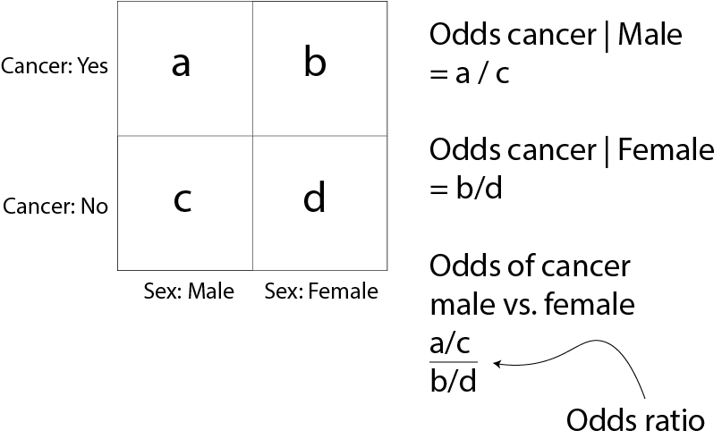

# Logistic regression

## What is Logistic Regression?

As we have seen in previous sessions, regression analysis is a statistical process for estimating the relationships between variables. 
For instance, we may try to predict the blood pressure of a group of patients based on their age.
As age and blood pressure are on a continuous scale, this is an example of linear regression. 


Logistic regression is an extension of this, where the variable being predicted is *categorical*.
We will deal with binary logistic regression, where the variable being predicted has two levels, e.g. yes or no, 0 or 1. 
In healthcare this is usually done for an event (like death) occurring or not occurring. 
Logistic regression can tell us the probability of the outcome occuring.

The aims of this session are to:

- Take you through Logistic Regression in R
- Learn how to fit a multivariable logistic regression model
- Output a logistic regression model to useful statistics


Logistic regression lets you adjust for the effects of confounding factors on an outcome. 
When you read a paper that says it has adjusted for confounding factors, this is the usual method which is used.

Adjusting for confounding factors allows us to isolate the true effect of a variable upon an outcome. 
For example, if we wanted to know the effects of smoking on deaths from heart attacks, we would need to also control for things like sex and diabetes, as we know they contribute towards heart attacks too.

Although in binary logistic regression the outcome must have two levels, the predictor variables (also known as the explanatory variables) can be either continuous or categorical.

Logistic regression can be performed to examine the influence of one predictor variable, which is known as a univariable analysis. 
Or multiple predictor variables, known as a multivariable analysis.

## Definitions

**Dependent** variable (in clinical research usually synonymous to **outcome**) - is what we are trying to explain, i.e. we are trying to identify the factors associated with a particular outcome. 
In binomial logistic regression, the dependent variable has exactly two levels (e.g. "Died" or "Alive", "Yes - Complications" or "No Complications", "Cured" or "Not Cured", etc.).

**Explanatory** variables (also known as **predictors**, **confounding** variables, or **"adjusted for"**) - patient-level information, usually including demographics (age, gender) as well as clinical information (disease stage, tumour type). 
Explanatory variables can be categorical as well as continuous, and categorical variables can have more than two levels.

**Univariable** - analysis with only one Explanatory variable.

**Multivariable** - analysis with more than one Explanatory variable. Synonymous to "adjusted".

(**Multivariate** - technically means more than one **Dependent variable** (we will not discuss this type of analysis), but very often used interchangeably with **Multivariable**.)

## Odds and probabilities

Odds and probabilities can get confusing so let's get them straight:


Odds and probabilities can always be interconverted. 
For example, if the odds of a patient dying from a disease are `9 to 1` then the probability of death (also known as risk) is 10%. Odds of `1 to 1` equal 50%.

$Odds = \frac{p}{1-p}$, where $p$ is the probability of the outcome occuring (or the circle being red).

Look at the numbers and convince yourself that this works. 

### Odds ratios

For a given categorical explanatory variable (e.g. gender), the likelihood of an outcome/dependent occuring (e.g cancer) can be expressed in a ratio of odds or odds ratio, e.g. the odds of men developing cancer is 2-times that of females, odds ratio = 2.0. 



An alternative is a ratio of probabilites, called a risk ratio or relative risk. 
Odds ratios have useful mathematical characteristics and are the main expression of results in logistic regression analysis.

\newpage

## Melanoma dataset

Malignant Melanoma is a cancer of the skin. 
It is agressive and highly invasive, making it difficult to treat.

It's classically divided into 4 stages of severity, based upon the depth of the tumour:

- Stage I- <0.5 mm depth
- Stage II- 0.5 to 1.0 mm depth
- Stage III- 1.0 to 4.0 mm depth
- Stage IV- > 4.0 mm depth

This will be important in our analysis as we will creating a new variable based upon this.

Using logistic regression, we will investigate factors associated with death from malignant melanoma.

### Doing logistic regression in R

There are a few different ways of creating a logistic regression in R. 
The `glm()` function is probably the most common and most flexible one to use. (`glm` stands for `generalised linear model`.)

Within the `glm()` function there are several `options` in the function we must define to make R run a logistic regression.

`data` - you must define the dataframe to be used in the regression.

`family` - this tells R to treat the analysis as a logisitic regression. For our purposes, `family` will always be `"binomial"` (as binary data follow this distribution).

`x ~ a + b + c` - this is the formula for the logistic regression, with `x` being the outcome and `a`, `b` and `c` being predictor variables.

Note the outcome is separated from the rest of the formula and sits on the left hand side of a `~`. The confounding variables are on the right side, separated by a `+` sign.

The final `glm()` function takes the following form:

`glm(x ~ a + b + c + d, data = data, family = "binomial")`


## Setting up your data

The most important step to ensure a good basis to start from is to ensure your variables are well structured and your outcome variable has exactly two outcomes.

We will need to make sure our outcome variables and predictor variables (the ones we want to adjust for) are suitably prepared.

In this example, the outcome variable called `status.factor` describes whether patients died or not and will be our (dependent) variable of interest.

### Worked Example


```r
library(tidyverse)

load("melanoma_factored.rda")
#Load in data from the previous session
```


Here `status.factor` has three levels: `Died`, `Died - other causes` and `Alive`. 
This is not useful for us, as logistic regression requires outcomes to be binary.

We want to find out using logistic regression, which variables predict death from Melanoma. 
So we should create a new factor variable, `died_melanoma.factor`. 
This will have two outcomes, `Yes` (did die from melanoma) or `No` (did not die from melanoma).


```r
mydata$status.factor %>% 
  fct_collapse("Yes" = c("Died"),
               "No"  = c("Alive", "Died - other causes")) ->
  mydata$died_melanoma.factor

mydata$died_melanoma.factor %>% levels()
```

```
## [1] "No"  "Yes"
```

## Creating categories

Now we have set up our outcome variable, we should ensure our predictor variables are prepared too.

Remember the stages of Melanoma? This is an important predictor of Melanoma Mortality based upon the scientific literature.

We should take this into account in our model.

### Exercise

After sorting out your outcome variable, create a new variable called `stage.factor` to encompass the stages of melanoma based upon the thickness. 
In this data, the `thickness` variable is measured in millimetres too.


```r
#the cut() function makes a continuous variable into a categorical variable
mydata$thickness %>% 
	cut(breaks = c(0,0.5,1,4, max(mydata$thickness, na.rm=T)),
			include.lowest = T) ->
mydata$stage.factor

mydata$stage.factor %>% levels()
```

```
## [1] "[0,0.5]"  "(0.5,1]"  "(1,4]"    "(4,17.4]"
```

```r
mydata$stage.factor %>% 
  fct_recode("Stage I"   = "[0,0.5]",
             "Stage II"  = "(0.5,1]",
             "Stage III" = "(1,4]",
             "Stage IV"  = "(4,17.4]"
    ) -> mydata$stage.factor

mydata$stage.factor %>% levels()
```

```
## [1] "Stage I"   "Stage II"  "Stage III" "Stage IV"
```


### Always plot your data first!


```r
source("1_source_theme.R")

mydata %>% 
  ggplot(aes(x = sex.factor)) +
  geom_bar(aes(fill = sex.factor))
```

<!-- -->


```r
mydata %>% 
  ggplot(aes(x = ulcer.factor)) +
  geom_bar(aes(fill = ulcer.factor))
```

<!-- -->


```r
mydata %>% 
  ggplot(aes(x = stage.factor)) +
  geom_bar(aes(fill = stage.factor))
```

<!-- -->


```r
mydata %>% 
  ggplot(aes(x = age)) +
  geom_histogram(aes(fill = age))
```

```
## `stat_bin()` using `bins = 30`. Pick better value with `binwidth`.
```

<!-- -->

Now we are ready for some modelling!


## Basic: One explanatory variable (predictor)

Lets find out what the influence of each predictor/confounding variable is on mortality from melanoma, which may help inform a more complicated regression, with multiple predictors/confounders.

We'll start with whether the patient was male or female

### Worked example

First we need to create a regression model, using `glm()`, we will then summarise it using `summary()`

Note, we need to use the `family` option. Specifying `'binomial'` in `family` tells `glm` to switch to logistic regression.


```r
#Create a model

glm(died_melanoma.factor ~ sex.factor, data = mydata, family = "binomial")
```

```
## 
## Call:  glm(formula = died_melanoma.factor ~ sex.factor, family = "binomial", 
##     data = mydata)
## 
## Coefficients:
##    (Intercept)  sex.factorMale  
##         -1.253           0.708  
## 
## Degrees of Freedom: 204 Total (i.e. Null);  203 Residual
## Null Deviance:	    242.4 
## Residual Deviance: 237.4 	AIC: 241.4
```

```r
model1 = glm(died_melanoma.factor ~ sex.factor, data = mydata, family = "binomial")

summary(model1)
```

```
## 
## Call:
## glm(formula = died_melanoma.factor ~ sex.factor, family = "binomial", 
##     data = mydata)
## 
## Deviance Residuals: 
##     Min       1Q   Median       3Q      Max  
## -0.9565  -0.7090  -0.7090   1.4157   1.7344  
## 
## Coefficients:
##                Estimate Std. Error z value Pr(>|z|)    
## (Intercept)     -1.2528     0.2143  -5.846 5.03e-09 ***
## sex.factorMale   0.7080     0.3169   2.235   0.0254 *  
## ---
## Signif. codes:  0 '***' 0.001 '**' 0.01 '*' 0.05 '.' 0.1 ' ' 1
## 
## (Dispersion parameter for binomial family taken to be 1)
## 
##     Null deviance: 242.35  on 204  degrees of freedom
## Residual deviance: 237.35  on 203  degrees of freedom
## AIC: 241.35
## 
## Number of Fisher Scoring iterations: 4
```

Now we have created the model- fantastic!

But this doesn't mean a lot to humans reading a paper- or us in fact.

The estimate output of `summary(model_1)` represents the logarithm of the odds ratio. The odds ratio would be a lot easier to understand.

Therefore, to sort that out we should exponentiate the output of the model! The `exp()` function will do this.


```r
exp(model1$coefficients)
```

```
##    (Intercept) sex.factorMale 
##      0.2857143      2.0300000
```

This gives us an odds ratio of 2.03 for males. 
That is to say, males are twice as likely to die from melanoma than females.

Now a confidence interval might be handy. 
As this will be the logarithm of the confidence interval, we should exponentiate it to make it understandable.


```r
exp(confint(model1))
```

```
## Waiting for profiling to be done...
```

```
##                    2.5 %    97.5 %
## (Intercept)    0.1843592 0.4284939
## sex.factorMale 1.0914854 3.7938450
```

The 2.5% is the lower bound and the 97.5% is the upper bound of the 95% confidence interval.

So we can therefore say that being male doubles your chances of dying from melanoma with an Odds Ratio of 2.03 (95% confidence interval of 1.09 to 3.79)

### Exercise

Repeat this for all the variables contained within the data, particulary:

`stage.factor`, `age`, `ulcer.factor`, `thickness` and `age.factor`.

Write their odds ratios and 95% confidence intervals down for the next section!

Congratulations on building your first regression model in R!

## Finalfit package

We have developed our `finalfit` package to help with advanced regression modelling. We will introduce it here, but not go into detail.

See www.finalfit.org for more information and updates.


## Summarise a list of variables by another variable

We can use the `finalfit` package to summarise a list of variables by another variable. This is very useful for "Table 1" in many studies. 


```r
library(finalfit)
dependent   = "died_melanoma.factor"
explanatory = c("age", "sex.factor")

mydata %>% 
  summary_factorlist(dependent, explanatory, p = TRUE) -> table_result
```


label        levels                No           Yes       p
-----------  ----------  ------------  ------------  ------
age          Mean (SD)    51.5 (16.1)   55.1 (17.9)   0.189
sex.factor   Female         98 (77.8)     28 (22.2)   0.024
             Male           50 (63.3)     29 (36.7)        

## `finalfit` function for logistic regression

We can then use the `finalfit` function to run a logistic regression analysis with similar syntax.


```r
dependent   = "died_melanoma.factor"
explanatory = c("sex.factor")

mydata %>% 
  finalfit(dependent, explanatory) -> model2
```


Dependent: died_melanoma.factor                    No         Yes            OR (univariable)          OR (multivariable)
--------------------------------  -------  ----------  ----------  --------------------------  --------------------------
sex.factor                        Female    98 (66.2)   28 (49.1)                           -                           -
                                  Male      50 (33.8)   29 (50.9)   2.03 (1.09-3.79, p=0.025)   2.03 (1.09-3.79, p=0.025)

\newpage
## Adjusting for multiple variables in R

Your first models only included one variable. It's time to scale them up.

Multivariable models take multiple variables and estimates how each variable predicts an event.
It adjusts for the effects of each one, so you end up with a model that calculates the adjusted effect estimate (i.e. the odds ratio), upon an outcome.

When you see the term 'adjusted' in scientific papers, this is what it means.

### Worked Example

Lets adjust for `age` (as a continuous variable), `sex.factor` and `stage.factor`. Then output them as odds ratios.


```r
dependent   = "died_melanoma.factor"
explanatory = c("age", "sex.factor", "stage.factor")

mydata %>% 
  finalfit(dependent, explanatory) -> model3
```


Dependent: died_melanoma.factor                         No           Yes               OR (univariable)             OR (multivariable)
--------------------------------  ----------  ------------  ------------  -----------------------------  -----------------------------
age                               Mean (SD)    51.5 (16.1)   55.1 (17.9)      1.01 (0.99-1.03, p=0.163)      1.01 (0.99-1.03, p=0.534)
sex.factor                        Female         98 (66.2)     28 (49.1)                              -                              -
                                  Male           50 (33.8)     29 (50.9)      2.03 (1.09-3.79, p=0.025)      1.62 (0.81-3.21, p=0.167)
stage.factor                      Stage I        18 (12.2)       1 (1.8)                              -                              -
                                  Stage II       32 (21.6)       5 (8.8)     2.81 (0.41-56.12, p=0.362)     2.83 (0.40-56.96, p=0.363)
                                  Stage III      75 (50.7)     29 (50.9)    6.96 (1.34-128.04, p=0.065)    7.17 (1.37-132.38, p=0.061)
                                  Stage IV       23 (15.5)     22 (38.6)   17.22 (3.13-322.85, p=0.008)   14.30 (2.54-270.31, p=0.014)


```r
or_plot(mydata, dependent, explanatory)
```

```
## Waiting for profiling to be done...
## Waiting for profiling to be done...
## Waiting for profiling to be done...
```

```
## Warning: Removed 2 rows containing missing values (geom_errorbarh).
```

<!-- -->


Note- when we enter age into regression models, the effect estimate is provided in terms of per unit increase. 
So in this case it's expressed in terms of an odds ratio per year increase (i.e. for every year in age gained odds of death increases by 1.02).

### Exercise

Now you try making a regression that includes `ulcer.factor`.

\newpage
## Advanced: Fitting the best model

Now we have our preliminary model. We could leave it there.

However, when you publish research, you are often asked to supply a measure of how well the model fitted the data.

There are different approaches to model fitting. 
Come to our course HealthyR-Advanced: Practical Logistic Regression. 
At this we describe use of the Akaike Information Criterion (AIC) and the C-statistic. 

The C-statistic describes discrimination and anything over 0.60 is considered good. 
The closer to 1.00 the C-statistic is, the better the fit.

The AIC measure model fit with lower values indicating better fit. 

These metrics are available here:

```r
mydata %>% 
  finalfit(dependent, explanatory, metrics=TRUE)
```

```
## Waiting for profiling to be done...
## Waiting for profiling to be done...
## Waiting for profiling to be done...
## Waiting for profiling to be done...
```

```
## [[1]]
##   Dependent: died_melanoma.factor                    No         Yes
## 1                             age Mean (SD) 51.5 (16.1) 55.1 (17.9)
## 2                      sex.factor    Female   98 (66.2)   28 (49.1)
## 3                                      Male   50 (33.8)   29 (50.9)
## 4                    stage.factor   Stage I   18 (12.2)     1 (1.8)
## 5                                  Stage II   32 (21.6)     5 (8.8)
## 6                                 Stage III   75 (50.7)   29 (50.9)
## 7                                  Stage IV   23 (15.5)   22 (38.6)
##               OR (univariable)           OR (multivariable)
## 1    1.01 (0.99-1.03, p=0.163)    1.01 (0.99-1.03, p=0.534)
## 2                            -                            -
## 3    2.03 (1.09-3.79, p=0.025)    1.62 (0.81-3.21, p=0.167)
## 4                            -                            -
## 5   2.81 (0.41-56.12, p=0.362)   2.83 (0.40-56.96, p=0.363)
## 6  6.96 (1.34-128.04, p=0.065)  7.17 (1.37-132.38, p=0.061)
## 7 17.22 (3.13-322.85, p=0.008) 14.30 (2.54-270.31, p=0.014)
## 
## [[2]]
## [1] "Number in dataframe = 205, Number in model = 205, Missing = 0, AIC = 232.3, C-statistic = 0.708, H&L = Chi-sq(8) 3.63 (p=0.889)"
```

### Extra material: Diagnostics plots

While outwith the objectives of this course, diagnostic plots for `glm` models can be produced by:


```r
plot(model1)
```

<!-- --><!-- --><!-- --><!-- -->
