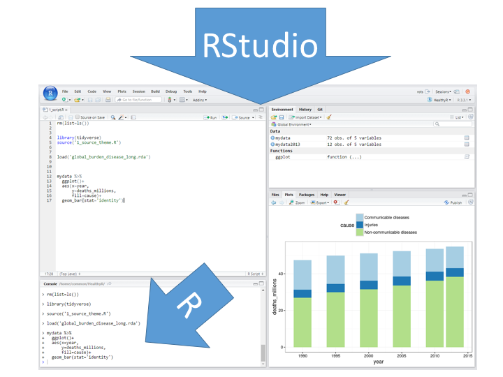

--- 
title: "HealthyR: R for healthcare data analysis"
author: "Ewen Harrison and Riinu Ots"
date: "16-January 2019"
site: bookdown::bookdown_site
output: bookdown::gitbook
documentclass: book
bibliography: [book.bib, packages.bib]
biblio-style: apalike
link-citations: yes
github-repo: SurgicalInformatics/healthyr_book/
description: "A HealthyR texbook for our 2.5-day quickstart training course."
colorlinks: yes
cover-image: images/healthyr_book_cover.png
---

# {-}

Version 0.3.1

Contributors: Riinu Ots, Ewen Harrison, Tom Drake, Peter Hall, Kenneth McLean.

This work is licensed under the Creative Commons Attribution-NonCommercial-NoDerivs 3.0 United States License. To view a copy of this license, visit http://creativecommons.org/licenses/by-nc-nd/3.0/us/


## Installation

<div class="healthyr">
<ul>
<li>Download R</li>
</ul>
</div>

https://www.r-project.org/

<div class="healthyr">
<ul>
<li>Install RStudio</li>
</ul>
</div>

https://www.rstudio.com/products/rstudio/

<div class="healthyr">
<ul>
<li>Install packages (copy these lines into the Console in RStudio):</li>
</ul>
</div>


```r
install.packages("tidyverse")

install.packages("gapminder")

install.packages("gmodels")

install.packages("Hmisc")

install.packages("devtools")

devtools::install_github("ewenharrison/finalfit")

install.packages("pROC")

install.packages("survminer")
```

<div class="warning">
<p>When working with data, don’t copy or type code directly into the Console. We will only be using the Console for viewing output, warnings, and errors (and installing packages as in the previous section). All code should be in a script and executed (=Run) using Control+Enter (line or section) or Control+Shift+Enter (whole script). Make sure you are always working in a project (the right-top corner of your RStudio interface should say “HealthyR”).</p>
</div>




