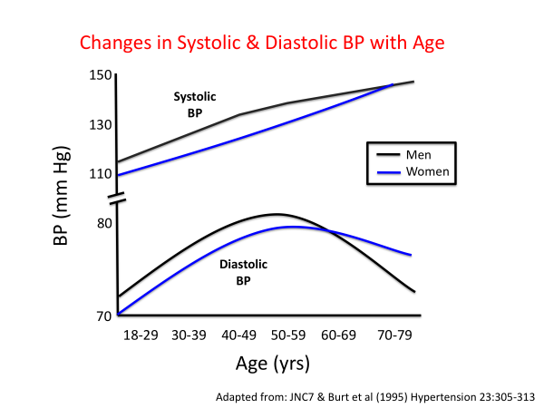
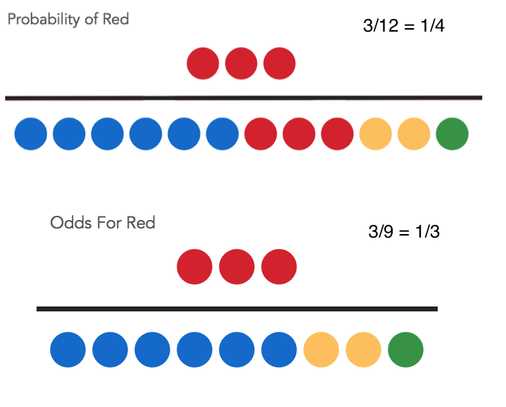

--- 
title: "HealthyR: R for healthcare data analysis"
author: "Ewen Harrison and Riinu Ots"
date: "2019-07-25"
site: bookdown::bookdown_site
output: bookdown::gitbook
documentclass: krantz
bibliography: [book.bib, packages.bib]
biblio-style: apalike
link-citations: yes
colorlinks: yes
graphics: yes
lot: yes
lof: yes
fontsize: 12pt
monofont: "Source Code Pro"
monofontoptions: "Scale=0.65"
github-repo: SurgicalInformatics/healthyr_book/
description: "An introductory book for healthcare data analysis using R."
cover-image: images/healthyr_book_cover.png
---


# Preface {-}

Version 0.3.1

Contributors: Riinu Ots, Ewen Harrison, Tom Drake, Peter Hall, Kenneth McLean.

This work is licensed under the Creative Commons Attribution-NonCommercial-NoDerivs 3.0 United States License. To view a copy of this license, visit http://creativecommons.org/licenses/by-nc-nd/3.0/us/


## Why read this book {-}

> We are drowning in information but starved for knowledge.  
> John Naisbitt

In this age of information, the manipulation, analysis and interpretation of data has become paramount. 
Nowhere more so than in the delivery of healthcare. 
From the understanding of disease and the development of new treatments, to the diagnosis and management of individual patients, the use of data and technology is now an integral part of the business of healthcare. 

Those working in healthcare interact daily with data, often without realising it. 
The conversion of this avalanche of information to useful knowledge is essential for high quality patient care. 
An important part of this information revolution is the opportunity for everybody to become involved in data analysis. 
This democratisation of data analysis is driven in part by the open source software movement – no longer do we require expensive specialised software to do this. 

The statistical programming language, R, is firmly at the heart of this! 

This book will take an individual with little or no experience in data analysis all the way through to performing sophisticated analyses. 
We emphasise the importance of understanding the underlying data with liberal use of plotting, rather than relying on opaque and possibly poorly understand statistical tests. 
There are numerous examples included that can be adapted for your own data, together with our own R packages with easy-to-use functions. 

We have a lot of fun teaching this course and focus on making the material as accessible as possible. 
We banish equations in favour of code and use examples rather than lengthy explanations. 
We are grateful to the many individuals and students who have helped refine these and welcome suggestions and bug reports via https://github.com/SurgicalInformatics. 

Ewen Harrison and Riinu Ots

August 2019

## Structure of the book {-}

Chapter \@ref(r-basics) introduces a new topic, and ...

## Software information and conventions {-}

I used the **knitr**\index{knitr} package [@xie2015] and the **bookdown**\index{bookdown} package [@R-bookdown] to compile my book. My R session information is shown below:


```r
xfun::session_info()
```

```
## R version 3.4.4 (2018-03-15)
## Platform: x86_64-pc-linux-gnu (64-bit)
## Running under: Ubuntu 16.04.5 LTS
## 
## Locale:
##   LC_CTYPE=en_GB.UTF-8      
##   LC_NUMERIC=C              
##   LC_TIME=en_GB.UTF-8       
##   LC_COLLATE=en_GB.UTF-8    
##   LC_MONETARY=en_GB.UTF-8   
##   LC_MESSAGES=en_GB.UTF-8   
##   LC_PAPER=en_GB.UTF-8      
##   LC_NAME=C                 
##   LC_ADDRESS=C              
##   LC_TELEPHONE=C            
##   LC_MEASUREMENT=en_GB.UTF-8
##   LC_IDENTIFICATION=C       
## 
## Package version:
##   base64enc_0.1.3  bookdown_0.7     compiler_3.4.4  
##   digest_0.6.20    evaluate_0.13    glue_1.3.1      
##   graphics_3.4.4   grDevices_3.4.4  highr_0.8       
##   htmltools_0.3.6  jsonlite_1.6     knitr_1.22      
##   magrittr_1.5     markdown_0.9     methods_3.4.4   
##   mime_0.6         Rcpp_1.0.2       rmarkdown_1.12.4
##   stats_3.4.4      stringi_1.4.3    stringr_1.4.0   
##   tinytex_0.11     tools_3.4.4      utils_3.4.4     
##   xfun_0.6         yaml_2.2.0
```

Package names are in bold text (e.g., **rmarkdown**), and inline code and filenames are formatted in a typewriter font (e.g., `knitr::knit('foo.Rmd')`). Function names are followed by parentheses (e.g., `bookdown::render_book()`).

## Acknowledgments {-}

A lot of people helped me when I was writing the book.

\BeginKnitrBlock{flushright}<p class="flushright">Frida Gomam  
on the Mars</p>\EndKnitrBlock{flushright}


<!-- This section should be moved somewhere a bit further down the line. -->

## Installation {-}


* Download R 

https://www.r-project.org/

* Install RStudio

https://www.rstudio.com/products/rstudio/


* Install packages (copy these lines into the Console in RStudio):


```r
install.packages("tidyverse")

install.packages("gapminder")

install.packages("gmodels")

install.packages("Hmisc")

install.packages("devtools")

devtools::install_github("ewenharrison/finalfit")

install.packages("pROC")

install.packages("survminer")
```

When working with data, don't copy or type code directly into the Console. We will only be using the Console for viewing output, warnings, and errors (and installing packages as in the previous section). All code should be in a script and executed (=Run) using Control+Enter (line or section) or Control+Shift+Enter (whole script). Make sure you are always working in a project (the right-top corner of your RStudio interface should say "HealthyR").


\includegraphics[width=5cm]{images/rstudio_vs_r} 

\mainmatter


<!--chapter:end:index.Rmd-->

# (PART) Data wrangling and visualisation {-}
# Your first R plots


In this session, we will create five beautiful and colourful barplots in less than an hour.
Do not worry about understanding every single word or symbol (e.g. the pipe - `%>%`) in the R code you are about to see. The purpose of this session is merely to

* gain familiarity with the RStudio interface:
    + to know what a script looks like,
    + what is the Environment tab,
    + where do your plots appear.

## Data

Load the example dataset which is already saved as an R-Data file (recognisable by the file extension .rda or .RData):


```r
library(ggplot2)

source("1_source_theme.R")

load("global_burden_disease_long.rda")
```

After loading the datasets, investigate your Environment tab (top-right). You will see two things listed: `mydata` and `mydata2013`, which is a subset of mydata.


Click on the name `mydata` and it will pop up next to where your script is.
Clicking on the blue button is not as useful (in this session), but it doesn't do any harm either.
Try it.

## First plot


```r
mydata %>% #press Control-Shift-M to insert this symbol (pipe)
  ggplot(aes(x      = year,
             y      = deaths_millions,
             fill   = cause,
             colour = cause)) +
  geom_col()
```

<!-- --> 


`ggplot()` stands for **grammar of graphics plot** - a user friendly yet flexible alternative to `plot()`.

`aes()` stands for **aesthetics** - things we can see.

`geom_()` stands for **geometric**.

### Question

Why are there two closing brackets - `))` - after the last aesthetic (colour)?


### Exercise 

Plot the number of deaths in Developed and Developing countries for the year 2013:

<!-- --> 


\newpage

## Comparing bars of different height

### Stretch each bar to 100%


`position="fill"` stretches the bars to show relative contributions:


```r
mydata2013 %>% 
  ggplot(aes(x      = location,
             y      = deaths_millions,
             fill   = cause,
             colour = cause)) +
  geom_col(position = "fill")
```

<!-- --> 


### Plot each bar next to each other

`position="dodge"` puts the different causes next to each rather (the default is `position="stack"`):


```r
mydata2013 %>% 
  ggplot(aes(x      = location,
             y      = deaths_millions,
             fill   = cause,
             colour = cause)) +
  geom_col(position = "dodge")
```

<!-- --> 


## Facets (panels)

Going back to the dataframe with all years (1990 -- 2015), add `facet_wrap(~year)` to plot all years at once:


```r
mydata %>% 
  ggplot(aes(x      = location,
             y      = deaths_millions,
             fill   = cause,
             colour = cause)) +
  geom_col() +
  facet_wrap(~year)
```

<!-- --> 


## Extra: using aethetics outside of the aes()

### Setting a constant fill

Using the `mydata2013` example again, what does the addition of `fill = "black"` in this code do?
Note that putting the `ggplot(aes())` code all on one line does not affect the result.


```r
mydata2013 %>% 
  ggplot(aes(x = location, y = deaths_millions, fill = cause, colour = cause)) +
  geom_col(fill = "black")
```

<!-- --> 

Setting aesthetics (x, y, fill, colour, etc.) outside of `aes()` sets them to a constant value.
R can recognise of a lot of colour names, e.g., try "cornflowerblue", "firebrick", or just "red", "green", "blue", etc.
For a full list, search Google for "Colours in R". R also knows HEX codes, e.g. `fill = "#fec3fc"` is pink.


### Exercise

What is the difference between colour and fill in the context of a barplot?

Hint: Use `colour = "black"` instead of `fill = "black"` to investigate what `ggplot()` thinks a colour is. 


```r
mydata2013 %>% 
  ggplot(aes(x = location, y = deaths_millions, fill = cause, colour = cause))+
  geom_col(colour = "black")
```

<!-- --> 

### Exercise

Why are some of the words in our code quoted (e.g. `fill = "black"`) whereas others are not (e.g. `x = location`)?

## Two geoms for barplots: `geom_bar()` or `geom_col()`

Both `geom_bar()` and `geom_col()` create barplots. If you:

* Want to visualise the count of different lines in a dataset - use geom_bar()
    + For example, if you are using a patient-level dataset (each line is a patient record):
    `mydata %>% 
     ggplot(aes(x = sex)) +
     geom_bar()`
  
* Your dataset is already summarised - use geom_col()
    + For example, in the GBD dataset we use here, each line already includes a summarised value (`deaths_millions`)

If you have used R before you might have come across `geom_bar(stat = "identity")` which is the same as `geom_col()`.


## Solutions

**1.2.1:**
There is a double closing bracket because `aes()` is wrapped inside `ggplot()` - `ggplot(aes())`.


**1.2.2:**

```r
mydata2013 %>% 
  ggplot(aes(x      = location,
             y      = deaths_millions,
             fill   = cause,
             colour = cause)) +
  geom_col()
```


**1.5.2:**

On a barplot, the colour aesthetic outlines the fill.
In a later session we will see, however, that for points and lines, colour is the main aesthetic to define.

**1.5.3:**

Words in quotes are generally something set to a constant value (e.g. make all outlines black, rather than colour them based on the cause they are representing).
Unquoted words are generally variables (or functions).
If the word "function" just threw you, Google "Jesse Maegan: What the h*ck is a function"


<!--chapter:end:01_first_interaction.Rmd-->

---
output: html_document
editor_options: 
  chunk_output_type: inline
---
# R Basics


The aim of this chapter is to familiarise you with how R works. 
We will read in data and start basic manipulations. 
We will be working with a shorter version of the Global Burden of Disease dataset that we met earlier. 


## Getting help

RStudio has a built in Help tab. 
To use the Help tab, click your cursor on something in your code (e.g. `read_csv()`) and press F1. This will show you the definition and some examples. 
However, the Help tab is only useful if you already know what you are looking for but can't remember exactly how it works. 
For finding help on things you have not used before, it is best to Google it. 
R has about 2 million users so someone somewhere has had the same question or problem.


## Objects and functions

The two fundamental concepts to understand about statistical programming are objects and functions. 
As usual, in this book, we prefer introducing new concepts using specific examples first.
And then define things in general terms after examples.

The most common data object you will be working with is a table - so something with rows and columns. 
It should be regular, e.g., the made-up example in Table \@ref(tab:chap2-tab-examp1).
^[Regular does not mean it can't have missing values.
Missing values are denoted `NA` which stands for either `Not available` or `Not applicable`. 
In same contexts, these things can have a different meaning. 
For example, since `var2` is `NA` for all male subjects, it may mean "Not applicable", i.e. something that can only be measured in females.
Whereas in `var3`, `NA` is more likely to mean "Not available" so real missing data, e.g. lost to follow-up.]

\begin{table}[t]

\caption{(\#tab:chap2-tab-examp1)Example of a table (=tibble once read into R), including missing values denoted NA (Not applicable/Not available).}
\centering
\fontsize{8}{10}\selectfont
\begin{tabular}{rlrrr}
\toprule
id & sex & var1 & var2 & var3\\
\midrule
1 & Male & 4 & NA & 2\\
2 & Female & 1 & 4 & 1\\
3 & Female & 2 & 5 & NA\\
4 & Male & 3 & NA & NA\\
\bottomrule
\end{tabular}
\end{table}


A table can live anywhere: on paper, in a Spreadsheet, in an SQL database, or it can live in your R Session's Environment. 
And yes, R sessions are as fun as they sound, almost as fun as, e.g., music sessions. 
We usually initiate and interface R using RStudio, but everything we talk about here (objects, functions, sessions, environment) also work when RStudio is not available, but R is. 
This can be the case if you are working on a supercomputer that can only serve the R Console, and not an RStudio IDE (reminder from first chapter: Integrated Development Environment). 
So, regularly shaped data in rows and columns is called table when it lives outside R, but once you read it into R (import it), we call it a tibble.
^[There used to be an older version of tables in R - they are called data frames. 
In most cases, `data frames` and `tibbles` work interchangeably (and both are R objects), but `tibbles` are newer and better. 
Another great alternative to base R's `data frames` are `data tables`. 
In this book, and for most of our day-to-day work these days, we use `tibbles` though.]
When you are in one of your very cool R sessions and read in some data, it goes into this session's Environment. Everything in your Environment needs to have a name as you can have multiple tibbles going on at the same time (`tibble` is not a name, it is the class of an object). To keep our code examples easy to follow, we call our example tibble `mydata`. In real analysis, you should give your tibbles meaningful names, e.g., `patient_data`, `lab_results`, `annual_totals`, etc.

So, the tibble named `mydata` is example of an object that can be in the Environment of your R Session:


```r
mydata
```

```
## # A tibble: 4 x 5
##      id sex     var1  var2  var3
##   <int> <chr>  <dbl> <dbl> <dbl>
## 1     1 Male       4    NA     2
## 2     2 Female     1     4     1
## 3     3 Female     2     5    NA
## 4     4 Male       3    NA    NA
```

An example of a function that can be applied on numeric data is `mean()`. 
R functions always have round brackets after their name. 
This is for two reasons. 
First, to easily differentiate them from objects - which don't have round brackets after their name. 
Second, and more important, we can put arguments in these brackets. 
Arguments can also be thought of as input, and in data analysis, the most common input for a function is data: we need to give `mean()` some data to average over. 
It does not make sense (nor will it work) to feed it the whole tibble that has multiple columns, including patient IDs and a categorical variable (`sex`). 
To quickly extract a single column, we use the `$` symbol like this:


```r
mydata$var1
```

```
## [1] 4 1 2 3
```

You can ignore the `## [1]` at the beginning of the extracted values - this is something that becomes more useful when printing multiple lines of data as the number in the square brackets keeps count on how many values we are seeing.

We can then use `mydata$var1` as the first argument of `mean()` by putting it inside its brackets:


```r
mean(mydata$var1)
```

```
## [1] 2.5
```

Which tells us that the mean of `var1` (4, 1, 2, 3) is 2.5.
In this example, `mydata$var1` is the first and only argument to `mean()`.
But what happens if we try to calculate the average value of `var2` (NA, 4, 5, NA)?


```r
mean(mydata$var2)
```

```
## [1] NA
```

We get an `NA` ("Not applicable").
We would expect to see an `NA` if we tried to, for example, calculate the average of `sex`:


```r
mean(mydata$sex)
```

```
## Warning in mean.default(mydata$sex): argument is not numeric or logical:
## returning NA
```

```
## [1] NA
```

In fact, in this case, R also gives us a pretty clear warning suggesting it can't compute the mean of an argument that is not numeric or logical. 
The sentence actually reads pretty fun, as if R was saying it was not logical to calculate the mean of something that is not numeric. 
But what R is actually saying that it is happy to calculate the mean of two types of variables: numerics or logicals, but what you have passed it is neither.
^[Logical is a data type with two potential values: TRUE or FALSE.
We will come back to data types shortly.]

So `mean(mydata$var2)` does not return an Error, but it also doesn't return the mean of the numeric values included in this column. 
That is because the column includes missing values (`NAs`), and R does not want to average over NAs implicitly.
It is being cautious - what if you didn't know there were missing values for some patients?
If you wanted to compare the means of `var1` and `var2` without any further filtering, you would be comparing samples of different size. 
Which might be fine if the sample sizes are sufficiently representative and the values are missing at random. 
Therefore, if you decide to ignore the NAs and want to calculate the mean anyway, you can do so by adding another argument to `mean()`:


```r
mean(mydata$var2, na.rm = TRUE)
```

```
## [1] 4.5
```

Adding `na.rm = TRUE` tells R that you are happy for it to calculate the mean of any existing values (but to remove - `rm` - the `NA` values).
This 'removal' excludes the NAs from the calculation, it does not affect the actual tibble (`mydata`) holding the dataset. 
R is case sensitive, so it has look exactly how the function expects it, so `na.rm`, not `NA.rm` etc. 
There is, however, no need to memorise how the arguments of functions are exactly spelled - this is what the Help tab (press `F1` when the cursor is on the name of the function) can remind you of. 
Functions' help pages are built into R, so an internet connection is not required for this.

> Make sure to separate multiple arguments with commas, or R will give you an error of `Error: unexpected symbol`.

Finally, some functions do not need any arguments to work.
A good example is the `Sys.time()` which returns the current time and date. 
This is very useful when using R to generate and update reports automatically.
Including this means you can always be clear on when the results were last updated.


```r
Sys.time()
```

```
## [1] "2019-07-25 20:43:22 BST"
```

To summarise, objects and functions work hand in hand. 
Objects are both an input as well as the output of a function (what the function returns). 
The data values input into a function are usually its first argument, further arguments can be used to specify a function's behaviour. 
When we say "the function returns", we are referring to its output (or an Error if it's one of those days).
The returned object can be different to its input object.
In our `mean()` examples above, the input object was a column (`mydata$var1`: 4, 1, 2, 3), whereas the output was a single value: 2.5.

## Working with Objects

To create a new object into our Environment we use the equals sign:


```r
a = 103
```

This reads: the variable `a` is assigned value 103. You know that the assignment worked when it shows up in the Environment tab.
If we now run `a` just on its own, it gets printed back to us:


```r
a
```

```
## [1] 103
```

Similarly, if we run a function without assignment to a variable, it gets printed but not saved in your Environment:


```r
seq(15, 30)
```

```
##  [1] 15 16 17 18 19 20 21 22 23 24 25 26 27 28 29 30
```

`seq()` is a function that creates a sequence of numbers (+1 by default) between the two arguments you pass to it in its brackets. 
We can assign the result of `seq(15, 30)` into a variable, let's call it `example_sequence`:


```r
example_sequence = seq(15, 30)
```

Doing this creates `example_sequence` in our Environment, but it does not print it. 

> If you save the results of an R function in a variable, it does not get printed. If you run a function without the assignment (`=`), its results get printed, but not saved in a variable.

You can call your variables (where you assigns new objects or the output of functions in) pretty much anything you want, as long as it starts with a letter. 
It can then include numbers as well, for example, we could have named the new variable `sequence_15_to_30`.
Spaces in variable names are not easy to work with, we tend to use underscores in their place, but you could also use capitalisation, e.g. `exampleSequence = seq(15, 30)`.

Finally, R doesn't mind overwriting an existing variable, for example (notice how we then include the variable on a new line to get it printed as well as overwritten):


```r
example_sequence = example_sequence/2

example_sequence
```

```
##  [1]  7.5  8.0  8.5  9.0  9.5 10.0 10.5 11.0 11.5 12.0 12.5 13.0 13.5 14.0
## [15] 14.5 15.0
```


>Note that many people use `<-` instead of `=`. 
>They mean the same thing in R: both `=` and `<-` save what is on the right into the variable name on the left. 
>There is also a left-to-right operator: `->`.

## Pipe - `%>%` 

The pipe - denoted `%>%` - is probably the oddest looking thing you'll see in this book. But please bear with, it is not as scary as it looks! Furthermore, it is super useful. We use the pipe to send objects into functions.

In the above examples, we calculated the mean of column `var1` from `mydata` by `mean(mydata$var1)`. With the pipe, we can rewrite this as:


```r
library(tidyverse)
mydata$var1 %>% mean()
```

```
## [1] 2.5
```

Which reads: "Working with `mydata`, we select a single column called `var1` (with the `$`) **and then** calculate the `mean()`." The pipe becomes especially useful once the analysis includes multiple steps applied one after another. A good way to read and think of the pipe is **"and then"**.
This piping business is not standard R functionality and before using it in a script, you need to tell R this is what you will be doing.
The pipe comes from the "magrittr" package (Figure \@ref(fig:chap2-fig-pipe)), but loading the tidyverse will also load the pipe.
So library(tidyverse) initialises everything you need (no need to include library(magrittr) explicitly).


>To insert a pipe `%>%`, use the keyboard shortcut `Ctrl+Shift+M`.


With or without the pipe, the general rule "if the result gets printed it doesn't get saved" still applies. To save the result of the function into a new variable (so it shows up in the Environment), you need to add the name of the new variable with the assignment operator (`=`):


```r
mean_result = mydata$var1 %>% mean()
```


\begin{figure}
\includegraphics[width=5.56in]{images/chapter02/magrittr} \caption{This is not a pipe. René Magritte inspired artwork by Stefan Milton Bache (creator of `%>%` in R). Image source: https://cran.r-project.org/web/packages/magrittr/vignettes/magrittr.html}(\#fig:chap2-fig-pipe)
\end{figure}


## Reading data into R

We mentioned before that once a table (e.g. from spreadsheet or database) gets read into R we start calling it a `tibble`. 
The most common format data comes to us in is CSV (comma separated values). 
CSV is basically an uncomplicated spreadsheet with no formatting or objects other than a single table with rows and columns (no worksheets or formulas).
Furthermore, you don't need special software to quickly view a CSV file - a text editor will do, and that includes RStudio.

For example, look at "example_data.csv" in the healthyr project's folder in Figure \@ref(fig:chap2-fig-examplecsv) (this is the Files pane at the bottom-right corner of your RStudio).

\begin{figure}
\includegraphics[width=7.68in]{images/chapter02/files_csv_example} \caption{View or import a data file.}(\#fig:chap2-fig-examplecsv)
\end{figure}

Clicking on a data file gives us two options: `View File` or `Import Dataset`. 
For very standard CSV files, we don't usually bother with the Import interface and just type in (or copy from a previous script):


```r
library(tidyverse)
example_data = read_csv("example_data.csv")
```

Without further arguments, `read_csv()` defaults to:

* values are delimited by commas (e.g., `id, var1, var2, ...`)
* numbers use decimal point (e.g., `4.12`), rather than decimal comma (e.g., `4,12`)
* the first line has column names (it is a "header")
* missing values are empty or denoted NA

If your file, however, is different to these, then the `Import Dataset` interface (Figure \@ref(fig:chap2-fig-examplecsv)) is very useful as it will give you the relevant `read_()` syntax with all the extra arguments filled in for you.

\begin{figure}
\includegraphics[width=20.44in]{images/chapter02/import_options} \caption{Import: Some of the special settings your data file might have.}(\#fig:chap02-fig-import-tool)
\end{figure}


\begin{figure}
\includegraphics[width=13.08in]{images/chapter02/code_preview} \caption{After using the Import Dataset window, copy-paste the resulting code into your script.}(\#fig:chap02-fig-import-code)
\end{figure}

After selecting the specific options for your import file (there is a friendly preview window too, so you can immediately see whether R understands the format of the your data file), DO NOT BE tempted to press the `Import` button. 
Yes, this will read in your dataset once, but means you have to redo the selections every time you come back to RStudio.
Do copy-paste the code it gives you (e.g., Figure \@ref(fig:chap02-fig-import-code)) into your R script - this way you can use it over and over again. 
Making sure all steps are recorded in scripts makes your workflow reproducible by your future self, colleagues, supervisors, extraterrestrials. 

>The `Import Dataset` can also help you to read in Excel, SPSS, Stata, or SAS files (instead of read_csv(), it will give you `read_excel()`, `read_sav()`, `read_stata()`, or `read_sas()).

If you've used R before or are trying to make sense of legacy scripts passed on to you by colleagues, you might see `read.csv()` rather than `read_csv()`. In short: `read_csv()` is faster and better, and in all new scripts that's what you should use. But in existing scripts that work and are tested, do not just start replacing `read.csv()` with `read_csv()`. The thing is, `read_csv()` handles categorical variables slightly differently ^[It does not silently convert strings to factors, i.e., it defaults to `stringsAsFactors = FALSE`. For those not familiar with the terminology here - don't worry, we will cover this in just a few sections.]. This means that an R script written using the `read.csv()` might not work as expected any more if just replaced with `read_csv()`.

> Do not start updating and possibly breaking existing R scripts by replacing base R functions with the tidyverse ones we show here. Do use the modern functions in any new code you write. 


### Reading in the Global Burden of Disease example dataset (short version)

In the next few chapters of this book, we will be using the Global Burden of Disease datasets. 
The Global Burden of Disease Study (GBD) is the most comprehensive worldwide observational epidemiological study to date. 
It describes mortality and morbidity from major diseases, injuries and risk factors to health at global, national and regional levels.
^[Global Burden of Disease Collaborative Network.
Global Burden of Disease Study 2017 (GBD 2017) Results.
Seattle, United States: Institute for Health Metrics and Evaluation (IHME), 2018.
Available from http://ghdx.healthdata.org/gbd-results-tool.]

GBD data are publicly available from their website. Table \@ref(tab:chap2-tab-gbd) and Figure \@ref(fig:chap2-fig-gbd) show a very high level version of the propject's data with just 3 variables: cause, year, deaths (number of people who die of each cause every year). Later, we will be using a longer dataset with different subgroups and we will show you how to summarise comprehensive datasets yourself.


```r
library(tidyverse)
gbd_short = read_csv("data/global_burden_disease_SHORT.csv")
```

\begin{table}[t]

\caption{(\#tab:chap2-tab-gbd)Deaths per year from three broad disease categories (short version of the Global Burden of Disease example dataset).}
\centering
\fontsize{8}{10}\selectfont
\begin{tabular}{lcr}
\toprule
cause & year & deaths\\
\midrule
Communicable diseases & 1990 & 15,392,200\\
Injuries & 1990 & 4,260,493\\
Non-communicable diseases & 1990 & 26,825,621\\
\addlinespace
Communicable diseases & 1995 & 15,132,654\\
Injuries & 1995 & 4,543,803\\
Non-communicable diseases & 1995 & 29,407,049\\
\addlinespace
Communicable diseases & 2000 & 14,835,531\\
Injuries & 2000 & 4,568,246\\
Non-communicable diseases & 2000 & 31,138,228\\
\addlinespace
Communicable diseases & 2005 & 13,906,587\\
Injuries & 2005 & 4,500,881\\
Non-communicable diseases & 2005 & 33,015,795\\
\addlinespace
Communicable diseases & 2010 & 12,528,020\\
Injuries & 2010 & 4,718,076\\
Non-communicable diseases & 2010 & 35,592,216\\
\addlinespace
Communicable diseases & 2015 & 10,882,449\\
Injuries & 2015 & 4,486,745\\
Non-communicable diseases & 2015 & 39,452,999\\
\addlinespace
Communicable diseases & 2017 & 10,389,874\\
Injuries & 2017 & 4,484,722\\
Non-communicable diseases & 2017 & 41,071,133\\
\bottomrule
\end{tabular}
\end{table}


```
## Warning: Unknown or uninitialised column: 'year'.
```

 

\clearpage

## Operators for filtering data

Operators are symbols that tell R how to handle different pieces of data or objects.
We have already introduced three: `$` (selects a column), `=` (assignes values or results to a variable), and the pipe - `%>%` (sends data into a function).

Other common operators are the ones we use for filtering data - these are called comparison and logical operators.
This may be for creating subgroups, or for excluding outliers or incomplete cases.

The comparison operators that work with numeric data are relatively straightforward: `>, <, >=, <=`.
The first two check whether your values are greater or less than another value, the last two check for "greater than or equal to" and "less than or equal to. These opreators are most commonly spotted inside the `filter()` function:


```r
gbd_short %>% 
  filter(year < 1995)
```

```
## # A tibble: 3 x 3
##   cause                      year    deaths
##   <chr>                     <dbl>     <dbl>
## 1 Communicable diseases      1990 15392200.
## 2 Injuries                   1990  4260493.
## 3 Non-communicable diseases  1990 26825621.
```
Here we send the data (`gbd_short`) to the `filter()` and ask it to retain all years that are less than 1995.
The resulting tibble only includes the year 1990.
Now, if we use the `<=` (less than or equal to) operator, both 1990 and 1995 pass the filter:

```r
gbd_short %>% 
  filter(year <= 1995)
```

```
## # A tibble: 6 x 3
##   cause                      year    deaths
##   <chr>                     <dbl>     <dbl>
## 1 Communicable diseases      1990 15392200.
## 2 Injuries                   1990  4260493.
## 3 Non-communicable diseases  1990 26825621.
## 4 Communicable diseases      1995 15132654.
## 5 Injuries                   1995  4543803.
## 6 Non-communicable diseases  1995 29407049.
```

Furthermore, the values either side of the operator could both be variables, e.g., `mydata %>% filter(var2 > var1)`.

To filter for values that are equal to something, we use the `==` operator. For example, the first filtering example was actually equivalent to:


```r
gbd_short %>% 
  filter(year == 1995)
```

```
## # A tibble: 3 x 3
##   cause                      year    deaths
##   <chr>                     <dbl>     <dbl>
## 1 Communicable diseases      1995 15132654.
## 2 Injuries                   1995  4543803.
## 3 Non-communicable diseases  1995 29407049.
```

Accidentally using the single equals (`=` so the assignment operator) is a very common mistake and still ocasionally happens to the best of us.
In fact, it happens so often that the error the `filter()` function gives when using the wrong one also reminds us what the correct one was


```r
gbd_short %>% 
  filter(year = 1995)
```

```
## `year` (`year = 1995`) must not be named, do you need `==`?
```

> The answer to 'do you need ==?" is almost always "Yes R, I do, thank you".

But that's just because `filter()` is a clever cookie and used to this very common mistake.
There are other useful functions we use these operators in, but they don't always know to tell us that we've just confused `=` for `==`.
So whenever checking for equality of variables but the result is not what you expect (you'll get an Error, but not necessary with the same wording as above), remember to check your `==` operators first.

R also has two operators for combining multiple comparisons: & and |, which stand for AND and OR, respectively.
For example, we can filter to only keep the earliest and latest years in the dataset:


```r
gbd_short %>% 
  filter(year == 1995 | year == 2017)
```

```
## # A tibble: 6 x 3
##   cause                      year    deaths
##   <chr>                     <dbl>     <dbl>
## 1 Communicable diseases      1995 15132654.
## 2 Injuries                   1995  4543803.
## 3 Non-communicable diseases  1995 29407049.
## 4 Communicable diseases      2017 10389874.
## 5 Injuries                   2017  4484722.
## 6 Non-communicable diseases  2017 41071133.
```

This reads: take the GBD dataset, send it to the filter to keep rows where year is equal to 1995 or year is equal to 2017.
Using specific values like we've done there (1995/2017) is called "hard-coding", which is fine if we know for sure we don't want to apply the same script on an updated dataset. But a cleverer way of achieving the same thing is to use the `min()` and `max()` functions:


```r
gbd_short %>% 
  filter(year == max(year) | year == min(year))
```

```
## # A tibble: 6 x 3
##   cause                      year    deaths
##   <chr>                     <dbl>     <dbl>
## 1 Communicable diseases      1990 15392200.
## 2 Injuries                   1990  4260493.
## 3 Non-communicable diseases  1990 26825621.
## 4 Communicable diseases      2017 10389874.
## 5 Injuries                   2017  4484722.
## 6 Non-communicable diseases  2017 41071133.
```


\begin{table}[t]

\caption{(\#tab:chap2-tab-filtering-operators)Filtering operators.}
\centering
\fontsize{8}{10}\selectfont
\begin{tabular}{lc}
\toprule
Operators & Meaning\\
\midrule
== & Equal to\\
!= & Not equal to\\
< & Less than\\
> & Greater than\\
<= & Less than or equal to\\
>= & Greater then or equal to\\
\& & AND\\
\addlinespace
| & OR\\
\bottomrule
\end{tabular}
\end{table}

| Symbol  | What does  | Example  | Example result|
|-------- | ---------  | -------- |-------|
| `%>% `   | sends data into a function | `x %>% print()` | 2 |
| `::`     | indicates package | `dplyr::count()` | `count()` fn. from the `dplyr` package|
| `->`            | assigns | `2 -> x` | the value of x is now 2 |

| `%in%`          | is value in list | `x %in% c(1,2,3)` | TRUE |
| `$`             | select a column | `mydata$year` | 1990,1996,...|
| `c()`           | combines values | `c(1, 2)`     | 1, 2 |
| `#`               | comment| `#Riinu changed this` | ignored by R   |


### Worked examples

Filter the dataset to only include the year 2000. Save this in a new variable using the assignment operator.


```r
mydata_year2000 = gbd_short %>% 
  filter(year == 2000)
```

Let's practice combining multiple selections together.

Reminder: '|' means OR and '&' means AND.

From `gbd_short`, select the lines where year is either 1990 or 2017 and cause is "Communicable diseases":


```r
new_data_selection = gbd_short %>% 
  filter((year == 1990 | year == 2013) & cause == "Communicable diseases")

# Or we can get rid of the extra brackets around the years
# by moving cause into a new filter on a new line:

new_data_selection = gbd_short %>% 
  filter(year == 1990 | year == 2013) %>% 
  filter(cause == "Communicable diseases")
```

## Missing values (NAs) and filters

Filtering for missing values (NAs) needs your special attention and care.
Remember the small example tibble from Table \@ref(tab:chap2-tab-examp1) - it has some NAs in columns `var2` and `var3`:


```r
mydata
```

```
## # A tibble: 4 x 5
##      id sex     var1  var2  var3
##   <int> <chr>  <dbl> <dbl> <dbl>
## 1     1 Male       4    NA     2
## 2     2 Female     1     4     1
## 3     3 Female     2     5    NA
## 4     4 Male       3    NA    NA
```


If we now want to filter for rows where `var2` is missing, `filter(var2 == NA)` is not the way to do it, it will not work. 
Since R is a programming language, it can be a bit stubborn with things like these.
When you ask R to do a comparison using `==` (or `<`, `>`, etc.) it expects a value on each side, but NA is not a value, it is the lack thereof.
The way to filter for missing values is using the `is.na()` function:


```r
mydata %>% 
  filter(is.na(var2))
```

```
## # A tibble: 2 x 5
##      id sex    var1  var2  var3
##   <int> <chr> <dbl> <dbl> <dbl>
## 1     1 Male      4    NA     2
## 2     4 Male      3    NA    NA
```
We send `mydata` to the filter and keep rows where `var2` is `NA`. 
Note the double brackets at the end: that's because the inner one belongs to `is.na()`, and the outer one to `filter()`.
Missing out a closing bracket is also a very common source of (minor, easily fixed) mistakes, and it still happens to the best of us.

If filtering for rows where `var2` is not missing, we do this:


```r
mydata %>% 
  filter(! is.na(var2))
```

```
## # A tibble: 2 x 5
##      id sex     var1  var2  var3
##   <int> <chr>  <dbl> <dbl> <dbl>
## 1     2 Female     1     4     1
## 2     3 Female     2     5    NA
```

In R, the exclamation mark (!) means "not".

Sometimes you want to drop a specific value (e.g. an outlier) from the dataset like this. The small example tibble `mydata` has 4 rows, with the values for `var2` as follows: NA, 4, 5, NA. We can exclude the row where `var2` is equal to 5 by using the "not equals" (`!=`)^[ `filter(var2 != 5) is equivalent to filter(! var2 == 5)`]:


```r
mydata %>% 
  filter(var2 != 5)
```

```
## # A tibble: 1 x 5
##      id sex     var1  var2  var3
##   <int> <chr>  <dbl> <dbl> <dbl>
## 1     2 Female     1     4     1
```

However, you'll see that by doing this, R drops the rows where `var2` is NA as well, as it can't be sure these missing values were not equal to 5.

If you want to keep the missing values, you need to make use of the OR (`|`) operator and the `is.na()` function:


```r
mydata %>% 
  filter(var2 != 5 | is.na(var2))
```

```
## # A tibble: 3 x 5
##      id sex     var1  var2  var3
##   <int> <chr>  <dbl> <dbl> <dbl>
## 1     1 Male       4    NA     2
## 2     2 Female     1     4     1
## 3     4 Male       3    NA    NA
```

Being caught out by missing values, either in filters or other functions is very common (remember mydata$var2 %>% mean() returns NA unless you add `na.rm = TRUE`). This is also why we insist that you always plot your data first - outliers will reveal themselves and NA values usually become obivious too.

Another thing we do to stay safe around filters and missing values is saving the results and making sure the number of rows still add up:


```r
subset1 = mydata %>% 
  filter(var2 == 5)

subset2 = mydata %>% 
  filter(! var2 == 5)

subset1
```

```
## # A tibble: 1 x 5
##      id sex     var1  var2  var3
##   <int> <chr>  <dbl> <dbl> <dbl>
## 1     3 Female     2     5    NA
```

```r
subset2
```

```
## # A tibble: 1 x 5
##      id sex     var1  var2  var3
##   <int> <chr>  <dbl> <dbl> <dbl>
## 1     2 Female     1     4     1
```

If the numbers are small, you can now quickly look at RStudio's Environment tab and figure out whether the number of observations (rows) in `subset1` and `subset2` add up to the whole dataset (`mydata`). Or use the `nrow()` function to as R to tell you what the number of rows is in each dataset:

Rows in `mydata`:


```r
nrow(mydata)
```

```
## [1] 4
```

Rows in `subset1`:

```r
nrow(subset1)
```

```
## [1] 1
```

Rows in `subset2`:

```r
nrow(subset2)
```

```
## [1] 1
```

Asking R whether adding these two up equals the original size:


```r
nrow(subset1) + nrow(subset2) == nrow(mydata)
```

```
## [1] FALSE
```


## Types of variables


```r
mydata = gbd_short
```


**consider structuring as per here: https://finalfit.org/articles/data_prep.html - AGREED, will do asap**

Like many other types of statistical software, R needs to know the variable type of each column. The main types are:

### Characters

**Characters** (sometimes referred to as *strings* or *character strings*) in R are letters, words, or even whole sentences (an example of this may be free text comments). 
We can specify these using the `as.character()` function. Characters are displayed in-between `""` (or `''`).

### Factors

**Factors** are fussy characters. 
Factors are fussy because they have something called levels. 
Levels are all the unique values this variable could take - e.g. like when we looked at `mydata$cause %>% unique()`.
Using factors rather than just characters can be useful because:


* The values factor levels can take is fixed. 
For example, if the levels of your column called `sex` are "Male" and "Female" and you try to add a new patient where sex is called just "F" you will get a warning from R. 
If `sex` was a character column rather than a factor R would have no problem with this and you would end up with "Male", "Female", and "F" in your column.
* Levels have an order. 
When we plotted the different causes of death in the last session, R ordered them alphabetically (because `cause` was a character rather than a factor). 
But if you want to use a non-alphabetical order, e.g. "Communicable diseases"-"Non-communicable diseases"-"Injuries", we need make `cause` into a factor. 
Making a character column into a factor enables us to define and change the order of the levels. 
Furthermore, there are useful tools such as `fct_inorder` or `fct_infreq` that can order factor levels for us.


These can be huge benefits, especially as a lot of medical data analyses include comparing different risks to a reference level. 
Nevertheless, the fussiness of factors can sometimes be unhelpful or even frustrating. 
For example, if you really did want to add a new level to your `gender` column (e.g., "Prefer not to say") you will either have to convert the column to a character, add it, and convert it back to a factor, or use `fct_expand` to add the level and then add your new line.

#### Exercise

Temporarily type `fct_inorder` anywhere in your script, then press F1. 
Read the **Description** in the Help tab and discuss with your neighbour how `fct_inorder` and `fct_infreq` would order your factor levels.


### Numbers

Self-explanatory! 
These are numbers. 
In R, we specify these using the `as.numeric()` function. 
Numbers without decimal places are sometimes called integers. 
Click on the blue arrow in front of `mydata` in the Environment tab and see that `year` is an `int` (integer) whereas `deaths` is a `num` (numeric).


### Specifying variable types


```r
as.character(mydata$cause)

as.numeric(mydata$year)

factor(mydata$year)

#Lets save the cause as a factor

mydata$cause = factor(mydata$cause)

#Now lets print it out

mydata$cause
```

### Exercise

Change the order of the levels in `mydata$cause` so that "Non-communicable diseases" come before "Injuries". 
Hint: use F1 to investigate examples of how `fct_relevel()` works.


## Adding columns to dataframes

If we wanted to add in a new column or variable to our data, we can simply use the dollar sign '$' to create a new variable inside a pre-existing piece of data:


```r
mydata$new = 1

mydata$new2 = 1:21
```

Run these lines and click on `mydata` in the Environment tab to check this worked as expected.

Conversely, if we want to delete a specific variable or column we can use the 'NULL' function, or alternatively ask R to `select()` the data without the new variable included.


```r
mydata$new = NULL

mydata = mydata %>% 
  select(-new2)
```

We can make new variables using calculations based on variables in the data too.

The mutate function is useful here. 
All you have to specify within the mutate function is the name of the variable (this can be new or pre-existing) and where the new data should come from.

There are two equivalent ways of defining new columns based on a calculation with a previous column:

**mutate formally introduced in later chapter. Need to think how best to present this in book.**


```r
# First option

mydata$years_from_1990 = mydata$year - 1990 
mydata$deaths_millions = mydata$deaths/1000000

# Second option (mutate() function)

mydata = mydata %>% 
  mutate(years_from_1990 = year-1990,
         deaths_millions = deaths/1000000) 
```

Throughout this course we will be using both of these ways to create or modify columns. 
The first option (using the `$`) can look neater when changing a single variable, but when combining multiple ones you will end up repeating `mydata$`. 
`mutate()` removes the duplication, but it does add a new line and brackets. 


## Rounding numbers

We can use `round()` to round the new variables to create integers.

### Exercise

Round the new column `deaths_millions` to no decimals:


```
##  [1] 15  4 27 15  5 29 15  5 31 14  5 33 13  5 36 11  4 39 10  4 41
```

* How would you round it to 2 decimals? Hint: use F1 to investigate `round()`. 

* What do `ceiling()` and `floor()` do? Hint: sometimes you want to round a number up or down.

## The combine function: c()

The combine function combines several values: `c()`

The combine function can be used with numbers or characters (like words or letters):


```r
examplelist = c("Red", "Yellow", "Green", "Blue")

# Ask R to print it by executing it on its own line

examplelist
```

```
## [1] "Red"    "Yellow" "Green"  "Blue"
```

### Exercise

There are 18 lines (observations) in mydata. 
Create a new variable using `c()` with 18 values (numbers, words, whichever you like, e.g. like we created `examplelist`). 
Then add it as new column to `mydata$newlist`. 
Advanced version: do this using a combination of `rep()` and `c()`.

\newpage
## The `paste()` function

The `paste()` function is used to paste several words or numbers into one character variable/sentence.

In the paste function we need to specify what we would like to combine, and what should separate the components. 
By default, the separation is a space, but we can change this using the `sep =` option within the paste function.

So, for example if we wanted to make a sentence:


```r
# 
#paste("Edinburgh", "is", "Great")

# Lets add in full stops


paste("Edinburgh", "is", "Great", sep = ".")
```

```
## [1] "Edinburgh.is.Great"
```

```r
# separator needs to go in "" as it is a character


# If we really like Edinburgh

#paste("Edinburgh", "is", "Great", sep = "!")

# If we want to make it one word

#paste("Edinburgh", "is", "Great", sep = "") # no separator (still need the brackets)
```

We can also join two different variables together using `paste()`: 


```r
paste("Year is", mydata$year)
```

```
##  [1] "Year is 1990" "Year is 1990" "Year is 1990" "Year is 1995"
##  [5] "Year is 1995" "Year is 1995" "Year is 2000" "Year is 2000"
##  [9] "Year is 2000" "Year is 2005" "Year is 2005" "Year is 2005"
## [13] "Year is 2010" "Year is 2010" "Year is 2010" "Year is 2015"
## [17] "Year is 2015" "Year is 2015" "Year is 2017" "Year is 2017"
## [21] "Year is 2017"
```


### Exercise

Fix this code:

Hint: Think about characters and quotes!


```r
paste(Today is, Sys.Date() )
```


## Combining two dataframes

For combining dataframes based on shared variables we use the joins: `left_join()`, `right_join()`, `inner_join()`, or `full_join()`. 
Let's split some of the variables in `mydata` between two new dataframes: `first_data` and `second_data`. 
For demonstrating the difference between the different joins, we will only include a subset (first 6 rows) of the dataset in `second_data`:


```r
first_data  = select(mydata, year, cause, deaths_millions)
second_data = select(mydata, year, cause, deaths_millions) %>% slice(1:6)

# change the order of rows in first_data to demosntrate the join does not rely on the ordering of rows:
first_data = arrange(first_data, deaths_millions)

combined_left  =  left_join(first_data, second_data)
combined_right = right_join(first_data, second_data)
combined_inner = inner_join(first_data, second_data)
combined_full  =  full_join(first_data, second_data)
```

Those who have used R before, or those who come across older scripts will have seen `merge()` instead of the joins. 
`merge()` works similarly to joins, but instead of having the four options defined clearly at the front, you would have had to use the `all = FALSE, all.x = all, all.y = all` arguments.


### Exercise

Investigate the four new dataframes called `combined_` using the Environment tab and discuss how the different joins (left, right, inner, full) work.


## The `summary()` function

In R, the `summary()` function provides a quick way of summarising both data or the results of statistical tests.

Lets get a quick summary of all the variables inside the Global Burden of Disease dataset. 
It will work for whole datasets and single variables too.


```r
mydata %>% summary()
```

```
##     cause                year          deaths         years_from_1990
##  Length:21          Min.   :1990   Min.   : 4260493   Min.   : 0.00  
##  Class :character   1st Qu.:1995   1st Qu.: 4568246   1st Qu.: 5.00  
##  Mode  :character   Median :2005   Median :13906587   Median :15.00  
##                     Mean   :2005   Mean   :17196825   Mean   :14.57  
##                     3rd Qu.:2015   3rd Qu.:29407049   3rd Qu.:25.00  
##                     Max.   :2017   Max.   :41071133   Max.   :27.00  
##  deaths_millions
##  Min.   : 4.00  
##  1st Qu.: 5.00  
##  Median :14.00  
##  Mean   :17.19  
##  3rd Qu.:29.00  
##  Max.   :41.00
```

This even works on statistical tests (we will learn more about these later):


```r
# lm stands for linear model
lm(deaths ~ year, data = mydata) %>% summary()
```

```
## 
## Call:
## lm(formula = deaths ~ year, data = mydata)
## 
## Residuals:
##       Min        1Q    Median        3Q       Max 
## -14038792 -11631319  -3335985  13231927  22547620 
## 
## Coefficients:
##               Estimate Std. Error t value Pr(>|t|)
## (Intercept) -196781313  616283136  -0.319    0.753
## year            106745     307436   0.347    0.732
## 
## Residual standard error: 13230000 on 19 degrees of freedom
## Multiple R-squared:  0.006305,	Adjusted R-squared:  -0.04599 
## F-statistic: 0.1206 on 1 and 19 DF,  p-value: 0.7322
```

### When pipe sends data to the wrong place

Note that our usual way of doing things with the pipe would not work here:


```r
mydata %>% 
  lm(deaths ~ year) %>%
  summary()
```

This is because the pipe tries to send data into the first place of the function (first argument), but `lm()` wants the formula (`deaths ~ year`) first, then the dataframe. 
We can bypass this using `data = .` to tell the pipe where to put mydata:


```r
mydata %>% 
  lm(deaths ~ year, data = .) %>%
  summary()
```


### Exercise

Try adding a new variable called `death_over_10m` which indicates whether there were more than 10 million deaths for a cause. 
The new variable should take the form 'Yes' or 'No'. 

Then make it into a factor.

Then use `summary()` to find out about it!

```r
mydata = mydata %>% 
  mutate(death_over_10m = ifelse(deaths >= 10000000, "Yes", "No")) # Using ifelse

mydata$death_over_10m = as.factor(mydata$death_over_10m)

mydata$death_over_10m %>% summary()
```

```
##  No Yes 
##   7  14
```

## Extra: Creating a dataframe from scratch

It is rare that you will need to create a data frame by hand as most of the time you will be reading in a data from a .csv or similar. 
But in some cases (e.g. when creating special labels for a plot) it might be useful, so this is how to create one:


```r
patient_id = paste0("ID", 1:10)
sex        = rep(c("Female", "Male"), 5)
age        = 18:27

newdata = data_frame(patient_id, sex, age)
```

```
## Warning: `data_frame()` is deprecated, use `tibble()`.
## This warning is displayed once per session.
```

```r
# same as

newdata      = data_frame(
  patient_id = paste0("ID", 1:10), #note the commas
  sex        = rep(c("Female", "Male"), 5),
  age        = 18:27
)
```


If we used `data.frame()` instead of `data_frame()`, all our character variables (`patient_id`, `sex`) would become factors automatically. 
This might make sense for `sex`, but it doesn't for `patient_id`.

### Exercise

Create a new dataframe called `my_dataframe` that looks like this:

Hint: Use the functions `paste0()`, `seq()` and `rep()`


```
## # A tibble: 10 x 3
##    patient_id   age sex   
##    <chr>      <dbl> <chr> 
##  1 ID11          15 Male  
##  2 ID12          20 Male  
##  3 ID13          25 Male  
##  4 ID14          30 Male  
##  5 ID15          35 Male  
##  6 ID16          40 Female
##  7 ID17          45 Female
##  8 ID18          50 Female
##  9 ID19          55 Female
## 10 ID20          60 Female
```


## Solutions

**2.5.3**


```r
mydata %>% names()
mydata %>% head()
mydata %>% str()
```

**2.5.4**


```r
mydata$cause %>% unique() %>% length()
```

```
## [1] 3
```

**2.6.2**


```r
mydata_year2000 = mydata %>% 
  filter(year == 2000)
```

**2.7.5** 


```r
mydata$cause %>% fct_relevel("Injuries", after = 1)
```

**2.10.1**


```r
mydata$deaths_millions = round(mydata$deaths_millions)

# or
mydata$deaths_millions = mydata$deaths_millions %>% round()
```

**2.11.1**


```r
examplelist = c("Red", "Yellow", "Green", "Blue",
                "Red", "Yellow", "Green", "Blue",
                "Red", "Yellow", "Green", "Blue",
                "Red", "Yellow", "Green", "Blue",
                "Red", "Yellow", "Green", "Blue",
                "Green")

#Let's see what we've made by using print

mydata$newlist = examplelist


# using rep()

#examplelist2 = rep(c("Green", "Red"), 9)
```


**2.12.1**


```r
paste("Today is", Sys.Date())
```

**2.15.1**


```r
my_dataframe = data_frame(
  patient_id = paste0("ID", 11:20),
  age        = seq(15, 60, 5),
  sex        = c( rep("Male", 5), rep("Female", 5))
)
```

<!--chapter:end:02_basics.Rmd-->

---
output:
  pdf_document: default
  html_document: default
---
# Summarising data

In this session we will get to know our three best friends for summarising data: `group_by()`, `summarise()`, and `mutate()`.

## Data
In Session 2, we used a very condensed version of the Global Burden of Disease data. 
We are now going back to a longer one and we will learn how to summarise it ourselves.


```r
source("healthyr_theme.R")
load("global_burden_disease_long.rda")
```

We were already using this longer dataset in Session 1, but with `colour=cause` to hide the fact that the total deaths in each year was made up of 12 groups of data (as the black lines on the bars indicate):


```r
mydata %>% 
	ggplot(aes(x = year, y = deaths_millions, fill = cause))+ 
	geom_col(colour = "black")
```

<!-- --> 

```r
mydata %>% 
	filter(year == 1990)
```

```
##      location                     cause    sex year deaths_millions
## 1  Developing Non-communicable diseases   Male 1990       9.2277141
## 2  Developing Non-communicable diseases Female 1990       8.0242455
## 3   Developed Non-communicable diseases   Male 1990       4.7692902
## 4   Developed Non-communicable diseases Female 1990       4.9722431
## 5  Developing                  Injuries   Male 1990       2.2039625
## 6  Developing                  Injuries Female 1990       1.2698308
## 7   Developed                  Injuries   Male 1990       0.5941184
## 8   Developed                  Injuries Female 1990       0.2578759
## 9  Developing     Communicable diseases   Male 1990       7.9819728
## 10 Developing     Communicable diseases Female 1990       7.5416376
## 11  Developed     Communicable diseases   Male 1990       0.3387820
## 12  Developed     Communicable diseases Female 1990       0.2870169
```

## Tidyverse packages: ggplot2, dplyr, tidyr, etc.

Most of the functions introduced in this session come from the tidyverse family (http://tidyverse.org/), rather than Base R. Including `library(tidyverse)` in your script loads a list of packages: ggplot2, dplyr, tidry, forcats, etc.


\includegraphics[width=20.71in]{images/library_vs_package} 


```r
library(tidyverse)
```


## Basic functions for summarising data

You can always pick a column and ask R to give you the `sum()`, `mean()`, `min()`, `max()`, etc. for it:


```r
mydata$deaths_millions %>% sum()
```

```
## [1] 309.4174
```

```r
mydata$deaths_millions %>% mean()
```

```
## [1] 4.297463
```

But if you want to get the total number of deaths for each `year` (or `cause`, or `sex`, whichever grouping variables you have in your dataset) you can use `group_by()` and `summarise()` that make subgroup analysis very convenient and efficient.


## Subgroup analysis: `group_by()` and `summarise()`

The `group_by()` function tells R that you are about to perform subgroup analysis on your data. 
It retains information about your groupings and calculations are applied on each group separately. 
To go back to summarising the whole dataset again use `ungroup()`. Note that `summarise()` is different to the `summary()` function we used in Session 2.

With `summarise()`, we can calculate the total number of deaths per year:


```r
mydata %>% 
	group_by(year) %>% 
	summarise(total_per_year = sum(deaths_millions)) ->
	summary_data1


mydata %>% 
	group_by(year, cause) %>% 
	summarise(total_per_cause = sum(deaths_millions)) ->
	summary_data2
```

* `summary_data1` includes the total number of deaths per year.
* `summary_data2` includes the number of deaths per cause per year.


\begin{tabular}{c|c}
\hline
year & total\_per\_year\\
\hline
1990 & 47\\
\hline
1995 & 50\\
\hline
2000 & 51\\
\hline
2005 & 52\\
\hline
2010 & 54\\
\hline
2013 & 55\\
\hline
\end{tabular}


\begin{tabular}{c|c|c}
\hline
year & cause & total\_per\_cause\\
\hline
1990 & Communicable diseases & 16\\
\hline
1990 & Injuries & 4\\
\hline
1990 & Non-communicable diseases & 27\\
\hline
1995 & Communicable diseases & 15\\
\hline
1995 & Injuries & 5\\
\hline
1995 & Non-communicable diseases & 30\\
\hline
\end{tabular}

... remaining years omitted from printing.


### Exercise

Compare the sizes - number of rows (observations) and number of columns (variables) - of `mydata`, `summary_data1`, and `summary_data2` (in the Environment tab).

* Convince yourself that for 1990, deaths by the three causes (`summary_data2`) add up to total deaths per year (`summary_data1`).
* `summary_data2` has exactly 3 times as many rows as `summary_data1`. Why?
* `mydata` has 5 variables, whereas the summarised dataframes have 2 and 3. Which variables got dropped? Why?


### Exercise

For each cause, calculate its percentage to total deaths in each year.

Hint: Use `full_join()` on `summary_data1` and `summary_data2`.

<!-- All this alldata$ here does not look good. Would be better to do it using mutate(), but we'd have to reorder the chapter then - to introduce mutate() before summarise(). -->

Solution:

```r
alldata = full_join(summary_data1, summary_data2)
```

```
## Joining, by = "year"
```

```r
alldata$percentage = 100*alldata$total_per_cause/alldata$total_per_year %>% round()
```

\begin{table}[t]

\caption{(\#tab:unnamed-chunk-10)alldata}
\centering
\begin{tabular}{ccccc}
\toprule
year & total\_per\_year & cause & total\_per\_cause & percentage\\
\midrule
1990 & 47 & Communicable diseases & 16 & 34\\
1990 & 47 & Injuries & 4 & 9\\
1990 & 47 & Non-communicable diseases & 27 & 57\\
1995 & 50 & Communicable diseases & 15 & 31\\
1995 & 50 & Injuries & 5 & 9\\
\addlinespace
1995 & 50 & Non-communicable diseases & 30 & 60\\
\bottomrule
\end{tabular}
\end{table}

`round()` defaults to 0 digits. If you want to round to a specified number of decimal places, use, e.g.,  round(digits = 2).

## `mutate()`

Mutate works similarly to `summarise()` (as in it respects groupings set with `group_by()`), but it adds a new column into the original data. `summarise()`, on the other hand, condenses the data into a minimal table that only includes the variables specifically asked for.

### Exercise

Investigate these examples to learn how `summarise()` and `mutate()` differ.


```r
summarise_example = mydata %>% 
	summarise(total_deaths = sum(deaths_millions)) 

mutate_example = mydata %>% 
	mutate(total_deaths = sum(deaths_millions))
```


\begin{table}[t]

\caption{(\#tab:unnamed-chunk-12)summarise example}
\centering
\begin{tabular}{c}
\toprule
total\_deaths\\
\midrule
309\\
\bottomrule
\end{tabular}
\end{table}


```r
mutate_example %>% 
  slice(1:5) %>% 
  knitr::kable(digits = 0,
               booktabs = TRUE,
               caption = "mutate\\_example",
               align = "c")
```

\begin{table}[t]

\caption{(\#tab:unnamed-chunk-13)mutate\_example}
\centering
\begin{tabular}{cccccc}
\toprule
location & cause & sex & year & deaths\_millions & total\_deaths\\
\midrule
Developing & Non-communicable diseases & Male & 1990 & 9 & 309\\
Developing & Non-communicable diseases & Female & 1990 & 8 & 309\\
Developed & Non-communicable diseases & Male & 1990 & 5 & 309\\
Developed & Non-communicable diseases & Female & 1990 & 5 & 309\\
Developing & Non-communicable diseases & Male & 1995 & 10 & 309\\
\bottomrule
\end{tabular}
\end{table}


You should see that `mutate()` adds the same total number (309) to every line in the dataframe. 

### Optional advanced exercise

Based on what we just observed on how `mutate()` adds a value to each row, can you think of a way to redo **Exercise 3.4.2** without using a join? 
Hint: instead of creating `summary_data1` (total deaths per year) as a separate dataframe which we then merge with `summary_data2` (total deaths for all causes per year), we can use `mutate()` to add `total_per_year` to each row.


```r
mydata %>% 
	group_by(year, cause) %>% 
	summarise(total_per_cause = sum(deaths_millions)) %>% 
	group_by(year) %>% 
	mutate(total_per_year = sum(total_per_cause)) %>% 
	mutate(percentage = 100*total_per_cause/total_per_year) -> alldata
```


## Wide vs long: `spread()` and `gather()`


\includegraphics[width=40.46in]{images/wide_long} 


### Wide format
Although having data in the long format is very convenient for R, for publication tables, it makes sense to spread some of the values out into columns:

<!-- I wonder if we should replace all th paste0 and round nonsense with `scales::percent()` -->


```r
alldata %>%
	mutate(percentage = paste0(round(percentage, 2), "%")) %>%
	select(year, cause, percentage) %>%
	spread(cause, percentage)
```

```
## # A tibble: 6 x 4
## # Groups:   year [6]
##    year `Communicable diseases` Injuries `Non-communicable diseases`
##   <int> <chr>                   <chr>    <chr>                      
## 1  1990 34.02%                  9.11%    56.87%                     
## 2  1995 30.91%                  9.28%    59.81%                     
## 3  2000 28.93%                  9.35%    61.72%                     
## 4  2005 26.53%                  9.23%    64.24%                     
## 5  2010 23.17%                  9.26%    67.57%                     
## 6  2013 21.53%                  8.73%    69.75%
```

* `select()` pick the variables you want to keep. Try running the lines until `spread()` to see how it works.

### Exercise
Calculate the percentage of male and female deaths for each year. 
Spread it to a human readable form:

Hints:

* create `summary_data3` that includes a variable called `total_per_sex`
* merge `summary_data1` and `summary_data3` into a new data frame
* calculate the percentage of `total_per_sex` to `total_per_year`
* round, add % labels
* spread


Solution: 

```r
mydata %>% 
	group_by(year) %>% 
	summarise(total_per_year = sum(deaths_millions)) ->
	summary_data1

mydata %>% 
	group_by(year, sex) %>% 
	summarise(total_per_sex = sum(deaths_millions)) ->
	summary_data3

alldata = full_join(summary_data1, summary_data3)
```

```
## Joining, by = "year"
```

```r
result_spread = alldata %>% 
  mutate(percentage = round(100*total_per_sex/total_per_year, 0)) %>%
  mutate(percentage = paste0(percentage, "%")) %>% 
  select(year, sex, percentage) %>% 
  spread(sex, percentage)

result_spread
```

```
## # A tibble: 6 x 3
##    year Female Male 
##   <int> <chr>  <chr>
## 1  1990 47%    53%  
## 2  1995 47%    53%  
## 3  2000 46%    54%  
## 4  2005 46%    54%  
## 5  2010 46%    54%  
## 6  2013 45%    55%
```

And save it into a csv file using `write_csv()`:


```r
write_csv(result_spread, "gbd_genders_summarised.csv")
```

You can open a csv file with Excel and copy the table into Word or PowerPoint for presenting.


### Long format

The opposite of `spread()` is `gather()`:

* The first argument is a name for the column that will include columns gathered from the wide columns (in this example, `Male` and `Female` are gathered into `sex`).
* The second argument is a name for the column that will include the values from the wide-format columns (the values from `Male` and `Female` are gathered into `percentage`).
* Any columns that already are condensed (e.g. year was in one column, not spread out like in the pre-course example) must be included with a negative (i.e. -year).


```r
result_spread %>% 
  gather(sex, percentage, -year)
```

```
## # A tibble: 12 x 3
##     year sex    percentage
##    <int> <chr>  <chr>     
##  1  1990 Female 47%       
##  2  1995 Female 47%       
##  3  2000 Female 46%       
##  4  2005 Female 46%       
##  5  2010 Female 46%       
##  6  2013 Female 45%       
##  7  1990 Male   53%       
##  8  1995 Male   53%       
##  9  2000 Male   54%       
## 10  2005 Male   54%       
## 11  2010 Male   54%       
## 12  2013 Male   55%
```


### Exercise

Test what happens when you

* Change the order of sex and percentage:


```r
result_spread %>% 
  gather(percentage, sex, -year)
```

Turns out in the above example, `percentage` and `sex` were just label you assigned to the gathered columns. 
It could be anything, e.g.:


```r
result_spread %>% 
  gather(`look-I-gathered-sex`, `values-Are-Here`, -year)
```

* What happens if we omit `-year`:


```r
result_spread %>% 
  gather(sex, percentage)
```

`-year` was telling R we don't want the year column to be gathered together with Male and Female, we want to keep it as it is.


## Sorting: `arrange()`

To reorder data ascendingly or descendingly, `use arrange()`:


```r
mydata %>% 
	group_by(year) %>% 
	summarise(total = sum(deaths_millions))  %>%
	arrange(-year) # reorder after summarise()
```


\newpage 

## Factor handling

We talked about the pros and cons of working with factors in Session 2. 
Overall, they are extremely useful for the type of analyses done in medical research. 

### Exercise
Explain how and why these two plots are different.


```r
mydata %>%                                   
	ggplot(aes(x = year, y = deaths_millions, fill = cause))+  
	geom_col()
```

<!-- --> 

```r
mydata %>% 
	ggplot(aes(x = factor(year), y = deaths_millions, fill = cause, colour = cause))+ 
	geom_col()
```

<!-- --> 

What about these?

  

These illustrate why it might sometimes be useful to use numbers as factors - on the second one we have used `fill = factor(year)` as the fill, so each year gets a distinct colour, rather than a gradual palette.

### `fct_collapse()` - grouping levels together


```r
mydata$cause  %>% 
	fct_collapse("Non-communicable and injuries" = c("Non-communicable diseases", "Injuries")) ->
	mydata$cause2

mydata$cause %>% levels()
```

```
## [1] "Communicable diseases"     "Injuries"                 
## [3] "Non-communicable diseases"
```

```r
mydata$cause2 %>% levels()
```

```
## [1] "Communicable diseases"         "Non-communicable and injuries"
```

### `fct_relevel()` - change the order of levels

Another reason to sometimes make a numeric variable into a factor is that we can then reorder it for the plot:


```r
mydata$year %>% 
  factor() %>% 
	fct_relevel("2013") -> #brings 2013 to the front
	mydata$year.factor

source("1_source_theme.R")

mydata %>% 
	ggplot(aes(x=year.factor, y=deaths_millions, fill=cause))+ 
	geom_col()
```

<!-- --> 

### `fct_recode()` - rename levels

```r
mydata$cause %>% 
	levels()  # levels() lists the factor levels of a column
```

```
## [1] "Communicable diseases"     "Injuries"                 
## [3] "Non-communicable diseases"
```

```r
mydata$cause %>% 
	fct_recode("Deaths from injury" = "Injuries") %>% 
	levels()
```

```
## [1] "Communicable diseases"     "Deaths from injury"       
## [3] "Non-communicable diseases"
```

### Converting factors to numbers

MUST REMEMBER: factor needs to become `as.character()` before converting to numeric or date!
Factors are actually stored as labelled integers (so like number codes), only the function `as.character()` will turn a factor back into a collated format which can then be converted into a number or date.

### Exercise

Investigate the two examples converting the `year.factor` variable back to a number.


```r
mydata$year.factor
```

```
##  [1] 1990 1990 1990 1990 1995 1995 1995 1995 2000 2000 2000 2000 2005 2005
## [15] 2005 2005 2010 2010 2010 2010 2013 2013 2013 2013 1990 1990 1990 1990
## [29] 1995 1995 1995 1995 2000 2000 2000 2000 2005 2005 2005 2005 2010 2010
## [43] 2010 2010 2013 2013 2013 2013 1990 1990 1990 1990 1995 1995 1995 1995
## [57] 2000 2000 2000 2000 2005 2005 2005 2005 2010 2010 2010 2010 2013 2013
## [71] 2013 2013
## Levels: 2013 1990 1995 2000 2005 2010
```

```r
mydata$year.factor %>%
	as.numeric()
```

```
##  [1] 2 2 2 2 3 3 3 3 4 4 4 4 5 5 5 5 6 6 6 6 1 1 1 1 2 2 2 2 3 3 3 3 4 4 4
## [36] 4 5 5 5 5 6 6 6 6 1 1 1 1 2 2 2 2 3 3 3 3 4 4 4 4 5 5 5 5 6 6 6 6 1 1
## [71] 1 1
```

```r
mydata$year.factor %>%
	as.character() %>% 
	as.numeric()
```

```
##  [1] 1990 1990 1990 1990 1995 1995 1995 1995 2000 2000 2000 2000 2005 2005
## [15] 2005 2005 2010 2010 2010 2010 2013 2013 2013 2013 1990 1990 1990 1990
## [29] 1995 1995 1995 1995 2000 2000 2000 2000 2005 2005 2005 2005 2010 2010
## [43] 2010 2010 2013 2013 2013 2013 1990 1990 1990 1990 1995 1995 1995 1995
## [57] 2000 2000 2000 2000 2005 2005 2005 2005 2010 2010 2010 2010 2013 2013
## [71] 2013 2013
```

\newpage 
## Long Exercise

This exercise includes multiple steps, combining all of the above.

First, create a new script called "2_long_exercise.R". Then Restart your R session, add `library(tidyverse)` and load `"global_burden_disease_long.rda"`.

* Calculate the total number of deaths in Developed and Developing countries. Hint: use `group_by(location)` and `summarise(new-column-name = sum(variable-to-sum))`.
* Calculate the total number of deaths in Developed and Developing countries and for men and women. Hint: this is as easy as adding `, sex` to `group_by()`.
* Filter for 1990.
* `spread()` the `location` column.


```
## # A tibble: 2 x 3
##   sex    Developed Developing
##   <fct>      <dbl>      <dbl>
## 1 Female      5.52       16.8
## 2 Male        5.70       19.4
```


## Extra: formatting a table for publication

Creating a publication table with both the total numbers and percentages (in brackets) + using `formatC()` to retain trailing zeros:


```r
# Let's use alldata from Exercise 5.2:

mydata %>% 
	group_by(year, cause) %>% 
	summarise(total_per_cause = sum(deaths_millions)) %>% 
	group_by(year) %>% 
	mutate(total_per_year = sum(total_per_cause)) %>% 
	mutate(percentage = 100*total_per_cause/total_per_year) -> alldata

alldata %>%
	mutate(total_percentage =	
				 	paste0(round(total_per_cause, 1)  %>% formatC(1, format = "f"),
				 	       " (", round(percentage, 1) %>% formatC(1, format = "f"),
				 	       "%)"
				 	       )
				 	) %>%
	select(year, cause, total_percentage) %>%
	spread(cause, total_percentage)
```

```
## # A tibble: 6 x 4
## # Groups:   year [6]
##    year `Communicable diseases` Injuries   `Non-communicable diseases`
##   <int> <chr>                   <chr>      <chr>                      
## 1  1990 16.1 (34.0%)            4.3 (9.1%) 27.0 (56.9%)               
## 2  1995 15.4 (30.9%)            4.6 (9.3%) 29.9 (59.8%)               
## 3  2000 14.8 (28.9%)            4.8 (9.4%) 31.5 (61.7%)               
## 4  2005 13.9 (26.5%)            4.8 (9.2%) 33.6 (64.2%)               
## 5  2010 12.4 (23.2%)            5.0 (9.3%) 36.3 (67.6%)               
## 6  2013 11.8 (21.5%)            4.8 (8.7%) 38.3 (69.7%)
```


## Solution: Long Exercise


```r
mydata %>% 
  filter(year == 1990) %>% 
  group_by(location, sex) %>% 
  summarise(total_deaths = sum(deaths_millions)) %>% 
  spread(location, total_deaths)
```


<!--chapter:end:03_summarising.Rmd-->

# Different types of plots 

## Data
We will be using the gapminder dataset:


```r
library(tidyverse)
library(gapminder)

mydata = gapminder

summary(mydata)
```

```
##         country        continent        year         lifeExp     
##  Afghanistan:  12   Africa  :624   Min.   :1952   Min.   :23.60  
##  Albania    :  12   Americas:300   1st Qu.:1966   1st Qu.:48.20  
##  Algeria    :  12   Asia    :396   Median :1980   Median :60.71  
##  Angola     :  12   Europe  :360   Mean   :1980   Mean   :59.47  
##  Argentina  :  12   Oceania : 24   3rd Qu.:1993   3rd Qu.:70.85  
##  Australia  :  12                  Max.   :2007   Max.   :82.60  
##  (Other)    :1632                                                
##       pop              gdpPercap       
##  Min.   :6.001e+04   Min.   :   241.2  
##  1st Qu.:2.794e+06   1st Qu.:  1202.1  
##  Median :7.024e+06   Median :  3531.8  
##  Mean   :2.960e+07   Mean   :  7215.3  
##  3rd Qu.:1.959e+07   3rd Qu.:  9325.5  
##  Max.   :1.319e+09   Max.   :113523.1  
## 
```

```r
mydata$year %>% unique()
```

```
##  [1] 1952 1957 1962 1967 1972 1977 1982 1987 1992 1997 2002 2007
```

## Scatter plots/bubble plots - `geom_point()`

Plot life expectancy against GDP per capita (`x = gdpPercap, y=lifeExp`) at year 2007:


```r
mydata %>% 
  filter(year == 2007) %>% 
  ggplot(aes(x = gdpPercap, y=lifeExp)) +
  geom_point()
```

<!-- --> 


### Exercise

Follow the step-by-step instructions to transform the grey plot just above into this:

<!-- --> 


* Add points: `geom_point()`
    + Change point type: `shape = 1` (or any number from your Quickstart Sheet) inside the `geom_point()`
* Colour each country point by its continent: `colour=continent` to aes()
* Size each country point by its population: `size=pop` to aes()
* Put the country points of each continent on a separate panel: `+ facet_wrap(~continent)`
* Make the background white: `+ theme_bw()`


## Line chart/timeplot - `geom_line()`

Plot life expectancy against year (`x = year, y=lifeExp`), add `geom_line()`:


```r
mydata %>% 
  ggplot(aes(x = year, y=lifeExp)) +
  geom_line()
```

<!-- --> 

The reason you now see this weird zig-zag is that, using the above code, R does not know you want a connected line for each country. 
Specify how you want data points grouped to lines: `group = country` in `aes()`:


```r
mydata %>% 
  ggplot(aes(x = year, y=lifeExp, group = country)) +
  geom_line()
```

<!-- --> 


### Exercise

Follow the step-by-step instructions to transform the grey plot just above into this:


<!-- --> 

* Colour lines by continents: `colour=continent` to `aes()`
* *Similarly to what we did in `geom_point()`, you can even size the line thicknesses by each country's population: `size=pop` to `aes()`*
* Continents on separate panels: `+ facet_wrap(~continent)`
* Make the background white: `+ theme_bw()`
* Use a nicer colour scheme: `+ scale_colour_brewer(palette = "Paired")`


### Advanced example

For European countries only (`filter(continent == "Europe") %>%`), plot life expectancy over time in grey colour for all countries, then add United Kingdom as a red line:


```r
mydata %>%
  filter(continent == "Europe") %>% #Europe only
  ggplot(aes(x = year, y=lifeExp, group = country)) +
  geom_line(colour = "grey") +
  theme_bw() +
  geom_line(data = filter(mydata, country == "United Kingdom"), colour = "red")
```

<!-- --> 


### Advanced Exercise

As previous, but add a line for France in blue:

<!-- --> 


## Box-plot - `geom_boxplot()`

Plot the distribution of life expectancies within each continent at year 2007:

* `filter(year == 2007) %>%`
* `x = continent, y = lifeExp`
* `+ geom_boxplot()`


```r
mydata %>% 
  filter(year == 2007) %>% 
  ggplot(aes(x = continent, y = lifeExp)) +
  geom_boxplot() +
  theme_bw()
```

<!-- --> 


### Exercise

Add individual (country) points on top of the box plot:

<!-- --> 

Hint: Use `geom_jitter()` instead of `geom_point()` to reduce overlap by spreading the points horizontally. Include the `width=0.3` option to reduce the width of the jitter.

**Optional:**

Include text labels for the highest life expectancy country of each continent.

**Hint 1** Create a separate dataframe called `label_data` with the maximum countries for each continent:

```r
label_data = mydata %>% 
  filter(year == max(year)) %>% # same as year == 2007
  group_by(continent) %>% 
  filter(lifeExp == max(lifeExp) )
```

**Hint 2** Add `geom_label()` with appropriate `aes()`:

```r
+ geom_label(data = label_data, aes(label=country), vjust = 0)
```


### Dot-plot - `geom_dotplot()`

`geom_dotplot(aes(fill=continent), binaxis = 'y', stackdir = 'center', alpha=0.6)`

<!-- --> 

## Barplot - `geom_bar()` and `geom_col()`


In the first module, we plotted barplots from already summarised data (using the `geom_col`), but `geom_bar()` is perfectly happy to count up data for you. 
For example, we can plot the number of countries in each continent without summarising the data beforehand:


```r
mydata %>% 
  filter(year == 2007) %>% 
  ggplot(aes(x = continent)) +
  geom_bar() + 
  ylab("Number of countries") +
  theme_bw()
```

<!-- --> 


### Exercise

Create this barplot of life expectancies in European countries (year 2007). Hint: `coord_flip()` makes the bars horizontal, `fill = NA` makes them empty, have a look at your QuickStar sheet for different themes.

<!-- --> 


## All other types of plots

These are just some of the main ones, see this gallery for more options: http://www.r-graph-gallery.com/portfolio/ggplot2-package/

And the `ggplot()` documentation: http://docs.ggplot2.org/

Remember that you can always combine different types of plots - i.e. add lines or points on bars, etc.


## Specifying `aes()` variables

The `aes()` variables wrapped inside `ggplot()` will be taken into account by all geoms. 
If you put `aes(colour = lifeExp)` inside `geom_point()`, only points will be coloured:


```r
mydata %>% 
  filter(continent == "Europe") %>% 
  ggplot(aes(x = year, y = lifeExp, group = country)) +
  geom_line() +
  geom_point(aes(colour = lifeExp))
```

<!-- --> 

## Extra: Optional exercises

### Exercise

Make this:


```r
mydata$dummy = 1  # create a column called "dummy" that includes number 1 for each country

mydata2007 = mydata %>% 
  filter(year==max(year)) %>% 
  group_by(continent) %>% 
  mutate(country_number = cumsum(dummy))  # create a column called "country_number" that
  # is a cumulative sum of the number of countries before it - basically indexing


mydata2007 %>% 
  ggplot(aes(x = continent)) +
  geom_bar(aes(colour=continent), fill = NA) +
  geom_text(aes(y = country_number, label=country), size=4, vjust=1, colour='black')+
  theme_void()
```

<!-- --> 

\newpage

### Exercise

Make this:

Hints: `coord_flip()`, `scale_color_gradient(...)`, `geom_segment(...)`, `annotate("text", ...)`


```r
mydata %>% 
  filter(continent == "Europe") %>% 
  ggplot(aes(y = fct_reorder(country, gdpPercap, .fun=max), x=lifeExp, colour=year)) +
  geom_point(shape = 15, size = 2) +
  theme_bw() +
  scale_colour_distiller(palette = "Greens", direction = 1) +
  geom_segment(aes(yend = "Switzerland", x = 85, y = "Bosnia and Herzegovina", xend = 85),
               colour = "black", size=1,
               arrow = arrow(length = unit(0.3, "cm"))) +
  annotate("text", y = "Greece", x=83, label = "Higher GDP per capita", angle = 90)
```

<!-- --> 


## Solutions

**4.2.1**


```r
mydata %>% 
  filter(year == 2007) %>% 
  ggplot(  aes(x = gdpPercap/1000, #divide by 1000 to tidy the x-axis
               y=lifeExp,
               colour=continent,
               size=pop)) +
  geom_point(shape = 1) +
  facet_wrap(~continent) +
  theme_bw()
```

**4.3.1**


```r
mydata %>% 
  ggplot(  aes(x = year, y=lifeExp, group = country, colour=continent)) +
  geom_line() +
  facet_wrap(~continent) + 
  theme_bw() +
  scale_colour_brewer(palette = "Paired")
```

**which**

Add ` + 
geom_line(data = filter(mydata, country == "France"), colour = "blue")`

**4.4.1**


```r
mydata %>% 
  filter(year == 2007) %>% 
  ggplot(aes(x = continent, y = lifeExp)) +
  geom_boxplot(outlier.shape = NA) +
  geom_jitter(aes(colour=continent), width=0.3, alpha=0.8) + #width defaults to 0.8 of box width
  theme_bw()
```


```r
mydata %>% 
  filter(year == 2007) %>% 
  ggplot(aes(x = continent, y = lifeExp)) +
  geom_boxplot(outlier.shape = NA) +
  geom_jitter(aes(colour=continent), width=0.3, alpha=0.8)
  theme_bw()
```

**4.5.1**


```r
mydata %>% 
  filter(year == 2007) %>%
  filter(continent == "Europe") %>% 
  ggplot(aes(x = country, y = lifeExp)) +
  geom_col(colour = "#91bfdb", fill = NA) +
  coord_flip() +
  theme_classic()
```


<!--chapter:end:04_plotting.Rmd-->

# Fine tuning plots


## Data and initial plot


We can save a `ggplot()` object into a variable (usually called `p` but can be any name). 
This then appears in the Environment tab. 
To plot it it needs to be recalled on a separate line. 
Saving a plot into a variable allows us to modify it later (e.g., `p + theme_bw()`).


```r
library(gapminder)
library(tidyverse)

mydata = gapminder

mydata$year %>% unique()
```

```
##  [1] 1952 1957 1962 1967 1972 1977 1982 1987 1992 1997 2002 2007
```

```r
p = mydata %>% 
  filter(year == 2007) %>% 
  group_by(continent, year) %>% 
  ggplot(aes(y = lifeExp, x = gdpPercap, colour = continent)) +
  geom_point(alpha = 0.3) +
  theme_bw() +
  geom_smooth(method = "lm", se = FALSE) +
  scale_colour_brewer(palette = "Set1")

p
```

<!-- --> 


## Scales

### Logarithmic


```r
p +
  scale_x_log10()
```

<!-- --> 

### Expand limits

Specify the value you want to be included:


```r
p +
  expand_limits(y = 0)
```

<!-- --> 

\newpage 

Or two:


```r
p +
  expand_limits(y = c(0, 100))
```

<!-- --> 

By default, `ggplot()` adds some padding around the included area (see how the scale doesn't start from 0, but slightly before). 
You can remove this padding with the expand option:


```r
p +
  expand_limits(y = c(0, 100)) +
  coord_cartesian(expand = FALSE)
```

<!-- --> 


### Zoom in


```r
p +
  coord_cartesian(ylim = c(70, 85), xlim = c(20000, 40000))
```

<!-- --> 


### Exercise

How is this one different to the previous?


```r
p +
  scale_y_continuous(limits = c(70, 85)) +
  scale_x_continuous(limits = c(20000, 40000))
```

```
## Warning: Removed 114 rows containing non-finite values (stat_smooth).
```

```
## Warning: Removed 114 rows containing missing values (geom_point).
```

<!-- --> 

Answer: the first one zooms in, still retaining information about the excluded points when calculating the linear regression lines. 
The second one removes the data (as the warnings say), calculating the linear regression lines only for the visible points.

### Axis ticks


```r
p +
  coord_cartesian(ylim = c(0, 100), expand = 0) +
  scale_y_continuous(breaks = c(17, 35, 88))
```

<!-- --> 


### Swap the axes


```r
p +
  coord_flip()
```

<!-- --> 


## Colours

### Using the Brewer palettes:


```r
p +
  scale_color_brewer(palette = "Paired")
```

<!-- --> 


### Legend title

`scale_colour_brewer()` is also a conventient place to change the legend title:


```r
p +
  scale_color_brewer("Continent - \n one of 5", palette = "Paired")
```

<!-- --> 

Note the `\n` inside the new legend title - new line.

### Choosing colours manually

Use words:


```r
p +
  scale_color_manual(values = c("red", "green", "blue", "purple", "pink"))
```

<!-- --> 

Or HEX codes (either from http://colorbrewer2.org/ or any other resource):


```r
p +
  scale_color_manual(values = c("#e41a1c", "#377eb8", "#4daf4a", "#984ea3", "#ff7f00"))
```

<!-- --> 


Note that http://colorbrewer2.org/ also has options for *Colourblind safe* and *Print friendly*.

\newpage 

## Titles and labels


```r
p +
  labs(x = "Gross domestic product per capita",
         y = "Life expectancy",
         title = "Health and economics",
         subtitle = "Gapminder dataset, 2007")
```

<!-- --> 


### Annotation


```r
p +
  annotate("text",
           x = 25000,
           y = 50,
           label = "No points here!")
```

<!-- --> 


```r
p +
  annotate("label",
           x = 25000,
           y = 50,
           label = "No points here!")
```

<!-- --> 


```r
p +
  annotate("label",
           x = 25000, 
           y = 50,
           label = "No points here!", 
           hjust = 0)
```

<!-- --> 


`hjust` stand for horizontal justification. It's default value is 0.5 (see how the label was centered at 25,000 - our chosen x location), 0 means the label goes to the right from 25,000, 1 would make it end at 25,000.


### Annotation with a superscript and a variable


```r
fit_glance = data.frame(r.squared = 0.7693465)


plot_rsquared = paste0(
  "R^2 == ",
  fit_glance$r.squared %>% round(2))


p +
  annotate("text",
           x = 25000, 
           y = 50,
           label = plot_rsquared, parse = TRUE,
           hjust = 0)
```

<!-- --> 

## Text size


```r
p +
  theme(axis.text.y = element_text(size = 16),
        axis.text.x = element_text(colour = "red", angle = 45, vjust = 0.5),
        axis.title = element_text(size = 16, colour = "darkgreen")
        )
```

<!-- --> 


### Legend position


Use the following words: `"right", "left", "top", "bottom"`, or `"none"` to remove the legend.

```r
p +
  theme(legend.position = "none")
```

<!-- --> 

Or use relative coordinates (0--1) to give it an -y location:


```r
p +
  theme(legend.position      = c(1,0),
        legend.justification = c(1,0)) #bottom-right corner
```

<!-- --> 


```r
p +
  theme(legend.position = "top") +
  guides(colour = guide_legend(ncol = 2))
```

<!-- --> 


## Saving your plot


```r
ggsave(p, file = "my_saved_plot.png", width = 5, height = 4)
```


<!--chapter:end:05_fine_tuning_plots.Rmd-->

# (PART) Data analysis {-}


In the second part of this book, we focus specifically on the business of data analysis.
That is, formulating clear questions and seeking to answer them using available datasets. 

Again, we emphasise the importance of understanding the underlying data through visualisation, rather than relying on statistical tests or, heaven forbid, the p-value alone. 

There are five chapters. 
Testing for continuous outcome variables (6) leads naturally into Linear regression (7). 
We would expect the majority of actual analysis done by readers to be using the methods in chapter 7 rather than 6. 
Similarly, Testing for categorical outcome variables (8) leads naturally to Logistic regression (9), where we would expect the majority of work to focus. 
Chapters 6 and 8 however do provide helpful reminders of how to prepare data for these analyses and shouldn't be skipped.
Time-to-event data introduces survival analysis and includes sections on the manipulation of dates. 

# Tests for continuous outcome variables
\index{continuous data@\textbf{continuous data}}

> Continuous data can be measured.  
> Categorical data can be counted.

## Continuous data

Continuous data is everywhere in healthcare. 
From physiological measures in patients such as systolic blood pressure or pulmonary function tests, through to populations measures like life expectancy or disease incidence, the analysis of continuous outcome measures is common and important.

Our goal in most health data questions, is to draw a conclusion on a comparison between groups. 
For instance, understanding differences life expectancy between the year 2002 and 2007 or between the Africa and Europe, is usually more useful than simply describing the average life expectancy across the entire world across all of time. 

The basis for comparisons between continuous measures is the distribution of the data. 
That word, as many which have a statistical flavour, brings on the sweats in a lot of people. 
It needn't. 
By distribution, we are simply referring to the shape of the data. 

<!-- Probably: -->
<!-- Figure of histograms or density plots showing normal, skew, mean, median. -->
<!-- Do we need SD vs SEM? -->
<!-- Maybe shiny app to help with this like https://gallery.shinyapps.io/dist_calc/ -->

## The Question

The examples in this chapter all use the data introduced previously from the amazing [Gapminder project](https://www.gapminder.org/). 
We will start by looking at the life expectancy of populations over time and in different geographical regions. 

## Get the data


```r
# Load packages
library(tidyverse)
library(finalfit)
library(gapminder)

# Create object mydata from object gapminder
mydata = gapminder
```

## Check the data

It is vital that data is carefully inspected when first read. 
<!-- Ref preparing data chapter -->
The three functions below provide a clear summary allowing errors or miscoding to be quickly identified. 
It is particularity important to ensure that any missing data is identified. 
If you don't do this you will regret it! 
There are many times when an analysis has got to a relatively advanced stage before research realised the dataset was incomplete. 


```r
glimpse(mydata) # each variable as line, variable type, first values
```

```
## Observations: 1,704
## Variables: 6
## $ country   <fct> Afghanistan, Afghanistan, Afghanistan, Afghanistan, ...
## $ continent <fct> Asia, Asia, Asia, Asia, Asia, Asia, Asia, Asia, Asia...
## $ year      <int> 1952, 1957, 1962, 1967, 1972, 1977, 1982, 1987, 1992...
## $ lifeExp   <dbl> 28.801, 30.332, 31.997, 34.020, 36.088, 38.438, 39.8...
## $ pop       <int> 8425333, 9240934, 10267083, 11537966, 13079460, 1488...
## $ gdpPercap <dbl> 779.4453, 820.8530, 853.1007, 836.1971, 739.9811, 78...
```

```r
missing_glimpse(mydata) # missing data for each variable
```

```
##               label var_type    n missing_n missing_percent
## country     country    <fct> 1704         0             0.0
## continent continent    <fct> 1704         0             0.0
## year           year    <int> 1704         0             0.0
## lifeExp     lifeExp    <dbl> 1704         0             0.0
## pop             pop    <int> 1704         0             0.0
## gdpPercap gdpPercap    <dbl> 1704         0             0.0
```

```r
ff_glimpse(mydata) # summary statistics for each variable
```

```
## Continuous
##               label var_type    n missing_n missing_percent       mean
## year           year    <int> 1704         0             0.0     1979.5
## lifeExp     lifeExp    <dbl> 1704         0             0.0       59.5
## pop             pop    <int> 1704         0             0.0 29601212.3
## gdpPercap gdpPercap    <dbl> 1704         0             0.0     7215.3
##                    sd     min quartile_25    median quartile_75
## year             17.3  1952.0      1965.8    1979.5      1993.2
## lifeExp          12.9    23.6        48.2      60.7        70.8
## pop       106157896.7 60011.0   2793664.0 7023595.5  19585221.8
## gdpPercap      9857.5   241.2      1202.1    3531.8      9325.5
##                    max
## year            2007.0
## lifeExp           82.6
## pop       1318683096.0
## gdpPercap     113523.1
## 
## Categorical
##               label var_type    n missing_n missing_percent levels_n
## country     country    <fct> 1704         0             0.0      142
## continent continent    <fct> 1704         0             0.0        5
##                                                      levels
## country                                                   -
## continent "Africa", "Americas", "Asia", "Europe", "Oceania"
##                     levels_count               levels_percent
## country                        -                            -
## continent 624, 300, 396, 360, 24 36.6, 17.6, 23.2, 21.1,  1.4
```

\index{functions!glimpse}
\index{functions!missing\_glimpse}
\index{functions!ff\_glimpse}

As can be seen, there are 6 variables, 4 are continuous and 2 are categorical. The categorical variables are already identified as `factors`. There are no missing data. 

## Plot the data

We will start by comparing life expectancy between the 5 continents of the world in two different years. 
Always plot your data first. 
Never skip this step!
We are particularly interested in the distribution. 
There's that word again. 
The shape of the data. 
Is it normal? 
Is it skewed? 
Does it differ between regions and years?

There are three useful plots which can help here: 

 - Histograms: examine shape of data and compare groups;
 - Q-Q plots: are data normally distributed?
 - Box-plots: identify outliers, compare shape and groups.

### Histogram


```r
mydata %>% 
	filter(year %in% c(2002, 2007)) %>%
	ggplot(aes(x = lifeExp)) +       # remember aes()
	geom_histogram(bins = 20) +      # histogram with 20 bars
	facet_grid(year ~ continent)     # add scale="free" for axes to vary                                 
```

 

\index{functions!filter}
\index{plotting!geom\_histogram}
\index{plotting!facet\_grid}

What can we see? 
That life expectancy in Africa is lower than in other regions. 
That we have little data for Oceania given there are only two countries included, Australia and New Zealand. 
That Africa and Asia have great variability in life expectancy by country than in the Americas or Europe. 
That the data follow a reasonably normal shape, with Africa 2002 a little right skewed. 

### Q-Q plot

A quantile-quantile sounds complicated but is not. 
It is simply a graphical method for comparing the distribution (think shape) of our own data to a theoretical distribution, such as the normal distribution. 
In this context, quantiles are just cut points which divide our data into bins each containing the same number of observations.
For example, if we have the life expectancy for 100 countries, then quartiles (note the quar-) for life expectancy are the three ages which split the observations into 4 groups each containing 25 countries. 
A Q-Q plot simply plots the quantiles for our data against the theoretical quantiles for a particular distributions (default below is normal). 
If our data follow that distribution (e.g. normal), then we get a 45 degree line on the plot. 


```r
mydata %>% 
  filter(year %in% c(2002, 2007)) %>%
  ggplot(aes(sample = lifeExp)) +      # Q-Q plot requires `sample
  geom_qq() +                          # defaults to normal distribution
  geom_qq_line() +                     # add 45 degree line
  facet_grid(year ~ continent)
```

 

\index{functions!filter}
\index{plotting!geom\_qq}
\index{plotting!geom\_qq\_line}
\index{plotting!facet\_grid}

What can we see. 
We are looking to see if the data follow the 45 degree line which is included in the plot.
These do reasonably, except for Africa which is curved upwards at each end, suggesting a skew. 

We are frequently asked about performing a hypothesis test to check the assumption of normality, such as the Shapiro-Wilk normality test. 
We do not recommend this, simply because it is often non-significant when the number of observations is small but the data look skewed, and often significant when the number of observations is high but the data look reasonably normal on inspection of plots. 
It is therefore not useful in practice - common sense should prevail.

### Boxplot

Boxplots are our preferred method for comparing a continuous variable such as life expectancy with a categorical explanatory variable. 
It is much better than a bar plot, or a bar plot with error bars, sometimes called a dynamite plot. 

The box represents the median and interquartile range (where 50% of the data sits). 
The lines (whiskers) by default are 1.5 times the interquartile range.
Outliers are represented as points. 

Thus it contains information, not only on central tenancy (median), but on the variation in the data and the distribution of the data, for instance a skew should be obvious. 


```r
mydata %>% 
  filter(year %in% c(2002, 2007)) %>%
  ggplot(aes(x = continent, y = lifeExp)) +
  geom_boxplot() +
  facet_grid(. ~ year)                    # spread by year, note `.`
```

 

\index{functions!filter}
\index{plotting!geom\_boxplot}
\index{plotting!facet\_grid}

What can we see?
The median life expectancy is lower in Africa than in any other continent. 
The variation in life expectancy is greatest in Africa and smallest in Oceania. 
The data in Africa looks skewed, particularly in 2002 - the lines/whiskers are unequal lengths. 

We can add further arguments 


```r
mydata %>%  
  filter(year %in% c(2002, 2007)) %>%
  ggplot(aes(x = factor(year), y = lifeExp)) +
  geom_boxplot(aes(fill = continent)) +     # add colour to boxplots
  geom_jitter(alpha = 0.4) +                # alpha = transparency
  facet_grid(. ~ continent) +               # spread by year, note `.`
  theme(legend.position = "none") +         # remove legend
  xlab("Year") +                            # label x-axis
  ylab("Life expectancy (years)") +         # label y-axis
  ggtitle(
    "Life expectancy by continent in 2002 v 2007") # add title
```

 

\index{functions!filter}
\index{plotting!geom\_boxplot}
\index{plotting!geom\_jitter}
\index{plotting!facet\_grid}
\index{plotting!theme}
\index{plotting!xlab}
\index{plotting!ylab}
\index{plotting!ggtitle}

## Compare the means of two groups

### T-test
\index{t-test@\textbf{t-test}}
A *t*-test is used to compare the means of two groups of continuous variables. Volumes have been written about this else where, and we won't rehearse it here. 

There are various variations on the *t*-test.
We will use two here. 
The most useful in our context is a two-sample test if independent groups (first figure). 
Repeated-measures data such as comparing the same countries between years can be analysed using a paired *t*-test (second figure)  

<!-- Any more here? -->


### Two-sample *t*-tests
\index{t-test@\textbf{t-test}!two-sample}

Referring to the first figure, let's compare life expectancy between Asia and Europe for 2007. 
What is imperative, is that you decide what sort of difference exists by looking at the boxplot, rather than relying on the *t*-test output. 
The median for Europe is clearly higher than in Asia. 
The distributions overlap, but it looks likely that Europe has a higher life expectancy than Asia. 


```r
ttest_data = mydata %>%                      # save as object testdata
  filter(year == 2007) %>%                   # 2007 only
  filter(continent %in% c("Asia", "Europe")) # Asia/Europe only

ttest_result = 
  t.test(lifeExp ~ continent, data = ttest_data) # Base R t.test
ttest_result
```

```
## 
## 	Welch Two Sample t-test
## 
## data:  lifeExp by continent
## t = -4.6468, df = 41.529, p-value = 3.389e-05
## alternative hypothesis: true difference in means is not equal to 0
## 95 percent confidence interval:
##  -9.926525 -3.913705
## sample estimates:
##   mean in group Asia mean in group Europe 
##             70.72848             77.64860
```

\index{functions!filter}
\index{functions!t.test}

The Welch two-sample t-test is the most flexible and copes with differences in variance (variability) between groups, as in this example. 
The difference in means is provided at the bottom of the output. 
The *t*-value, degrees of freedom (df) and p-value are all provided. 
The p-value is 0.00003. 

The base R output is not that easy to utilise. 
For reference, the results can be explored and exported. 
However, more straightforward methods are provided below. 


```r
names(ttest_result)  # Names of elements of result object
```

```
## [1] "statistic"   "parameter"   "p.value"     "conf.int"    "estimate"   
## [6] "null.value"  "alternative" "method"      "data.name"
```

```r
str(ttest_result)    # Details of result object
```

```
## List of 9
##  $ statistic  : Named num -4.65
##   ..- attr(*, "names")= chr "t"
##  $ parameter  : Named num 41.5
##   ..- attr(*, "names")= chr "df"
##  $ p.value    : num 3.39e-05
##  $ conf.int   : atomic [1:2] -9.93 -3.91
##   ..- attr(*, "conf.level")= num 0.95
##  $ estimate   : Named num [1:2] 70.7 77.6
##   ..- attr(*, "names")= chr [1:2] "mean in group Asia" "mean in group Europe"
##  $ null.value : Named num 0
##   ..- attr(*, "names")= chr "difference in means"
##  $ alternative: chr "two.sided"
##  $ method     : chr "Welch Two Sample t-test"
##  $ data.name  : chr "lifeExp by continent"
##  - attr(*, "class")= chr "htest"
```

```r
ttest_result$p.value # Extracted element of result object
```

```
## [1] 3.38922e-05
```

The `broom` package provides useful methods for 'tidying' common model outputs into a `tibble`.  
The whole analysis can be constructed as a single piped function. 


```r
library(broom)
mydata %>%
  filter(year == 2007) %>%                        # 2007 only
  filter(continent %in% c("Asia", "Europe")) %>%  # Asia/Europe only
  t.test(lifeExp ~ continent, data = .) %>%  
  tidy()
```

```
## # A tibble: 1 x 10
##   estimate estimate1 estimate2 statistic p.value parameter conf.low
##      <dbl>     <dbl>     <dbl>     <dbl>   <dbl>     <dbl>    <dbl>
## 1    -6.92      70.7      77.6     -4.65 3.39e-5      41.5    -9.93
## # ... with 3 more variables: conf.high <dbl>, method <chr>,
## #   alternative <chr>
```

\index{functions!filter}
\index{functions!tidy}

### Paired *t*-tests
\index{t-test@\textbf{t-test}!paired}

Consider that we want to compare the difference in life expectancy in Asian countries between 2002 and 2007.
The overall difference is not impressive in the boxplot. 

We can plot differences at the country level directly. 


```r
paired_data = mydata %>%               # save as object paired_data
  filter(year %in% c(2002, 2007)) %>%  # 2002 and 2007 only
  filter(continent == "Asia")          # Asia only

paired_data %>%      
  ggplot(aes(x = year, y = lifeExp, 
             group = country)) +       # for individual country lines
  geom_line()
```

 

\index{functions!filter}
\index{plotting!geom\_line}

What is the difference in life expectancy for each individual country. 
We don't usually have to produce this directly, but here is one method. 


```r
paired_table = paired_data %>%        # save object paired_data
  select(country, year, lifeExp) %>%  # select vars interest
  spread (year, lifeExp) %>%          # make wide table
  mutate(
    dlifeExp = `2007` - `2002`        # difference in means
  )

paired_table
```

```
## # A tibble: 33 x 4
##    country          `2002` `2007` dlifeExp
##    <fct>             <dbl>  <dbl>    <dbl>
##  1 Afghanistan        42.1   43.8    1.70 
##  2 Bahrain            74.8   75.6    0.84 
##  3 Bangladesh         62.0   64.1    2.05 
##  4 Cambodia           56.8   59.7    2.97 
##  5 China              72.0   73.0    0.933
##  6 Hong Kong, China   81.5   82.2    0.713
##  7 India              62.9   64.7    1.82 
##  8 Indonesia          68.6   70.6    2.06 
##  9 Iran               69.5   71.0    1.51 
## 10 Iraq               57.0   59.5    2.50 
## # ... with 23 more rows
```

```r
# Mean of difference in years
paired_table %>% summarise( mean(dlifeExp) )
```

```
## # A tibble: 1 x 1
##   `mean(dlifeExp)`
##              <dbl>
## 1             1.49
```

\index{functions!select}
\index{functions!spread}
\index{functions!mutate}
\index{functions!summarise}


On average, therefore, there is an increase in life expectancy of 1.5 years in Asian countries between 2002 and 2007. 
Let's test whether this number differs from zero with a paired *t*-test. 


```r
paired_data %>% 
  t.test(lifeExp ~ year, data = .) # Include paired = TRUE
```

```
## 
## 	Welch Two Sample t-test
## 
## data:  lifeExp by year
## t = -0.74294, df = 63.839, p-value = 0.4602
## alternative hypothesis: true difference in means is not equal to 0
## 95 percent confidence interval:
##  -5.513722  2.524510
## sample estimates:
## mean in group 2002 mean in group 2007 
##           69.23388           70.72848
```

\index{functions!t.test}

The results show a highly significant difference. 
As an exercise you can repeat this analysis simply comparing the means in an unpaired manner. 
The resulting p-value is `R paired_data %>% t.test(lifeExp ~ year, data = .)$p.value`.
Why is there such a difference between the two approaches?
This emphasises just how important it is to plot the data first. 
The average difference of 1.5 years is highly consistent between countries, as show on the line plot, and this differs from zero.
It is up to you the investigator to interpret the effect size of 1.5 y in reporting the finding. 

## Compare the mean of one group

### One sample *t*-tests
\index{t-test@\textbf{t-test}!one-sample}

We can use a *t*-test to determine whether the mean of a distribution is different to a specific value. 

The paired *t*-test above is is equivalent to a one-sample *t*-test on the calculated difference in life expectancy being different to zero.


```r
  t.test(paired_table$dlifeExp)
```

```
## 
## 	One Sample t-test
## 
## data:  paired_table$dlifeExp
## t = 14.338, df = 32, p-value = 1.758e-15
## alternative hypothesis: true mean is not equal to 0
## 95 percent confidence interval:
##  1.282271 1.706941
## sample estimates:
## mean of x 
##  1.494606
```

We can compare to values other than zero. 
For instance, we can test whether the mean life expectancy in each continent was significantly different to 77 years in 2007.
We have included some extra code here to demonstrate how to run multiple base R tests in one pipe function. 


```r
mydata %>% 
  filter(year == 2007) %>%          # 2007 only
  group_by(continent) %>%           # split by continent
  do(                               # dplyr function
    t.test(.$lifeExp, mu = 77) %>%  # compare mean to 77 years 
      tidy()                        # tidy into tibble
    )
```

```
## # A tibble: 5 x 9
## # Groups:   continent [5]
##   continent estimate statistic  p.value parameter conf.low conf.high method
##   <fct>        <dbl>     <dbl>    <dbl>     <dbl>    <dbl>     <dbl> <chr> 
## 1 Africa        54.8    -16.6  3.15e-22        51     52.1      57.5 One S~
## 2 Americas      73.6     -3.82 8.32e- 4        24     71.8      75.4 One S~
## 3 Asia          70.7     -4.52 7.88e- 5        32     67.9      73.6 One S~
## 4 Europe        77.6      1.19 2.43e- 1        29     76.5      78.8 One S~
## 5 Oceania       80.7      7.22 8.77e- 2         1     74.2      87.3 One S~
## # ... with 1 more variable: alternative <chr>
```

<!-- group_modify option -->


```r
mydata %>% 
  filter(year == 2007) %>%           # 2007 only
  group_by(continent) %>%            # split by continent
  group_modify(                      # dplyr function
    ~ t.test(.$lifeExp, mu = 77) %>% # compare mean to 77 years 
      tidy()                         # tidy into tibble
    )
```

```
## # A tibble: 5 x 9
## # Groups:   continent [5]
##   continent estimate statistic  p.value parameter conf.low conf.high method
##   <fct>        <dbl>     <dbl>    <dbl>     <dbl>    <dbl>     <dbl> <chr> 
## 1 Africa        54.8    -16.6  3.15e-22        51     52.1      57.5 One S~
## 2 Americas      73.6     -3.82 8.32e- 4        24     71.8      75.4 One S~
## 3 Asia          70.7     -4.52 7.88e- 5        32     67.9      73.6 One S~
## 4 Europe        77.6      1.19 2.43e- 1        29     76.5      78.8 One S~
## 5 Oceania       80.7      7.22 8.77e- 2         1     74.2      87.3 One S~
## # ... with 1 more variable: alternative <chr>
```

\index{functions!filter}
\index{functions!group\_by}
\index{functions!do}
\index{functions!t.test}
\index{functions!tidy}

The mean life expectancy for Europe and Oceania do not differ from 77, while the others to to varying degrees. 
In particular, look at the confidence intervals of the tables and whether they include or exclude 77.


## Compare the means of more than two groups

It may be that our question is set around a hypothesis involving more than two groups. 
For example, we may be interested in comparing life expectancy across 3 continents such as the Americas, Europe and Asia.

### Plot the data


```r
mydata %>% 
	filter(year == 2007) %>% 
	filter(continent %in% 
	         c("Americas", "Europe", "Asia")) %>% 
	ggplot(aes(x = continent, y=lifeExp)) +
	geom_boxplot()
```

 

\index{functions!filter}
\index{plotting!geom\_boxplot}

### ANOVA
\index{analysis of variance (ANOVA)}

Analysis of variance is a collection of statistical tests which can be used to test the difference in means between two or more groups. 

In base R form, it produces an ANOVA table which includes an F-test. 
This so-called omnibus test tells you whether there are any differences in the comparison of means of the included groups. 
Again, it is important to plot carefully and be clear what question you are asking.  


```r
aov_data = mydata %>% 
  filter(year == 2007) %>% 
  filter(continent %in% c("Americas", "Europe", "Asia"))

fit = aov(lifeExp ~ continent, data = aov_data) 
summary(fit)
```

```
##             Df Sum Sq Mean Sq F value   Pr(>F)    
## continent    2  755.6   377.8   11.63 3.42e-05 ***
## Residuals   85 2760.3    32.5                     
## ---
## Signif. codes:  0 '***' 0.001 '**' 0.01 '*' 0.05 '.' 0.1 ' ' 1
```

\index{functions!aov}
\index{functions!summary}

We can conclude from this, that there is a difference in the means between at least two pairs of the included continents. 
As above, the output can be neatened up using the `tidy` function. 


```r
library(broom)
mydata %>% 
  filter(year == 2007) %>% 
  filter(continent %in% c("Americas", "Europe", "Asia")) %>% 
  aov(lifeExp~continent, data = .) %>% 
	tidy()
```

```
## # A tibble: 2 x 6
##   term         df sumsq meansq statistic    p.value
##   <chr>     <dbl> <dbl>  <dbl>     <dbl>      <dbl>
## 1 continent     2  756.  378.       11.6  0.0000342
## 2 Residuals    85 2760.   32.5      NA   NA
```

\index{functions!filter}
\index{functions!aov}
\index{functions!tidy}

### Assumptions

As with the normality assumption of the *t*-test, there are assumptions of the ANOVA model). 
These are covered in detail in the linear regression chapter and will not be repeated here. 
Suffice to say that diagnostic plots can be produced to check that the assumptions are fulfilled. 


```r
par(mfrow=c(2,2))
plot(fit)
```

 

```r
par(mfrow=c(1,1))
```

### Pairwise testing and multiple comparisons
\index{pairwise testing}

When the F-test is significant, we will often want to proceed to try and determine where the differences lie. 
This should of course be obvious from the boxplot you have made. 
However, some are fixated on the p-value!


```r
pairwise.t.test(aov_data$lifeExp, aov_data$continent, 
                p.adjust.method = "bonferroni")
```

```
## 
## 	Pairwise comparisons using t tests with pooled SD 
## 
## data:  aov_data$lifeExp and aov_data$continent 
## 
##        Americas Asia   
## Asia   0.180    -      
## Europe 0.031    1.9e-05
## 
## P value adjustment method: bonferroni
```

\index{functions!pairwise.t.test}

A matrix of pairwise p-values is produced.
Here we can that there is good evidence of a difference in means between Europe and Asia. 

The p-values are corrected for multiple comparisons. 
When performing a hypothesis test at the 5% level (alpha = 0.05), there is a 5% chance of a type 1 error. 
That is, a 1 in 20 chance of concluding a difference exists when it in fact does not (formally, this is rejection of a true null hypothesis). 
As more simultaneous statistical tests are performed, the chance of a type 1 error increases. 

There are three approaches to this. The first, is to no perform any correction at all. 
Some advocate that the best approach is simply to present the results of all the tests that were performed, and let the sceptical reader make adjustments themselves. 
This is attractive, but presupposes a sophisticated readership who will take the time to consider the results in their entirety. 

The second and classical approach, is to control for the so-called family-wise error rate. 
The "Bonferroni" correction is probably the most famous and most conservative, where the threshold for significance is lowered in proportion to the number of comparisons made. 
For example, if three comparisons are made, the threshold for significance is lowered to 0.017. 
Equivalently, any particular p-value can be multiples by 3 and the value compared to a threshold of 0.05, as is done above. 
The Bonferroni method is particular conservative, meaning that type 2 errors may occur (failure to identify true differences, or false negatives) in favour or minimising type 1 errors (false positives).

The third newer approach controls false-discovery rate. 
The development of these methods has been driven in part by the needs of areas of science where many different statistical tests are performed at the same time, for instance, examining the influence of 1000 genes simultaneously. 
In these hypothesis-generating settings, a higher tolerance to type 1 errors may be preferable to missing potential findings through type 2 errors. 
You can see in our example, that the p-values are lower with the `fdr` correction when compared to the `Bonferroni` correction. 


```r
pairwise.t.test(aov_data$lifeExp, aov_data$continent, 
                p.adjust.method = "fdr")
```

```
## 
## 	Pairwise comparisons using t tests with pooled SD 
## 
## data:  aov_data$lifeExp and aov_data$continent 
## 
##        Americas Asia   
## Asia   0.060    -      
## Europe 0.016    1.9e-05
## 
## P value adjustment method: fdr
```

\index{functions!pairwise.t.test}

Try not to get too hung up on this. 
Be sensible. 
Plot the data and look for differences. 
Focus on effect size, for instance, the actual difference in life expectancy in years, rather than the p-value of a comparison test. 
Choose a method which fits with your overall aims. 
If you are generating hypotheses which you will proceed to test with other methods, the `fdr` approach may be preferable.
If you are trying to capture robust effect and want to minimise type 2 errors, use a family-wise approach. 


## Non-parametric data
\index{non-parametric tests@\textbf{non-parametric tests}}

What if your data is different shape to normal or the ANOVA assumptions are not fulfilled (see linear regression chapter). 
As always, be sensible!
Would your data be expected to be normally distributed given the data-generating process?
For instance, if you examining length of hospital stay it is likely that your data are highly right skewed - most patients are discharged from hospital in a few days while a smaller number stay for a long time. 
Is a comparison of means ever going to be the correct approach here?
Perhaps you should consider a time-to-event analysis for instance (see chapter x).

If a comparison of means approach is reasonable, but the normality assumption are not fulfilled there are two approaches, 

1. Transform the data;
2. Perform non-parametric tests.

### Transforming data
\index{tranformations}

Remember, the Welch *t*-test is reasonably robust to divergence from the normality assumption, so small deviations can be safely ignored. 

Otherwise, the data can be transformed to another scale to deal with a skew. 
A natural `log` scale is most common. 


```r
africa_data = mydata %>%                # save as africa_data
  filter(year == 2002) %>%              # only 2002
  filter(continent == "Africa") %>%     # only Africa
  select(country, lifeExp) %>%          # only these variables
  mutate(
    lifeExp_log = log(lifeExp)          # log life expectancy
  )
head(africa_data)                       # inspect
```

```
## # A tibble: 6 x 3
##   country      lifeExp lifeExp_log
##   <fct>          <dbl>       <dbl>
## 1 Algeria         71.0        4.26
## 2 Angola          41.0        3.71
## 3 Benin           54.4        4.00
## 4 Botswana        46.6        3.84
## 5 Burkina Faso    50.6        3.92
## 6 Burundi         47.4        3.86
```

```r
africa_data %>% 
  gather(key, lifeExp, -country) %>%     # gather vals to same column
  ggplot(aes(x = lifeExp)) +             
  geom_histogram(bins = 15) +            # make histogram
  facet_grid(. ~ key, scales = "free")   # facet & axes free to vary
```

 

\index{functions!filter}
\index{functions!select}
\index{functions!mutate}
\index{functions!head}
\index{functions!gather}
\index{plotting!geom\_histogram}
\index{plotting!facet\_grid}

This has worked well here. 
The right skew on the Africa data has been dealt with by the transformation. 
A parametric test such as a *t*-test can now be performed. 

### Non-parametric test for comparing two groups
\index{non-parametric tests@\textbf{non-parametric tests}!Mann-Whitney U}
\index{non-parametric tests@\textbf{non-parametric tests}!Wilcoxon rank sum}

The Mann-Whitney U test is also called the Wilcoxon rank-sum test and uses a rank-based method to compare two groups (note the Wilcoxon signed-rank test is for paired data).
We can use if to test for a difference in life expectancies for African countries between 1982 and 2007.
Let's do a histogram, Q-Q plot and boxplot first. 


```r
africa_plot = mydata %>%                          
  filter(year %in% c(1982, 2007)) %>%      # only 1982 and 2007
  filter(continent %in% c("Africa"))       # only Africa

p1 = africa_plot %>%                       # save plot as p1
  ggplot(aes(x = lifeExp)) + 
  geom_histogram(bins = 15) +
  facet_grid(. ~ year)

p2 = africa_plot %>%                       # save plot as p2
  ggplot(aes(sample = lifeExp)) +          # `sample` for Q-Q plot
  geom_qq() + 
  geom_qq_line() + 
  facet_grid(. ~ year)

p3 = africa_plot %>%                       # save plot as p3
  ggplot(aes(x = factor(year),
             y = lifeExp)) +               # change year to factor
  geom_boxplot(aes(fill = factor(year))) + # colour boxplot
  geom_jitter(alpha = 0.4) +               # add data points
  theme(legend.position = "none")          # remove legend

library(patchwork)                         # great for combining plots
p1 / p2 | p3
```

 

\index{functions!filter}
\index{plotting!geom\_boxplot}
\index{plotting!facet\_grid}
\index{plotting!geom\_qq}
\index{plotting!geom\_qq\_line}
\index{plotting!geom\_jitter}
\index{plotting!patchwork}
\index{plotting!theme}

The data is a little skewed based on the histograms and Q-Q plots. 
The difference between 1982 and 2007 is not particularly striking on the boxplot.


```r
africa_plot %>% 
  wilcox.test(lifeExp ~ year, data = .)
```

```
## 
## 	Wilcoxon rank sum test with continuity correction
## 
## data:  lifeExp by year
## W = 1130, p-value = 0.1499
## alternative hypothesis: true location shift is not equal to 0
```

\index{functions!wilcox.test}

### Non-parametric test for comparing more than two groups
\index{non-parametric tests@\textbf{non-parametric tests}!!Kruskal-Wallis}

The non-parametric equivalent to ANOVA, is the Kruskal-Wallis test. 
It can be used in base R, or via the finalfit package below. 


```r
library(broom)
mydata %>% 
  filter(year == 2007) %>% 
  filter(continent %in% c("Americas", "Europe", "Asia")) %>% 
  kruskal.test(lifeExp~continent, data = .) %>% 
	tidy()
```

```
## # A tibble: 1 x 4
##   statistic   p.value parameter method                      
##       <dbl>     <dbl>     <int> <chr>                       
## 1      21.6 0.0000202         2 Kruskal-Wallis rank sum test
```

\index{functions!filter}
\index{functions!kruskal.test}
\index{functions!tidy}

## Finalfit approach

The finalfit package provides an easy to use interface for performing non-parametric hypothesis tests.
Any number of explanatory variables can be tested against a so-called dependent variable. 
In this case, this is equivalent to a typical Table 1 in healthcare study. 


```r
dependent = "year"
explanatory = c("lifeExp", "pop", "gdpPercap")
mydata %>%                          
  filter(year %in% c(1982, 2007)) %>%       # only 1982 and 2007
  filter(continent == "Africa") %>%         # only Africa
  mutate(
    year = factor(year)                     # change year to factor
  ) %>% 
  summary_factorlist(dependent, explanatory,
                     cont = "median", p = TRUE) %>% 
  knitr::kable(row.names = FALSE, booktabs = TRUE, 
               align = c("l", "l", "r", "r", "r", "r"),
               caption = "Life expectancy, population and GDPperCap in Africa 1982 v 2007")
```

\begin{table}[t]

\caption{(\#tab:unnamed-chunk-27)Life expectancy, population and GDPperCap in Africa 1982 v 2007}
\centering
\begin{tabular}{llrrr}
\toprule
label & levels & 1982 & 2007 & p\\
\midrule
lifeExp & Median (IQR) & 50.8 (11.0) & 52.9 (11.6) & 0.150\\
pop & Median (IQR) & 5668228.5 (8218654.0) & 10093310.5 (16454428.0) & 0.032\\
gdpPercap & Median (IQR) & 1323.7 (1958.9) & 1452.3 (3130.6) & 0.506\\
\bottomrule
\end{tabular}
\end{table}

\index{functions!filter}
\index{functions!mutate}
\index{functions!summary\_factorlist}

## Conclusions

Continuous data is frequently encountered in a healthcare setting. 
Liberal use of plotting is required to really understand the underlying data. 
Comparisons can easily made between two or more groups of data, but always remember what you are actually trying to analyse and don't become fixated on the p-value. 
In the next chapter, we will explore the comparison of two continuous variables together with multivariable models of datasets.   

## Exercises

### Exercise 1

Make a histogram, Q-Q plot, and a box-plot for the life expectancy for a continent of your choice, but for all years. 
Do the data appear normally distributed?

### Exercise 2

1. Select any 2 years in any continent and perform a *t*-test to determine whether mean life expectancy is significantly different. 
Remember to plot your data first.

2. Extract only the p-value from your `t.test()` output.

### Exercise 3

In 2007, in which continents did mean life expectancy differ from 70.

### Exercise 4

1. Use ANOVA to determine if the population changed significantly through the 1990s/2000s in individual continents. 


## Exercise solutions


```r
# Exerise 1 
## Make a histogram, Q-Q plot, and a box-plot for the life expectancy
## for a continent of your choice, but for all years. 
## Do the data appear normally distributed?

asia_plot = mydata %>%                          
  filter(continent %in% c("Asia"))              

p1 = asia_plot %>%                              
  ggplot(aes(x = lifeExp)) + 
  geom_histogram(bins = 15) #+                 
  #facet_grid(. ~ year)                         # no facet

p2 = asia_plot %>%                          
  ggplot(aes(sample = lifeExp)) +               # `sample` for Q-Q plot
  geom_qq() + 
  geom_qq_line() #+ 
  #facet_grid(. ~ year)                         # no facet

p3 = asia_plot %>%                              
  ggplot(aes(x = factor(year), y = lifeExp)) +  # year as factor
  geom_boxplot(aes(fill = factor(year))) +      
  geom_jitter(alpha = 0.4) +                    
  theme(legend.position = "none")               

library(patchwork)                              
p1 / p2 | p3
```

<!-- --> 


```r
# Exercise 2
## Select any 2 years in any continent and perform a *t*-test to 
## determine whether mean life expectancy is significantly different. 
## Remember to plot your data first.

asia_years = mydata %>%                          
  filter(continent %in% c("Asia")) %>%          
  filter(year %in% c(1952, 1972))              

p1 = asia_years %>%                             
  ggplot(aes(x = lifeExp)) + 
  geom_histogram(bins = 15) +                 
  facet_grid(. ~ year)                          

p2 = asia_years %>%                            
  ggplot(aes(sample = lifeExp)) +              
  geom_qq() + 
  geom_qq_line() + 
  facet_grid(. ~ year)                        

p3 = asia_years %>%                             
  ggplot(aes(x = factor(year), y = lifeExp)) + 
  geom_boxplot(aes(fill = factor(year))) +      
  geom_jitter(alpha = 0.4) +                    
  theme(legend.position = "none")               

library(patchwork)                              
p1 / p2 | p3
```

<!-- --> 

```r
asia_years %>% 
  t.test(lifeExp ~ year, data = .)
```

```
## 
## 	Welch Two Sample t-test
## 
## data:  lifeExp by year
## t = -4.7007, df = 63.869, p-value = 1.428e-05
## alternative hypothesis: true difference in means is not equal to 0
## 95 percent confidence interval:
##  -15.681981  -6.327769
## sample estimates:
## mean in group 1952 mean in group 1972 
##           46.31439           57.31927
```

<!-- Changed to group_modify -->


```r
# Exercise 3
## In 2007, in which continents did mean life expectancy differ from 70
mydata %>% 
  filter(year == 2007) %>% 
  group_by(continent) %>%
  group_modify(
    ~ t.test(.$lifeExp, mu = 70) %>% tidy() # Somtimes awkward in the tidyverse
  )
```

```
## # A tibble: 5 x 9
## # Groups:   continent [5]
##   continent estimate statistic  p.value parameter conf.low conf.high method
##   <fct>        <dbl>     <dbl>    <dbl>     <dbl>    <dbl>     <dbl> <chr> 
## 1 Africa        54.8   -11.4   1.33e-15        51     52.1      57.5 One S~
## 2 Americas      73.6     4.06  4.50e- 4        24     71.8      75.4 One S~
## 3 Asia          70.7     0.525 6.03e- 1        32     67.9      73.6 One S~
## 4 Europe        77.6    14.1   1.76e-14        29     76.5      78.8 One S~
## 5 Oceania       80.7    20.8   3.06e- 2         1     74.2      87.3 One S~
## # ... with 1 more variable: alternative <chr>
```

<!-- Changed to group_modify -->

```r
# Exercise 4
## Use Kruskal-Wallis to determine if the mean population changed 
## significantly through the 1990s/2000s in individual continents. 

mydata %>% 
  filter(year >=1990) %>% 
  ggplot(aes(x = factor(year), y = pop)) + 
  geom_boxplot() + 
  facet_grid(. ~ continent)
```

<!-- --> 

```r
mydata %>% 
  filter(year >=1990) %>% 
  group_by(continent) %>% 
  group_modify(
    ~ kruskal.test(pop ~ factor(year), data = .) %>% tidy()
  )
```

```
## # A tibble: 5 x 5
## # Groups:   continent [5]
##   continent statistic p.value parameter method                      
##   <fct>         <dbl>   <dbl>     <int> <chr>                       
## 1 Africa        2.10    0.553         3 Kruskal-Wallis rank sum test
## 2 Americas      0.847   0.838         3 Kruskal-Wallis rank sum test
## 3 Asia          1.57    0.665         3 Kruskal-Wallis rank sum test
## 4 Europe        0.207   0.977         3 Kruskal-Wallis rank sum test
## 5 Oceania       1.67    0.644         3 Kruskal-Wallis rank sum test
```

<!--chapter:end:06_tests_continuous.Rmd-->

# Linear regression

## Regression

Regression is a method with which we can determine the existence and strength of the relationship between two or more variables. 
This can be thought of as drawing lines, ideally straight lines, through data points. 

Linear regression is our method of choice for examining continuous outcome variables. 
Broadly, there are often two separate goals in regression:

* Prediction: fitting a predictive model to an observed dataset. Using that model to make predictions about an outcome from a new set of explanatory variables;
* Explanation: fit a model to explain the inter-relationships between a set of variables.

Figure \@ref(fig:chap07-fig-regression) unifies the terms we will use throughout. 
A clear scientific question should define our `explanatory variable of interest` (*x*), which sometimes gets called a exposure, predictor, or independent variable. 
Our outcome of interest will be referred to as the `dependent` variable (*y*), sometimes referred to as the response. 
In simple linear regression, there is a single explanatory variable and a dependent variable, and we will sometimes refer to this as *univariable linear regression*. 
When there is more than one explanatory variable, we will call this *multivariable regression*. 
Avoid the term *multivariate regression*, which suggests more than one dependent variable. 
We don't use this method and we suggest you don't either!

Note that the dependent variable is always continuous, it cannot be a categorical variable. 
The explanatory variables can be either continuous or categorical. 

## The Question (1)

We will illustrate our examples of linear regression using a classical question which is important to many of us!
This is the relationship between coffee consumption and blood pressure (and therefore cardiovascular events, such as myocardial infarction and stroke).
There has been a lot of backwards and forwards over decades about whether coffee is harmful, has no effect, or is in fact beneficial. 
Figure \@ref(fig:chap07-fig-regression) shows a linear regression example. 
Each point is a person and average number of cups of coffee per day is the explanatory variable of interest (*x*) and systolic blood pressure as the dependent variable (*y*). 
This next bit is important!
These data are made up, fake, randomly generated, fabricated, not real. 
So please do not alter your coffee habit on the basis of these plots!

 

## Fitting a regression line

Simple linear regression uses the *ordinary least squares* method for fitting. 
The details of this are beyond the scope here, but if you want to get out the linear algebra/matrix maths you did in high school, an enjoyable afternoon can be spent proving to yourself how it actually works. 

Figure \@ref(fig:chap07-fig-residuals) aims to make this easy to understand. 
The maths defines a line which best fits the data provided. 
For the line to fit best, the distances between it and the observed data should be as small as possible. 
The distance from each observed point to the line is called a *residual* - one of those statistical terms that bring on the sweats. 
It just refers to the "residual error" left over after the line is fitted. 

You can use the [simple regression shiny app](https://argoshare.is.ed.ac.uk/simple_regression) to explore the concept. 
We want the residuals to be as small as possible. 
We can square each residual (to get rid of minuses and penalise further away points) and add them up. 
If this number is as small as possible, the line is fitting as best it can. 
Or in more formal language, we want to minimise the sum of squared residuals. 

 

## When the line fits well

Linear regression modelling has four main assumptions:

1. Linear relationship;
2. Independence of residuals;
3. Normal distribution of residuals;
4. Equal variance of residuals. 

You can use the [simple regression diagnostics shiny app](https://argoshare.is.ed.ac.uk/simple_regression_diagnostics) to get a handle on these. 

Figure \@ref(fig:chap07-fig-diags) shows diagnostic plots from the app, which we will run ourselves below. 

### Linear relationship

A simple scatter plot should show a linear relationship between the explanatory and the dependent variable, as in figure \@ref(fig:chap07-fig-diags)A. 
If the data describe a non-linear pattern (figure \@ref(fig:chap07-fig-diags)B), then a straight line is not going to fit it very well. 
In this situation, an alternative model should be considered, such as including a quadratic (x^2^) or polynomial term. 

### Independence of residuals

The observations and therefore the residuals should be independent.
This is more commonly a problem in time series data, where observations may be correlated across time with each other (autocorrelation). 


### Normal distribution of residuals

The observations should be normally distributed around the fitted line. 
This means that the residuals should show a normal distribution with a mean of zero (figure \@ref(fig:chap07-fig-diags)A).
If the observations are not equally distributed around the line, the histogram of residuals will be skewed and a normal Q-Q plot will show residuals diverging from the 45 degree line (figure \@ref(fig:chap07-fig-diags)B). 
See *Q-Q plot ref*. 

### Equal variance of residuals

The distribution of the observations around the fitted line should be the same on the left side of the scatter plot as they are on the right side. 
Look at the fan-shaped data on the [simple regression diagnostics shiny app](https://argoshare.is.ed.ac.uk/simple_regression_diagnostics). 
This should be obvious on the residuals vs. fitted values plot, as well as the histogram and normal Q-Q plot. 

This is really all about making sure that the line you draw through your data points is valid.
It is about ensuring that the regression line is valid across the range of the explanatory variable and dependent variable.
It is really about understanding the underlying data, rather than relying on a fancy statistical test that gives you a p-value. 

 

## The fitted line and the linear equation

We promised to keep the equations to a minimum, but this one is so important it needs to be included. But it is easy to understand, so fear not. 

Figure \@ref(fig:chap07-fig-equation) links the fitted line, the linear equation, and the output from R. Some of this will likely be already familiar to you. 

Figure \@ref(fig:chap07-fig-equation)A shows a scatter plot with fitted lines from a multivariable linear regression model. 
The plot is taken from the [multivariable regression shiny app](https://argoshare.is.ed.ac.uk/multi_regression/). 
Remember, these data are simulated and are not real. 
This app will really help you understand different regression models, more on this below. 
The app allows us to specify "the truth" with the sliders on the left hand side. 
For instance, we can set the intercept=1, meaning that when all $x=0$, the value of the dependent variable, $\hat{y}=1$.  

Our model has a continuous explanatory variable of interest (average coffee consumption) and a further categorical variable (smoking). 
In the example the truth is set as $intercept=1$, $\beta_1=1$ (true effect of coffee on blood pressure, gradient/slope of line), and $\beta_2=2$ (true effect of smoking on blood pressure).
The points on the plot are simulated following the addition of random noise. 

Figure \@ref(fig:chap07-fig-equation)B shows the default output in R for this linear regression model. 
Look carefully and make sure you are clear how the fitted lines, the linear equation, and the R output fit together. 
In this example, the random sample from our true population specified above shows $intercept=0.67$, $\beta_1=1.00$ (coffee), and $\beta_2=2.48$ (smoking). 
A *p*-value is provided ($Pr(> \left| t \right|)$), which is the result of a null hypothesis significance test for the gradient of the line being equal to zero. Said another way, this is the probability that the gradient of the particular line is equal to zero. 

 

## Effect modification

Effect modification occurs when the size of the effect of the explanatory variable of interest (exposure) on the outcome (dependent variable) differs depending on the level of a third variable. 
Said another way, this is a situation in which an explanatory variable differentially (positively or negatively) modifies the observed effect of another explanatory variable on the outcome.

Again, this is best thought about using the concrete example provided in the [multivariable regression shiny app](https://argoshare.is.ed.ac.uk/multi_regression/).

Figure \@ref(fig:chap07-fig-dags) shows three potential causal pathways. 

In the first, smoking is not associated with the outcome (blood pressure) or our explanatory variable of interest (coffee consumption). 

In the second, smoking is associated with elevated blood pressure, but not with coffee consumption. 
This is an example of effect modification. 

In the third, smoking is associated with elevated blood pressure and with coffee consumption. 
This is an example of confounding. 

 

### Additive vs. multiplicative effect modification (interaction)

Depending on the field you work, will depend on which set of terms you use. 
Effect modification can be additive or multiplicative. 
We refer to multiplicative effect modification as simply including a statistical interaction. 

Figure \@ref(fig:chap07-fig-types) should make it clear exactly how these work. 
The data have been set-up to include an interaction term. 
What does this mean? 

* $intercept=1$: the blood pressure ($\hat{y}$) for non-smokers who drink no coffee (all $x=0$);
* $\beta_1=1$ (`coffee`): the additional blood pressure for each cup of coffee drunk by non-smokers (slope of the line when $x_2=0$;
* $\beta_2=1$ (`smoking`): the difference in blood pressure between non-smokers and smokers who drink no coffee ($x_1=0$);
* $\beta_3=1$ (`coffee:smoking` interaction): the blood pressure ($\hat{y}$) in addition to $\beta_1$ and $\beta_2$, for each cup of coffee drunk by smokers ($x_2=1)$.

You may have to read that a couple of times in combination with looking at Figure \@ref(fig:chap07-fig-types).

With the additive model, the fitted lines for non-smoking vs smoking are constrained to be parallel. 
Look at the equation in Figure \@ref(fig:chap07-fig-types)B and convince yourself that the lines can never be anything other than parallel. 

A statistical interaction (or multiplicative effect modification) is a situation where the effect of an explanatory variable on the outcome is modified in non-additive manner. 
In other words using our example, the fitted lines are no longer constrained to be parallel.

If we had not checked for an interaction effect, we would have inadequately described the true relationship between these three variables. 

What does this mean back in reality? 
Well it may be biologically plausible for the effect of smoking on blood pressure to increase multiplicatively due to a a chemical interaction between cigarette smoke and caffeine, for example.

Note, we are just trying to find a model which best describes the underlying data. 
All models are approximations of reality. 

 

## R-squared and model fit

Figure \@ref(fig:chap07-fig-types) includes a further metric from the R output: `Adjusted R-squared`. 

R-squared is another measure of how close the data are to the fitted line. 
It is also known as the coefficient of determination and represents proportion of the dependent variable which is explained by the explanatory variable(s). 
So 0.0 indicates that none of the variability in the dependent is explained by the explanatory (no relationship between data points and fitted line) and 1.0 indicates that the model explains all of the variability in the dependent (fitted line follows data points exactly).

R provides the `R-squared` and the `Adjusted R-squared`. 
The adjusted R-squared includes a penalty the more explanatory variables are included in the model. 
So if the model includes variables which do not contribute to the description of the dependent variable, the adjusted R-squared will be lower. 

Looking again at Figure \@ref(fig:chap07-fig-types), in A, a simple model of coffee alone does not describe the data well (adjusted R-squared 0.38). 
Add smoking to the model improves the fit as can be seen by the fitted lines (0.87). But a true interaction exists in the actual data. 
By including this interaction in the model, the fit is very good indeed (0.93).

## Confounding

The last important concept to mention here is confounding. 
Confounding is a situation in which the association between an explanatory variable (exposure) and outcome (dependent variable) is distorted by the presence of another explanatory variable.

In our example, confounding exists if there is an association between smoking and blood pressure AND smoking and coffee consumption (Figure \@ref(fig:chap07-fig-dags)C). 
This exists simply if smokers drink more coffee than non-smokers. 

Figure \@ref(fig:chap07-fig-confounding) shows this really clearly. 
The underlying data have been altered so that those who drink more than two cups of coffee per day also smoke and those who drink fewer than two cups per day do not smoke. 
A true effect of smoking on blood pressure is entered, but NO effect of coffee on blood pressure. 

If we simply fit blood pressure by coffee consumption (Figure \@ref(fig:chap07-fig-confounding)A), then we may mistakenly conclude a relationship between coffee consumption and blood pressure. 
But this does not exist, because the ground truth we have set is that no relationship exists between coffee and blood pressure. 
We are simply seeing the effect of smoking on blood pressure, which is confounding the effect of coffee on blood pressure. 

If we include the confounder in the model by adding smoking, the true relationship becomes apparent. 
Two parallel flat lines indicating no effect of coffee on blood pressure, but a relationship between smoking and blood pressure. 
This procedure is often referred to as controlling for or adjusting for confounders. 

 

## Summary

We have intentionally spent some time going through the principles and applications of linear regression because it is so important. 
A firm grasp of these concepts lead to an easy understanding of other regression procedures, such as logistic regression and Cox Proportional Hazards regression. 

We will now perform all this ourselves in R using a gapminder dataset which you are familiar with from preceding chapters. 

## Fitting simple models

### The Question (2)
We are interested in modelling the change in life expectancy for different countries over the past 60 years.  

### Get the data

```r
library(tidyverse)
library(gapminder) # dataset
library(lubridate) # handles dates
library(finalfit)
library(broom)

theme_set(theme_bw())
mydata = gapminder
```

### Check the data
Always check a new dataset, as described in 06-1 
<!-- need ref -->


```r
glimpse(mydata) # each variable as line, variable type, first values
missing_glimpse(mydata) # missing data for each variable
ff_glimpse(mydata) # summary statistics for each variable
```

### Plot the data

Let's plot the life expectancies in European countries over the past 60 years, focussing on the UK and Turkey. 


```r
p = mydata %>%                         # save as object p
  filter(continent == "Europe") %>%    # Europe only
  ggplot(aes(x = year, y = lifeExp)) + # lifeExp~year  
  geom_point() +                       # plot points
  facet_wrap(~ country) +              # facet by country
  scale_x_continuous(
    breaks = c(1960, 1980, 2000))      # adjust x-axis   
p                                      # view result
```

 

We can add in simple best fit lines using `ggplot` directly


```r
p +
  geom_smooth(method = "lm")
```

 

### Simple linear regression

As you can see, `ggplot()` is very happy to run and plot linear regression models for us.
While this is sometimes convenient, we usually want to build, run, and explore these models ourselves. 
We can then investigate the intercepts and the slope coefficients (linear increase per year):

First let's plot two countries to compare, Turkey and United Kingdom


```r
mydata %>% 
  filter(country %in% c("Turkey", "United Kingdom")) %>% 
  ggplot(aes(x = year, y = lifeExp, colour = country)) + 
  geom_point()
```

<!-- --> 

The two non-parallel lines may make you think of what has been discussed above. 

First, let's model the two countries separately. 

United Kingdom:

```r
fit_uk = mydata %>%
  filter(country == "United Kingdom") %>% 
  lm(lifeExp~year, data = .)

fit_uk %>% 
  summary()
```

```
## 
## Call:
## lm(formula = lifeExp ~ year, data = .)
## 
## Residuals:
##      Min       1Q   Median       3Q      Max 
## -0.69767 -0.31962  0.06642  0.36601  0.68165 
## 
## Coefficients:
##               Estimate Std. Error t value Pr(>|t|)    
## (Intercept) -2.942e+02  1.464e+01  -20.10 2.05e-09 ***
## year         1.860e-01  7.394e-03   25.15 2.26e-10 ***
## ---
## Signif. codes:  0 '***' 0.001 '**' 0.01 '*' 0.05 '.' 0.1 ' ' 1
## 
## Residual standard error: 0.4421 on 10 degrees of freedom
## Multiple R-squared:  0.9844,	Adjusted R-squared:  0.9829 
## F-statistic: 632.5 on 1 and 10 DF,  p-value: 2.262e-10
```

Turkey: 

```r
fit_turkey = mydata %>%
  filter(country == "Turkey") %>% 
  lm(lifeExp~year, data = .)

fit_turkey %>% 
  summary()
```

```
## 
## Call:
## lm(formula = lifeExp ~ year, data = .)
## 
## Residuals:
##     Min      1Q  Median      3Q     Max 
## -2.4373 -0.3457  0.1653  0.9008  1.1033 
## 
## Coefficients:
##               Estimate Std. Error t value Pr(>|t|)    
## (Intercept) -924.58989   37.97715  -24.35 3.12e-10 ***
## year           0.49724    0.01918   25.92 1.68e-10 ***
## ---
## Signif. codes:  0 '***' 0.001 '**' 0.01 '*' 0.05 '.' 0.1 ' ' 1
## 
## Residual standard error: 1.147 on 10 degrees of freedom
## Multiple R-squared:  0.9853,	Adjusted R-squared:  0.9839 
## F-statistic: 671.8 on 1 and 10 DF,  p-value: 1.681e-10
```

*Probably covered enough already ->*

### When pipe sends data to the wrong place: use `, data = .` to direct it

In the code above, the `, data = .` bit is necessary because the pipe usually sends data to the beginning of function brackets. So `mydata %>% lm(lifeExp~year)` would be equivalent to `lm(mydata, lifeExp~year)`. However, this is not an order that `lm()` will accept. `lm()` wants us to specify the variables first (`dependent~explanatory`), and then wants the data these variables are present in. So we have to use the `.` to tell the pipe to send the data to the second argument of `lm()`, not the first.

#### Accessing the coefficients of linear regression

A simple linear regression model will return two coefficients - the intercept and the slope (the second returned value). 
Compare this to the `summary()` output above.


```r
fit_uk$coefficients
```

```
##  (Intercept)         year 
## -294.1965876    0.1859657
```


```r
fit_turkey$coefficients
```

```
##  (Intercept)         year 
## -924.5898865    0.4972399
```

In this example, the intercept is telling us that life expectancy at year 0 in the United Kingdom (some 2000 years ago) was -294 years. While this is mathematically correct (based on the data we have), it makes no sense in practice. It is important at all stages of data analysis, to keep "sense checking" your results.

To make the intercepts meaningful, we will add in a new column called `year_from1952` and re-run `fit_uk` and `fit_turkey` using `year_from1952` instead of `year`.


```r
mydata = mydata %>% 
  mutate(year_from1952 = year - 1952)

fit_uk = mydata %>%
  filter(country == "United Kingdom") %>% 
  lm(lifeExp ~ year_from1952, data = .)

fit_turkey = mydata %>%
  filter(country == "Turkey") %>% 
  lm(lifeExp ~ year_from1952, data = .)
```


```r
fit_uk$coefficients
```

```
##   (Intercept) year_from1952 
##    68.8085256     0.1859657
```


```r
fit_turkey$coefficients
```

```
##   (Intercept) year_from1952 
##    46.0223205     0.4972399
```

Now, the updated results tell us that in year 1952, the life expectancy in the United Kingdom was 68 years. 
Note that the slope (0.18) does not change. There was nothing wrong with the original model and the results were correct, the intercept was just not very useful.

#### Accesing all model information `tidy()` and `glance()`

In the fit_uk and fit_turkey examples above, we were using `fit_uk %>% summary()` to get R to print out a summary of the model. This summary is not, however, in a rectangular shape so we can't easily access the values or put them in a table/use as information on plot labels.

We use the `tidy()` function from `library(broom)` to get the explanatory variable specific values in a nice tibble:


```r
fit_uk %>% tidy()
```

```
## # A tibble: 2 x 5
##   term          estimate std.error statistic  p.value
##   <chr>            <dbl>     <dbl>     <dbl>    <dbl>
## 1 (Intercept)     68.8     0.240       287.  6.58e-21
## 2 year_from1952    0.186   0.00739      25.1 2.26e-10
```

In the `tidy()` output, the column `estimate` includes both the intercepts and slopes.

And we use the `glance()` function to get overall model statistics (mostly the r.squared).

```r
fit_uk %>% glance()
```

```
## # A tibble: 1 x 11
##   r.squared adj.r.squared sigma statistic  p.value    df logLik   AIC   BIC
##       <dbl>         <dbl> <dbl>     <dbl>    <dbl> <int>  <dbl> <dbl> <dbl>
## 1     0.984         0.983 0.442      633. 2.26e-10     2  -6.14  18.3  19.7
## # ... with 2 more variables: deviance <dbl>, df.residual <int>
```

### Multivariable linear regression

Multivariable linear regression includes more than one explanatory variable. There are a few ways to include more variables, depending on whether they should share the intercept and how they interact:

Simple linear regression (exactly one predictor variable):

`myfit = lm(lifeExp ~ year, data = mydata)`

Multivariable linear regression (additive):

`myfit = lm(lifeExp ~ year + country, data = mydata)`

Multivariable linear regression (interaction):

`myfit = lm(lifeExp ~ year * country, data = mydata)`

This equivalent to:
`myfit = lm(lifeExp ~ year + country + year:country, data = mydata)`

These examples of multivariable regression include two variables: `year` and `country`, but we could include more by adding them with `+`.

In this particular setting, it will become obvious which model is appropriate. So we have complete control over the model being fitted, we will use the `predict()` function directly to obtain our fitted line, rather than leaving it up to `ggplot`.  

#### Model 1: year only


```r
mydata_UK_T = mydata %>% 
  filter(country %in% c("Turkey", "United Kingdom"))

fit_both1 = mydata_UK_T %>% 
  lm(lifeExp ~ year_from1952, data = .)
fit_both1
```

```
## 
## Call:
## lm(formula = lifeExp ~ year_from1952, data = .)
## 
## Coefficients:
##   (Intercept)  year_from1952  
##       57.4154         0.3416
```

```r
pred_both1 = predict(fit_both1)

mydata_UK_T %>% 
  bind_cols(pred_both = pred_both1) %>% 
  ggplot() + 
  geom_point(aes(x = year, y = lifeExp, colour = country)) +
  geom_line(aes(x = year, y = pred_both))
```

<!-- --> 

By fitting year only, the model ignores country. This gives us a fitted line which is the average of life expectancy in the UK and Turkey. This may be desirable, depending on the question. But here we want to best describe the data. 

#### Model 2: year + country

```r
fit_both2 = mydata_UK_T %>% 
  lm(lifeExp ~ year_from1952 + country, data = .)
fit_both2
```

```
## 
## Call:
## lm(formula = lifeExp ~ year_from1952 + country, data = .)
## 
## Coefficients:
##           (Intercept)          year_from1952  countryUnited Kingdom  
##               50.3023                 0.3416                14.2262
```

```r
pred_both2 = predict(fit_both2)

mydata_UK_T %>% 
  bind_cols(pred_both = pred_both2) %>% 
  ggplot() + 
  geom_point(aes(x = year, y = lifeExp, colour = country)) +
  geom_line(aes(x = year, y = pred_both, colour = country))
```

<!-- --> 

This is better, by including country in the model, we now have fitted lines better represent the data. However, the lines are constrained to be parallel. This is discussed in detail above. We need to include an interaction term to allow the effect of year on life expectancy to vary by country in a non-additive manner. 

#### Model 3: year * country


```r
fit_both3 = mydata_UK_T %>% 
  lm(lifeExp ~ year_from1952 * country, data = .)
fit_both3
```

```
## 
## Call:
## lm(formula = lifeExp ~ year_from1952 * country, data = .)
## 
## Coefficients:
##                         (Intercept)                        year_from1952  
##                             46.0223                               0.4972  
##               countryUnited Kingdom  year_from1952:countryUnited Kingdom  
##                             22.7862                              -0.3113
```

```r
pred_both3 = predict(fit_both3)

mydata_UK_T %>% 
  bind_cols(pred_both = pred_both3) %>% 
  ggplot() + 
  geom_point(aes(x = year, y = lifeExp, colour = country)) +
  geom_line(aes(x = year, y = pred_both, colour = country))
```

<!-- --> 

This fits the data much better than the previous two models. You can check the R-squared using `summary(fit_both1)

*Pro tip*


```r
library(purrr)
list(fit_both1, fit_both2, fit_both3) %>% 
  map_df(glance, .id = "fit")
```

```
## # A tibble: 3 x 12
##   fit   r.squared adj.r.squared sigma statistic  p.value    df logLik   AIC
##   <chr>     <dbl>         <dbl> <dbl>     <dbl>    <dbl> <int>  <dbl> <dbl>
## 1 1         0.373         0.344 7.98       13.1 1.53e- 3     2  -82.9 172. 
## 2 2         0.916         0.908 2.99      114.  5.18e-12     3  -58.8 126. 
## 3 3         0.993         0.992 0.869     980.  7.30e-22     4  -28.5  67.0
## # ... with 3 more variables: BIC <dbl>, deviance <dbl>, df.residual <int>
```

### Check assumptions

The assumptions of linear regression can be checked with diagnostic plots, either by passing the fitted object (`lm()` output) to base R `plot()`, or by using the more convenient function below. 


```r
library(ggfortify)
autoplot(fit_both3)
```

<!-- --> 

There is no clear problem with the residuals, as we would expect from the scatterplot with fitted lines. 

## Fitting more complex models

### The Question (3)

Finally in this chapter, we are going to fit a more complex linear regression model. Here, we will discuss variable selection and introduce the Akaike Information Criterion (AIC). 

We will introduce a new dataset: The Western Collaborative Grou Study. This classic includes data from 3154 healthy young men aged 39-59 from the San Francisco area who were assessed for their personality type. It aimed to capture the occrunce of coronary heart disease over the following 8.5 years. 

We will use it however to explore the relationship between systolic blood pressure (`sbp`), weight (`weight`) and personality type (`personality_2L`). 

Personality type is A: aggressive and B: passive. 

### AIC

The Akaike Information Criterion (AIC) is an alternative goodness-of-fit measure. In that sense, it is similar to the R-squared, but has a different statistical basis. It is useful because it can be used to help guide the best fit in generalised linear models such as logistic regression (ref: chapter 9). It is based on the likelihood but is also penalised for the number of variables present in the model. We aim to have as small an AIC as possible. 

### Model fitting principles

Our 4/5 principles here. 

### Get the data


```r
mydata = finalfit::wcgs #F1 here for details
```

### Check the data

```r
library(dplyr)
library(finalfit)
glimpse(mydata) # each variable as line, variable type, first values
missing_glimpse(mydata) # missing data for each variable
ff_glimpse(mydata) # summary statistics for each variable
```

### Plot the data


```r
mydata %>% 
  ggplot(aes(y = sbp, x = weight, 
             colour = personality_2L)) +   # Personality type
  geom_point() +
  geom_smooth(method = "lm", se = FALSE)
```

<!-- --> 

From this plot we can see that there is a weak relationship between weight and blood pressure. In addition, there is really no meaningful effect of personality type on blood pressure. This is important, because as you will see below, we are about to find statistically significant effects in a model. 

### Linear regression with Finalfit

Finalfit is our own package and provides a convenient set of functions for fitting regression models with results presented in final tables.


```r
dependent = "sbp"
explanatory = "weight"
fit_sbp1 = mydata %>% 
  finalfit(dependent, explanatory, metrics = TRUE)
```

```
## Dependent is not a factor and will be treated as a continuous variable
```


\begin{tabular}{llrrr}
\toprule
Dependent: Systolic BP (mmHg) &  & Mean (sd) & Coefficient (univariable) & Coefficient (multivariable)\\
\midrule
Weight (pounds) & [78,320] & 128.6 (15.1) & 0.18 (0.16 to 0.21, p<0.001) & 0.18 (0.16 to 0.21, p<0.001)\\
\bottomrule
\end{tabular}


\begin{tabular}{l}
\toprule
\\
\midrule
Number in dataframe = 3154, Number in model = 3154, Missing = 0, Log-likelihood = -12936.15, AIC = 25878.3, R-squared = 0.064, Adjusted r-squared = 0.064\\
\bottomrule
\end{tabular}


```r
dependent = "sbp"
explanatory = c("weight", "personality_2L")
fit_sbp2 = mydata %>% 
  finalfit(dependent, explanatory, metrics = TRUE)
```

```
## Dependent is not a factor and will be treated as a continuous variable
```


\begin{tabular}{llrrr}
\toprule
Dependent: Systolic BP (mmHg) &  & Mean (sd) & Coefficient (univariable) & Coefficient (multivariable)\\
\midrule
Weight (pounds) & [78,320] & 128.6 (15.1) & 0.18 (0.16 to 0.21, p<0.001) & 0.18 (0.16 to 0.20, p<0.001)\\
Personality type & B & 127.5 (14.4) & - & -\\
 & A & 129.8 (15.7) & 2.32 (1.26 to 3.37, p<0.001) & 1.99 (0.97 to 3.01, p<0.001)\\
\bottomrule
\end{tabular}


\begin{tabular}{l}
\toprule
\\
\midrule
Number in dataframe = 3154, Number in model = 3154, Missing = 0, Log-likelihood = -12928.82, AIC = 25865.6, R-squared = 0.068, Adjusted r-squared = 0.068\\
\bottomrule
\end{tabular}


```r
dependent = "sbp"
explanatory = c("weight", "personality_2L", "age", "height", "chol", "smoking") 
fit_sbp3 = mydata %>% 
  finalfit(dependent, explanatory, metrics = TRUE)
```

```
## Dependent is not a factor and will be treated as a continuous variable
```


\begin{tabular}{llrrr}
\toprule
Dependent: Systolic BP (mmHg) &  & Mean (sd) & Coefficient (univariable) & Coefficient (multivariable)\\
\midrule
Weight (pounds) & [78,320] & 128.6 (15.1) & 0.18 (0.16 to 0.21, p<0.001) & 0.24 (0.21 to 0.27, p<0.001)\\
Personality type & B & 127.5 (14.4) & - & -\\
 & A & 129.8 (15.7) & 2.32 (1.26 to 3.37, p<0.001) & 1.44 (0.44 to 2.43, p=0.005)\\
Age (years) & [39,59] & 128.6 (15.1) & 0.45 (0.36 to 0.55, p<0.001) & 0.43 (0.33 to 0.52, p<0.001)\\
Height (inches) & [60,78] & 128.6 (15.1) & 0.11 (-0.10 to 0.32, p=0.302) & -0.84 (-1.08 to -0.61, p<0.001)\\
\addlinespace
Cholesterol (mg/100 ml) & [103,645] & 128.6 (15.1) & 0.04 (0.03 to 0.05, p<0.001) & 0.03 (0.02 to 0.04, p<0.001)\\
Smoking & Non-smoker & 128.6 (15.6) & - & -\\
 & Smoker & 128.7 (14.6) & 0.08 (-0.98 to 1.14, p=0.883) & 0.95 (-0.05 to 1.96, p=0.063)\\
\bottomrule
\end{tabular}


\begin{tabular}{l}
\toprule
\\
\midrule
Number in dataframe = 3154, Number in model = 3142, Missing = 12, Log-likelihood = -12772.04, AIC = 25560.1, R-squared = 0.12, Adjusted r-squared = 0.12\\
\bottomrule
\end{tabular}


```r
dependent = "sbp"
explanatory = c("weight", "personality_2L", "age", "height", "chol", "smoking") 
explanatory_multi = c("weight", "personality_2L", "age", "height", "chol") 
fit_sbp4 = mydata %>% 
  finalfit(dependent, explanatory, 
           explanatory_multi, 
           keep_models = TRUE, metrics = TRUE)
```

```
## Dependent is not a factor and will be treated as a continuous variable
```


\begin{tabular}{llrrrr}
\toprule
Dependent: Systolic BP (mmHg) &  & Mean (sd) & Coefficient (univariable) & Coefficient (multivariable) & Coefficient (multivariable reduced)\\
\midrule
Weight (pounds) & [78,320] & 128.6 (15.1) & 0.18 (0.16 to 0.21, p<0.001) & 0.24 (0.21 to 0.27, p<0.001) & 0.23 (0.21 to 0.26, p<0.001)\\
Personality type & B & 127.5 (14.4) & - & - & -\\
 & A & 129.8 (15.7) & 2.32 (1.26 to 3.37, p<0.001) & 1.44 (0.44 to 2.43, p=0.005) & 1.49 (0.50 to 2.49, p=0.003)\\
Age (years) & [39,59] & 128.6 (15.1) & 0.45 (0.36 to 0.55, p<0.001) & 0.43 (0.33 to 0.52, p<0.001) & 0.42 (0.33 to 0.51, p<0.001)\\
Height (inches) & [60,78] & 128.6 (15.1) & 0.11 (-0.10 to 0.32, p=0.302) & -0.84 (-1.08 to -0.61, p<0.001) & -0.83 (-1.06 to -0.59, p<0.001)\\
\addlinespace
Cholesterol (mg/100 ml) & [103,645] & 128.6 (15.1) & 0.04 (0.03 to 0.05, p<0.001) & 0.03 (0.02 to 0.04, p<0.001) & 0.03 (0.02 to 0.04, p<0.001)\\
Smoking & Non-smoker & 128.6 (15.6) & - & - & -\\
 & Smoker & 128.7 (14.6) & 0.08 (-0.98 to 1.14, p=0.883) & 0.95 (-0.05 to 1.96, p=0.063) & -\\
\bottomrule
\end{tabular}


\begin{tabular}{l}
\toprule
\\
\midrule
Number in dataframe = 3154, Number in model = 3142, Missing = 12, Log-likelihood = -12772.04, AIC = 25560.1, R-squared = 0.12, Adjusted r-squared = 0.12\\
Number in dataframe = 3154, Number in model = 3142, Missing = 12, Log-likelihood = -12773.77, AIC = 25561.5, R-squared = 0.12, Adjusted r-squared = 0.12\\
\bottomrule
\end{tabular}

More to add for each step above.

An important message here relates to the highly significant p-values in the table above. 
Should we conclude that in a "multivariable regression model controlling for weight, height, age, serum cholesterol levels and smoking status, blood pressure was significantly elevated in those with a Type A personality (1.44 (95% CI 0.44 to 2.43, p=0.005) compared with Type B. 
The p-value looks impressive, but the actual difference in blood pressure is only 1.4 mmHg. 
Even at a population level, that seems unlikely to be clinically significant. 
Which fits with our first thoughts when we saw the scatter plot. 


<!-- ## Exercise 5 -->

<!-- 1. Copy the multivariable linear regression model (where "Turkey" and the "United Kingdom" are in the same `lm()` model) from Exercise 4. -->

<!-- 2. Include a third country (e.g. "Portugal") in the `filter(country %in% c("Turkey", "United Kingdom", "Portugal"))` to your multivariable linear regression model. -->

<!-- 3. Do the results change? How, and why? -->

<!-- ```{r} -->
<!-- # Exercise 5 - your R code -->
<!-- ``` -->


<!-- ## Exercise 2 -->

<!-- Open the first Shiny app ("Simple regression"). Move the sliders until the red lines (residuals*) turn green - this means you've made the line fit the points as well as possible. Look at the intercept and slope - discuss with your neighbour or a tutor what these numbers mean/how they affect the straight line on the plot. -->

<!-- *Residual is how far away each point (observation) is from the linear regression line. (In this example it's the linear regression line, but residuals are relevant in many other contexts as well.) -->


<!-- ## Solutions -->

<!-- ## Exercise 1 solution -->

<!-- ```{r} -->
<!-- mydata %>%  -->
<!--   filter(country %in% c("United Kingdom", "Turkey")) %>%  -->
<!--   ggplot(aes(x = year, y = lifeExp)) + -->
<!--   geom_point() + -->
<!--   facet_wrap(~country) + -->
<!--   theme_bw() + -->
<!--   scale_x_continuous(breaks = c(1960, 1980, 2000)) + -->
<!--   geom_smooth(method = "lm") -->
<!-- ``` -->

<!-- ## Exercise 5 solution -->


<!-- ```{r} -->

<!-- mydata %>%  -->
<!--   filter(country %in% c("Turkey", "United Kingdom", "Portugal")) %>%  -->
<!--   lm(lifeExp ~ year_from1952*country, data = .)   %>%  -->
<!--   tidy() %>% -->
<!--   mutate(estimate = round(estimate, 2)) %>%  -->
<!--   select(term, estimate) -->

<!-- ``` -->

<!-- Overall, the estimates for Turkey and the UK do not change, but Portugal becomes the reference (alphabetically first) and you need to subtract or add the relevant lines for Turkey and UK to get their intercept values. -->


<!-- ## Exercise 4 -->

<!-- Convince yourself that using an fully interactive multivariable model is the same as running several separate simple linear regression models. Remember that we calculate the life expectancy in 1952 (intercept) and improvement per year (slope) for Turkey and the United Kingdom: -->

<!-- ```{r} -->
<!-- fit_uk %>% -->
<!--   tidy() %>% -->
<!--   mutate(estimate = round(estimate, 2)) %>%  -->
<!--   select(term, estimate) -->
<!-- ``` -->


<!-- ```{r} -->
<!-- fit_turkey %>% -->
<!--   tidy() %>% -->
<!--   mutate(estimate = round(estimate, 2)) %>%  -->
<!--   select(term, estimate) -->
<!-- ``` -->

<!-- These were the two separate models from above (now using `tidy() %>%  mutate() %>%  select()` instead of `summary()`). And this is how we can get to the same coefficients using a single multivariable linear regression model (note the `year_from1952*country`): -->

<!-- ```{r} -->
<!-- mydata %>%  -->
<!--   filter(country %in% c("Turkey", "United Kingdom")) %>%  -->
<!--   lm(lifeExp ~ year_from1952 * country, data = .)   %>%  -->
<!--   tidy() %>% -->
<!--   mutate(estimate = round(estimate, 2)) %>%  -->
<!--   select(term, estimate) -->
<!-- ``` -->

<!-- Now. It may seem like R has omitted Turkey but the values for Turkey are actually in the Intercept = 46.02 and in year_from1952 = 0.50. Can you make out the intercept and slope for the UK? Are they the same as in the simple linear regression model? -->


<!--chapter:end:07_linear_regression.Rmd-->

# Tests for categorical variables

## Data
We are now changing to a new dataset, `melanoma`. 
Click on `mydata` in your environment and have a look at the values - you'll see that categorical variables are coded as numbers, rather than text. 
You will need to recode these numbers into proper factors. 


```r
library(tidyverse)
library(finalfit)
library(broom)
library(knitr)
library(kableExtra)
mydata = boot::melanoma
head(mydata) %>% 
 kable(booktabs = TRUE) %>% 
 kable_styling(font_size = 7)
```

\begin{table}[H]
\centering\begingroup\fontsize{7}{9}\selectfont

\begin{tabular}{rrrrrrr}
\toprule
time & status & sex & age & year & thickness & ulcer\\
\midrule
10 & 3 & 1 & 76 & 1972 & 6.76 & 1\\
30 & 3 & 1 & 56 & 1968 & 0.65 & 0\\
35 & 2 & 1 & 41 & 1977 & 1.34 & 0\\
99 & 3 & 0 & 71 & 1968 & 2.90 & 0\\
185 & 1 & 1 & 52 & 1965 & 12.08 & 1\\
\addlinespace
204 & 1 & 1 & 28 & 1971 & 4.84 & 1\\
\bottomrule
\end{tabular}
\endgroup{}
\end{table}

### Recap on factors

Press `F1` on `boot::melanoma` to see its description. 
Use the information from help to change the numbers into proper factors (e.g. 0 - female, 1 - male).

<!-- Dollars here which is quite late on, we should change this. Agree.  -->


```r
mydata$status %>% 
  factor() %>% 
  fct_recode("Died"  = "1",
             "Alive" = "2",
             "Died - other causes" = "3") %>% 
  fct_relevel("Alive") -> # move Alive to front (first factor level) 
  mydata$status.factor    # so odds ratio will be relative to that

mydata$sex %>% 
  factor() %>% 
  fct_recode("Female" = "0",
             "Male" = "1") ->
  mydata$sex.factor
  
mydata$ulcer %>% 
  factor() %>% 
  fct_recode("Present" = "1",
             "Absent"  = "0") -> 
  mydata$ulcer.factor

#the cut() function makes a continuous variable into a categorical variable
mydata$age %>% 
  cut(breaks = c(4,20,40,60,95), include.lowest=TRUE) ->
  mydata$age.factor
```


## Chi-squared test / Fisher's exact test

### Plotting

Always plot new data first!


```r
mydata %>% 
	ggplot(aes(x = ulcer.factor, fill=status.factor)) + 
	  geom_bar(position = "fill") +
	  theme_bw() +
	  scale_fill_brewer(palette = "Paired")
```

<!-- --> 


```r
mydata %>% 
  ggplot(aes(x = age.factor, fill = status.factor)) +
    geom_bar() +
    theme_bw() +
    scale_fill_brewer(palette = "Paired")
```

<!-- --> 


```r
mydata %>% 
  ggplot(aes(x = ulcer.factor, fill=status.factor)) + 
    geom_bar() +
    theme_bw() +
    scale_fill_brewer(palette = "Paired") +
    facet_grid(sex.factor~age.factor)
```

<!-- --> 

## Analysis

### Using base R

First lets group together those that 'died of another cause' with those 'alive', to give a disease-specific mortality variable (`fct_collapse()` will help us). 


```r
mydata$status.factor %>%  
	fct_collapse("Alive" = c("Alive", "Died - other causes")) ->
  mydata$status.factor
```

Let's test mortality against sex.


```r
table(mydata$status.factor, mydata$sex.factor)
```

```
##        
##         Female Male
##   Alive     98   50
##   Died      28   29
```

```r
chisq.test(mydata$status.factor, mydata$sex.factor)
```

```
## 
## 	Pearson's Chi-squared test with Yates' continuity correction
## 
## data:  mydata$status.factor and mydata$sex.factor
## X-squared = 4.3803, df = 1, p-value = 0.03636
```

Note that `chisq.test()` defaults to the Yates' continuity correction. 

<!-- Lots of dollars here -->
It is fine to use this, but if you have a particular need not to, turn if off with `chisq.test(mydata$status.factor, mydata$sex.factor, correct=FALSE)`.

<!-- Crosstable in? -->
### Using `CrossTable`
This gives lots of useful information. 
It is readable in R and has lots of options, including Fisher's exact test. 
It is not that easy to extract results. 
\newpage

```r
library(gmodels)
# F1 CrossTable to see options
CrossTable(mydata$status.factor, mydata$sex.factor, chisq=TRUE)
```

```
## 
##  
##    Cell Contents
## |-------------------------|
## |                       N |
## | Chi-square contribution |
## |           N / Row Total |
## |           N / Col Total |
## |         N / Table Total |
## |-------------------------|
## 
##  
## Total Observations in Table:  205 
## 
##  
##                      | mydata$sex.factor 
## mydata$status.factor |    Female |      Male | Row Total | 
## ---------------------|-----------|-----------|-----------|
##                Alive |        98 |        50 |       148 | 
##                      |     0.544 |     0.868 |           | 
##                      |     0.662 |     0.338 |     0.722 | 
##                      |     0.778 |     0.633 |           | 
##                      |     0.478 |     0.244 |           | 
## ---------------------|-----------|-----------|-----------|
##                 Died |        28 |        29 |        57 | 
##                      |     1.412 |     2.253 |           | 
##                      |     0.491 |     0.509 |     0.278 | 
##                      |     0.222 |     0.367 |           | 
##                      |     0.137 |     0.141 |           | 
## ---------------------|-----------|-----------|-----------|
##         Column Total |       126 |        79 |       205 | 
##                      |     0.615 |     0.385 |           | 
## ---------------------|-----------|-----------|-----------|
## 
##  
## Statistics for All Table Factors
## 
## 
## Pearson's Chi-squared test 
## ------------------------------------------------------------
## Chi^2 =  5.076334     d.f. =  1     p =  0.0242546 
## 
## Pearson's Chi-squared test with Yates' continuity correction 
## ------------------------------------------------------------
## Chi^2 =  4.380312     d.f. =  1     p =  0.03635633 
## 
## 
```

### Exercise
Use the 3 methods (`table`, `chisq.test`, `CrossTable`) to test `status.factor` against `ulcer.factor`. 


```r
table(mydata$status.factor, mydata$ulcer.factor)
chisq.test(mydata$status.factor, mydata$ulcer.factor)
```

Using `CrossTable`

```r
CrossTable(mydata$status.factor, mydata$ulcer.factor, chisq=TRUE)
```

### Fisher's exact test

An assumption of the chi-squared test is that the 'expected cell count' is greater than 5. 
If it is less than 5 the test becomes unreliable and the Fisher's exact test is recommended. 

Run the following code. 


```r
library(gmodels)
CrossTable(mydata$status.factor, mydata$age.factor, expected=TRUE, chisq=TRUE)
```

```
## Warning in chisq.test(t, correct = FALSE, ...): Chi-squared approximation
## may be incorrect
```

```
## 
##  
##    Cell Contents
## |-------------------------|
## |                       N |
## |              Expected N |
## | Chi-square contribution |
## |           N / Row Total |
## |           N / Col Total |
## |         N / Table Total |
## |-------------------------|
## 
##  
## Total Observations in Table:  205 
## 
##  
##                      | mydata$age.factor 
## mydata$status.factor |    [4,20] |   (20,40] |   (40,60] |   (60,95] | Row Total | 
## ---------------------|-----------|-----------|-----------|-----------|-----------|
##                Alive |         6 |        30 |        66 |        46 |       148 | 
##                      |     6.498 |    26.712 |    66.420 |    48.371 |           | 
##                      |     0.038 |     0.405 |     0.003 |     0.116 |           | 
##                      |     0.041 |     0.203 |     0.446 |     0.311 |     0.722 | 
##                      |     0.667 |     0.811 |     0.717 |     0.687 |           | 
##                      |     0.029 |     0.146 |     0.322 |     0.224 |           | 
## ---------------------|-----------|-----------|-----------|-----------|-----------|
##                 Died |         3 |         7 |        26 |        21 |        57 | 
##                      |     2.502 |    10.288 |    25.580 |    18.629 |           | 
##                      |     0.099 |     1.051 |     0.007 |     0.302 |           | 
##                      |     0.053 |     0.123 |     0.456 |     0.368 |     0.278 | 
##                      |     0.333 |     0.189 |     0.283 |     0.313 |           | 
##                      |     0.015 |     0.034 |     0.127 |     0.102 |           | 
## ---------------------|-----------|-----------|-----------|-----------|-----------|
##         Column Total |         9 |        37 |        92 |        67 |       205 | 
##                      |     0.044 |     0.180 |     0.449 |     0.327 |           | 
## ---------------------|-----------|-----------|-----------|-----------|-----------|
## 
##  
## Statistics for All Table Factors
## 
## 
## Pearson's Chi-squared test 
## ------------------------------------------------------------
## Chi^2 =  2.019848     d.f. =  3     p =  0.5682975 
## 
## 
## 
```

Why does it give a warning? Run it a second time including `fisher=TRUE`. 


```r
library(gmodels)
CrossTable(mydata$status.factor, mydata$age.factor, expected=TRUE, chisq=TRUE)
```

```
## Warning in chisq.test(t, correct = FALSE, ...): Chi-squared approximation
## may be incorrect
```

```
## 
##  
##    Cell Contents
## |-------------------------|
## |                       N |
## |              Expected N |
## | Chi-square contribution |
## |           N / Row Total |
## |           N / Col Total |
## |         N / Table Total |
## |-------------------------|
## 
##  
## Total Observations in Table:  205 
## 
##  
##                      | mydata$age.factor 
## mydata$status.factor |    [4,20] |   (20,40] |   (40,60] |   (60,95] | Row Total | 
## ---------------------|-----------|-----------|-----------|-----------|-----------|
##                Alive |         6 |        30 |        66 |        46 |       148 | 
##                      |     6.498 |    26.712 |    66.420 |    48.371 |           | 
##                      |     0.038 |     0.405 |     0.003 |     0.116 |           | 
##                      |     0.041 |     0.203 |     0.446 |     0.311 |     0.722 | 
##                      |     0.667 |     0.811 |     0.717 |     0.687 |           | 
##                      |     0.029 |     0.146 |     0.322 |     0.224 |           | 
## ---------------------|-----------|-----------|-----------|-----------|-----------|
##                 Died |         3 |         7 |        26 |        21 |        57 | 
##                      |     2.502 |    10.288 |    25.580 |    18.629 |           | 
##                      |     0.099 |     1.051 |     0.007 |     0.302 |           | 
##                      |     0.053 |     0.123 |     0.456 |     0.368 |     0.278 | 
##                      |     0.333 |     0.189 |     0.283 |     0.313 |           | 
##                      |     0.015 |     0.034 |     0.127 |     0.102 |           | 
## ---------------------|-----------|-----------|-----------|-----------|-----------|
##         Column Total |         9 |        37 |        92 |        67 |       205 | 
##                      |     0.044 |     0.180 |     0.449 |     0.327 |           | 
## ---------------------|-----------|-----------|-----------|-----------|-----------|
## 
##  
## Statistics for All Table Factors
## 
## 
## Pearson's Chi-squared test 
## ------------------------------------------------------------
## Chi^2 =  2.019848     d.f. =  3     p =  0.5682975 
## 
## 
## 
```


## Summarising multiple factors (optional)
`CrossTable` is useful for summarising single variables. 
We often want to summarise more than one factor or continuous variable against our `dependent` variable of interest. 
Think of Table 1 in a journal article. 

## Summarising factors with `library(finalfit)`

This is our own package which we have written and maintain. 
It contains functions to summarise data for publication tables and figures, and to easily run regression analyses. 
We specify a `dependent` or outcome variable, and a set of `explanatory` or predictor varaibles. 


```r
library(finalfit)
mydata %>% 
  summary_factorlist(dependent = "status.factor", 
                     explanatory = c("sex.factor", "ulcer.factor", "age.factor"),
                     p = TRUE,
                     column = TRUE)
```

```
## Warning in chisq.test(tab, correct = FALSE): Chi-squared approximation may
## be incorrect
```

```
##          label  levels     Alive      Died      p
## 5   sex.factor  Female 98 (66.2) 28 (49.1)  0.024
## 6                 Male 50 (33.8) 29 (50.9)       
## 7 ulcer.factor  Absent 99 (66.9) 16 (28.1) <0.001
## 8              Present 49 (33.1) 41 (71.9)       
## 1   age.factor  [4,20]   6 (4.1)   3 (5.3)  0.568
## 2              (20,40] 30 (20.3)  7 (12.3)       
## 3              (40,60] 66 (44.6) 26 (45.6)       
## 4              (60,95] 46 (31.1) 21 (36.8)
```


### Summarising factors with `library(tidyverse)`

### Example

`Tidyverse` gives the flexibility and power to examine millions of rows of your data any way you wish. The following are intended as an extension to what you have already done. These demonstrate some more advanced approaches to combining `tidy` functions. 


```r
# Calculate number of patients in each group
counted_data = mydata %>%
  count(ulcer.factor, status.factor)

# Add the total number of people in each status group
counted_data2  = counted_data %>%
  group_by(status.factor) %>%
  mutate(total = sum(n))
```


```r
# Calculate the percentage of n to total
counted_data3 = counted_data2 %>%
  mutate(percentage = round(100*n/total, 1))
```

Create a combined columns of both `n` and `percentage` using `paste()` to add brackets around the percentage.


```r
counted_data4  = counted_data3 %>% 
  mutate(count_perc = paste0(n, " (", percentage, ")"))
```

Or combine everything together without the intermediate `counted_data` breaks.


```r
mydata %>%
  count(ulcer.factor, status.factor) %>%
  group_by(status.factor) %>%
  mutate(total = sum(n)) %>%
  mutate(percentage = round(100*n/total, 1)) %>% 
  mutate(count_perc = paste0(n, " (", percentage, ")")) %>% 
  select(-total, -n, -percentage) %>% 
  spread(status.factor, count_perc)
```

```
## # A tibble: 2 x 3
##   ulcer.factor Alive     Died     
##   <fct>        <chr>     <chr>    
## 1 Absent       99 (66.9) 16 (28.1)
## 2 Present      49 (33.1) 41 (71.9)
```

### Exercise

By changing one and only one word at a time in the above block (the "Combine everything together" section)

Reproduce this:


```
##   age.factor     Alive      Died
## 1     [4,20]   6 (4.1)   3 (5.3)
## 2    (20,40] 30 (20.3)  7 (12.3)
## 3    (40,60] 66 (44.6) 26 (45.6)
## 4    (60,95] 46 (31.1) 21 (36.8)
```

And then this:

```
##   sex.factor     Alive      Died
## 1     Female 98 (66.2) 28 (49.1)
## 2       Male 50 (33.8) 29 (50.9)
```

Solution: The only thing you need to change is the first variable in `count()`, e.g., `count(age.factor, ...`.

<!--chapter:end:08_tests_categorical.Rmd-->

# Logistic regression

## What is Logistic Regression?

As we have seen in previously, regression analysis is a statistical process for estimating the relationships between variables. 
For instance, we may try to predict the blood pressure of a group of patients based on their age.
As age and blood pressure are on a continuous scale, this is an example of linear regression. 





Logistic regression is an extension of this, where the variable being predicted is *categorical*.
We will deal with binary logistic regression, where the variable being predicted has two levels, e.g. yes or no, 0 or 1. 
In healthcare, this is usually done for an event (like death) occurring or not occurring. 
Logistic regression can tell us the probability of the outcome occuring.


Logistic regression lets you adjust for the effects of confounding factors on an outcome. 
When you read a paper that says it has adjusted for confounding factors, this is the usual method which is used.

Adjusting for confounding factors allows us to isolate the true effect of a variable upon an outcome. 
For example, if we wanted to know the effects of smoking on deaths from heart attacks, we would need to also control for things like sex and diabetes, as we know they contribute towards heart attacks too.

Although in binary logistic regression the outcome must have two levels, the predictor variables (also known as the explanatory variables) can be either continuous or categorical.

Logistic regression can be performed to examine the influence of one predictor variable, which is known as a univariable analysis. 
Or multiple predictor variables, known as a multivariable analysis.

## Definitions

**Dependent** variable (in clinical research usually synonymous to **outcome**) - is what we are trying to explain, i.e. we are trying to identify the factors associated with a particular outcome. 
In binomial logistic regression, the dependent variable has exactly two levels (e.g. "Died" or "Alive", "Yes - Complications" or "No Complications", "Cured" or "Not Cured", etc.).

**Explanatory** variables (also known as **predictors**, **confounding** variables, or **"adjusted for"**) - patient-level information, usually including demographics (age, gender) as well as clinical information (disease stage, tumour type). 
Explanatory variables can be categorical as well as continuous, and categorical variables can have more than two levels.

**Univariable** - analysis with only one Explanatory variable.

**Multivariable** - analysis with more than one Explanatory variable. Synonymous to "adjusted".

(**Multivariate** - technically means more than one **Dependent variable** (we will not discuss this type of analysis), but very often used interchangeably with **Multivariable**.)

## Odds and probabilities

Odds and probabilities can get confusing so let's get them straight:



Odds and probabilities can be interconverted. 
For example, if the odds of a patient dying from a disease are `9 to 1` then the probability of death (also known as risk) is 10%. Odds of `1 to 1` equal 50%.

$Odds = \frac{p}{1-p}$, where $p$ is the probability of the outcome occuring (or the circle being red).

Look at the numbers and convince yourself that this works. 

### Odds ratios

For a given categorical explanatory variable (e.g. gender), the likelihood of an outcome/dependent occuring (e.g cancer) can be expressed in a ratio of odds or odds ratio, e.g. the odds of men developing cancer is 2-times that of females, odds ratio = 2.0. 


An alternative is a ratio of probabilites, called a risk ratio or relative risk. 
Odds ratios have useful mathematical characteristics and are the main expression of results in logistic regression analysis.

\newpage


## Melanoma dataset

Malignant melanoma is a cancer of the skin. 
It is agressive and highly invasive, making it difficult to treat.

It's classically divided into 4 stages of severity, based upon the depth of the tumour:

- Stage I: <0.5 mm depth
- Stage II: 0.5 to 1.0 mm depth
- Stage III: 1.0 to 4.0 mm depth
- Stage IV: > 4.0 mm depth

This will be important in our analysis as we will creating a new variable based upon this.

Using logistic regression, we will investigate factors associated with death from malignant melanoma.

### Doing logistic regression in R

There are a few different ways of doing logistic regression in R. 
The `glm()` function is probably the most common and most flexible one to use. (`glm` stands for `generalised linear model`.)

Within the `glm()` function there are several `options` in the function we must define to make R run a logistic regression.

`data` - you must define the dataframe to be used in the regression.

`family` - this tells R to treat the analysis as a logisitic regression. For our purposes, `family` will always be `"binomial"` (as binary data follow this distribution).

`x ~ a + b + c` - this is the formula for the logistic regression, with `x` being the outcome and `a`, `b` and `c` being predictor variables.

Note the outcome is separated from the rest of the formula and sits on the left hand side of a `~`. The confounding variables are on the right side, separated by a `+` sign.

The final `glm()` function takes the following form:

`glm(x ~ a + b + c + d, data = data, family = "binomial")`


## Setting up your data

The most important step to ensure a good basis to start from is to ensure your variables are well structured and your outcome variable has exactly two outcomes.

We will need to make sure our outcome variables and predictor variables (the ones we want to adjust for) are suitably prepared.

In this example, the outcome variable called `status.factor` describes whether patients died or not and will be our (dependent) variable of interest.

### Worked Example


```r
library(tidyverse)

load("melanoma_factored.rda")
#Load in data from the previous session
```


Here `status.factor` has three levels: `Died`, `Died - other causes` and `Alive`. 
This is not useful for us, as logistic regression requires outcomes to be binary (exactly two levels).

We want to find out which variables predict death from melanoma. 
So we should create a new factor variable, `died_melanoma.factor`. 
This will have two outcomes, `Yes` (did die from melanoma) or `No` (did not die from melanoma).


```r
mydata$status.factor %>% 
  fct_collapse("Yes" = c("Died"),
               "No"  = c("Alive", "Died - other causes")) ->
  mydata$died_melanoma.factor

mydata$died_melanoma.factor %>% levels()
```

```
## [1] "No"  "Yes"
```

## Creating categories

Now that we have set up our outcome variable, we should ensure our predictor variables are prepared too.

Remember the stages of melanoma? This is an important predictor of melanoma Mortality based upon the scientific literature.

We should take this into account in our model.

### Exercise

Create a new variable called `stage.factor` to encompass the stages of melanoma based upon the thickness. 
In this data, the `thickness` variable is measured in millimetres too.


```r
#the cut() function makes a continuous variable into a categorical variable
mydata$thickness %>% 
	cut(breaks = c(0,0.5,1,4, max(mydata$thickness, na.rm=T)),
			include.lowest = T) ->
mydata$stage.factor

mydata$stage.factor %>% levels()
```

```
## [1] "[0,0.5]"  "(0.5,1]"  "(1,4]"    "(4,17.4]"
```

```r
mydata$stage.factor %>% 
  fct_recode("Stage I"   = "[0,0.5]",
             "Stage II"  = "(0.5,1]",
             "Stage III" = "(1,4]",
             "Stage IV"  = "(4,17.4]"
    ) -> mydata$stage.factor

mydata$stage.factor %>% levels()
```

```
## [1] "Stage I"   "Stage II"  "Stage III" "Stage IV"
```


### Always plot your data first!


```r
source("1_source_theme.R")

mydata %>% 
  ggplot(aes(x = sex.factor)) +
  geom_bar(aes(fill = sex.factor))
```

<!-- --> 


```r
mydata %>% 
  ggplot(aes(x = ulcer.factor)) +
  geom_bar(aes(fill = ulcer.factor))
```

<!-- --> 


```r
mydata %>% 
  ggplot(aes(x = stage.factor)) +
  geom_bar(aes(fill = stage.factor))
```

<!-- --> 


```r
mydata %>% 
  ggplot(aes(x = age)) +
  geom_histogram(aes(fill = age))
```

```
## `stat_bin()` using `bins = 30`. Pick better value with `binwidth`.
```

<!-- --> 

Now we are ready for some modelling!


## Basic: One explanatory variable (predictor)

Lets find out what the influence of each predictor/confounding variable is on mortality from melanoma, which may help inform a more complicated regression, with multiple predictors/confounders.

We'll start with whether the patient was male or female:

### Worked example

First we need to create a regression model using `glm()`. We will then summarise it using `summary()`

Note, we need to use the `family` option. Specifying `'binomial'` in `family` tells `glm()` to switch to logistic regression.


```r
#Create a model

glm(died_melanoma.factor ~ sex.factor, data = mydata, family = "binomial")
```

```
## 
## Call:  glm(formula = died_melanoma.factor ~ sex.factor, family = "binomial", 
##     data = mydata)
## 
## Coefficients:
##    (Intercept)  sex.factorMale  
##         -1.253           0.708  
## 
## Degrees of Freedom: 204 Total (i.e. Null);  203 Residual
## Null Deviance:	    242.4 
## Residual Deviance: 237.4 	AIC: 241.4
```

```r
model1 = glm(died_melanoma.factor ~ sex.factor, data = mydata, family = "binomial")

summary(model1)
```

```
## 
## Call:
## glm(formula = died_melanoma.factor ~ sex.factor, family = "binomial", 
##     data = mydata)
## 
## Deviance Residuals: 
##     Min       1Q   Median       3Q      Max  
## -0.9565  -0.7090  -0.7090   1.4157   1.7344  
## 
## Coefficients:
##                Estimate Std. Error z value Pr(>|z|)    
## (Intercept)     -1.2528     0.2143  -5.846 5.03e-09 ***
## sex.factorMale   0.7080     0.3169   2.235   0.0254 *  
## ---
## Signif. codes:  0 '***' 0.001 '**' 0.01 '*' 0.05 '.' 0.1 ' ' 1
## 
## (Dispersion parameter for binomial family taken to be 1)
## 
##     Null deviance: 242.35  on 204  degrees of freedom
## Residual deviance: 237.35  on 203  degrees of freedom
## AIC: 241.35
## 
## Number of Fisher Scoring iterations: 4
```

Now we have created the model - fantastic!

But this doesn't mean a lot to humans reading a paper - or us in fact.

The estimate output of `summary(model_1)` represents the logarithm of the odds ratio. The odds ratio would be a lot easier to understand.

Therefore, to sort that out we should exponentiate the output of the model! The `exp()` function will do this.


```r
exp(model1$coefficients)
```

```
##    (Intercept) sex.factorMale 
##      0.2857143      2.0300000
```

This gives us an odds ratio of 2.03 for males. 
That is to say, males are twice as likely to die from melanoma than females.

Now a confidence interval might be handy. 
As this will be the logarithm of the confidence interval, we should exponentiate it to make it understandable.


```r
exp(confint(model1))
```

```
## Waiting for profiling to be done...
```

```
##                    2.5 %    97.5 %
## (Intercept)    0.1843592 0.4284939
## sex.factorMale 1.0914854 3.7938450
```

The 2.5% is the lower bound and the 97.5% is the upper bound of the 95% confidence interval.

So we can therefore say that being male doubles your chances of dying from melanoma with an Odds Ratio of 2.03 (95% confidence interval of 1.09 to 3.79)

### Exercise

Repeat this for all the variables contained within the data, particulary:

`stage.factor`, `age`, `ulcer.factor`, `thickness` and `age.factor`.

Write their odds ratios and 95% confidence intervals down for the next section!

Congratulations on building your first regression model in R!

## Finalfit package

We have developed our `finalfit` package to help with advanced regression modelling. We will introduce it here, but not go into detail.

See www.finalfit.org for more information and updates.


## Summarise a list of variables by another variable

We can use the `finalfit` package to summarise a list of variables by another variable. This is very useful for "Table 1" in many studies. 


```r
library(finalfit)
dependent   = "died_melanoma.factor"
explanatory = c("age", "sex.factor")

table_result = mydata %>% 
  summary_factorlist(dependent, explanatory, p = TRUE)
```


\begin{tabular}{l|l|r|r|r}
\hline
label & levels & No & Yes & p\\
\hline
age & Mean (SD) & 51.5 (16.1) & 55.1 (17.9) & 0.189\\
\hline
sex.factor & Female & 98 (77.8) & 28 (22.2) & 0.024\\
\hline
 & Male & 50 (63.3) & 29 (36.7) & \\
\hline
\end{tabular}

## `finalfit` function for logistic regression

We can then use the `finalfit` function to run a logistic regression analysis with similar syntax.


```r
dependent   = "died_melanoma.factor"
explanatory = c("sex.factor")

model2 = mydata %>% 
  finalfit(dependent, explanatory)
```


\begin{tabular}{l|l|r|r|r|r}
\hline
Dependent: died\_melanoma.factor &  & No & Yes & OR (univariable) & OR (multivariable)\\
\hline
sex.factor & Female & 98 (66.2) & 28 (49.1) & - & -\\
\hline
 & Male & 50 (33.8) & 29 (50.9) & 2.03 (1.09-3.79, p=0.025) & 2.03 (1.09-3.79, p=0.025)\\
\hline
\end{tabular}

\newpage

## Adjusting for multiple variables in R

Your first models only included one variable. It's time to scale them up.

Multivariable models take multiple variables and estimates how each variable predicts an event.
It adjusts for the effects of each one, so you end up with a model that calculates the adjusted effect estimate (i.e. the odds ratio), upon an outcome.

When you see the term 'adjusted' in scientific papers, this is what it means.

### Worked Example

Lets adjust for `age` (as a continuous variable), `sex.factor` and `stage.factor`. Then output them as odds ratios.


```r
dependent   = "died_melanoma.factor"
explanatory = c("age", "sex.factor", "stage.factor")

model3 = mydata %>% 
  finalfit(dependent, explanatory)
```


\begin{tabular}{l|l|r|r|r|r}
\hline
Dependent: died\_melanoma.factor &  & No & Yes & OR (univariable) & OR (multivariable)\\
\hline
age & Mean (SD) & 51.5 (16.1) & 55.1 (17.9) & 1.01 (0.99-1.03, p=0.163) & 1.01 (0.99-1.03, p=0.534)\\
\hline
sex.factor & Female & 98 (66.2) & 28 (49.1) & - & -\\
\hline
 & Male & 50 (33.8) & 29 (50.9) & 2.03 (1.09-3.79, p=0.025) & 1.62 (0.81-3.21, p=0.167)\\
\hline
stage.factor & Stage I & 18 (12.2) & 1 (1.8) & - & -\\
\hline
 & Stage II & 32 (21.6) & 5 (8.8) & 2.81 (0.41-56.12, p=0.362) & 2.83 (0.40-56.96, p=0.363)\\
\hline
 & Stage III & 75 (50.7) & 29 (50.9) & 6.96 (1.34-128.04, p=0.065) & 7.17 (1.37-132.38, p=0.061)\\
\hline
 & Stage IV & 23 (15.5) & 22 (38.6) & 17.22 (3.13-322.85, p=0.008) & 14.30 (2.54-270.31, p=0.014)\\
\hline
\end{tabular}


```r
or_plot(mydata, dependent, explanatory)
```

```
## Waiting for profiling to be done...
## Waiting for profiling to be done...
## Waiting for profiling to be done...
```

```
## Warning: Removed 2 rows containing missing values (geom_errorbarh).
```

<!-- --> 


When we enter age into regression models, the effect estimate is provided in terms of per unit increase. 
So in this case it's expressed in terms of an odds ratio per year increase (i.e. for every year in age gained odds of death increases by 1.02).

### Exercise

Create a regression that includes `ulcer.factor`.

\newpage
## Advanced: Fitting the best model

Now we have our preliminary model. We could leave it there.

However, when you publish research, you are often asked to supply a measure of how well the model fitted the data.

There are different approaches to model fitting. 
Come to our course HealthyR-Advanced: Practical Logistic Regression. 
At this we describe use of the Akaike Information Criterion (AIC) and the C-statistic. 

The C-statistic describes discrimination and anything over 0.60 is considered good. 
The closer to 1.00 the C-statistic is, the better the fit.

The AIC measure model fit with lower values indicating better fit. 

These metrics are available here:

```r
mydata %>% 
  finalfit(dependent, explanatory, metrics=TRUE)
```

```
## Waiting for profiling to be done...
## Waiting for profiling to be done...
## Waiting for profiling to be done...
## Waiting for profiling to be done...
```

```
## Setting levels: control = 0, case = 1
```

```
## Setting direction: controls < cases
```

```
## [[1]]
##   Dependent: died_melanoma.factor                    No         Yes
## 1                             age Mean (SD) 51.5 (16.1) 55.1 (17.9)
## 2                      sex.factor    Female   98 (66.2)   28 (49.1)
## 3                                      Male   50 (33.8)   29 (50.9)
## 4                    stage.factor   Stage I   18 (12.2)     1 (1.8)
## 5                                  Stage II   32 (21.6)     5 (8.8)
## 6                                 Stage III   75 (50.7)   29 (50.9)
## 7                                  Stage IV   23 (15.5)   22 (38.6)
##               OR (univariable)           OR (multivariable)
## 1    1.01 (0.99-1.03, p=0.163)    1.01 (0.99-1.03, p=0.534)
## 2                            -                            -
## 3    2.03 (1.09-3.79, p=0.025)    1.62 (0.81-3.21, p=0.167)
## 4                            -                            -
## 5   2.81 (0.41-56.12, p=0.362)   2.83 (0.40-56.96, p=0.363)
## 6  6.96 (1.34-128.04, p=0.065)  7.17 (1.37-132.38, p=0.061)
## 7 17.22 (3.13-322.85, p=0.008) 14.30 (2.54-270.31, p=0.014)
## 
## [[2]]
## [1] "Number in dataframe = 205, Number in model = 205, Missing = 0, AIC = 232.3, C-statistic = 0.708, H&L = Chi-sq(8) 3.63 (p=0.889)"
```

### Extra material: Diagnostics plots

While outwith the objectives of this course, diagnostic plots for `glm` models can be produced by:


```r
plot(model1)
```

<!-- --> <!-- --> <!-- --> <!-- --> 

<!--chapter:end:09_logistic_regression.Rmd-->

---
output: html_document
editor_options: 
  chunk_output_type: console
---
# Time-to-event data and survival

## Data

The `boot::melanoma` dataset was introduced in chapter 7.

In the previous session, we used logistic regression to investigate death by calculating odds ratios for different factors at a single point in time.

<!-- Change to mutate -->


```r
library(tidyverse)
library(broom)
library(survival)
library(survminer)
mydata = boot::melanoma

mydata$status %>% 
	factor() %>% 
	fct_recode("Died" = "1",
						 "Alive" = "2",
						 "Died - other causes" = "3") %>% 
	fct_relevel("Alive") -> # move Alive to front (first factor level) 
	mydata$status.factor    # so OR will be relative to that

mydata$sex %>% 
	factor() %>% 
	fct_recode("Female" = "0",
						 "Male"   = "1") ->
	mydata$sex.factor

mydata$ulcer %>% 
	factor() %>% 
	fct_recode("Present" = "1",
						 "Absent" = "0") -> 
	mydata$ulcer.factor

mydata$age %>% 
	cut(breaks = c(4,20,40,60,95), include.lowest=TRUE) ->
	mydata$age.factor
```

## Kaplan-Meier survival estimator

The Kaplan-Meier (KM) survival estimator is a non-parametric statistic used to estimate the survival function from time-to-event data.

'Time' is time from event to last known status. This status could be the event, for instance death. Or could be when the patient was last seen, for instance at a clinic. In this circumstance the patient is considered 'censored'. 


```r
survival_object = Surv(mydata$time, mydata$status.factor == "Died")

# It is often useful to convert days into years
survival_object = Surv(mydata$time/365, mydata$status.factor == "Died")

# Investigate this:
head(survival_object) # + marks censoring in this case "Died of other causes"
# Or that the follow-up ended and the patient is censored.
```

```
## [1] 0.02739726+ 0.08219178+ 0.09589041+ 0.27123288+ 0.50684932  0.55890411
```

### KM analysis for whole cohort

### Model

The survival object is the first step to performing univariable and multivariable survival analyses. 
A univariable model can then be fitted.

If you want to plot survival stratified by a single grouping variable, you can substitute "survival_object ~ 1" by "survival_object ~ factor"


```r
# For all patients
my_survfit = survfit(survival_object ~ 1, data = mydata)
my_survfit # 205 patients, 57 events
```

```
## Call: survfit(formula = survival_object ~ 1, data = mydata)
## 
##       n  events  median 0.95LCL 0.95UCL 
##     205      57      NA      NA      NA
```

### Life table

A life table is the tabular form of a KM plot, which you may be familiar with. 
It shows survival as a proportion, together with confidence limits. 
The whole table is shown with, `summary(my_survfit)`.


```r
summary(my_survfit, times = c(0, 1, 2, 3, 4, 5))
```

```
## Call: survfit(formula = survival_object ~ 1, data = mydata)
## 
##  time n.risk n.event survival std.err lower 95% CI upper 95% CI
##     0    205       0    1.000  0.0000        1.000        1.000
##     1    193       6    0.970  0.0120        0.947        0.994
##     2    183       9    0.925  0.0187        0.889        0.962
##     3    167      15    0.849  0.0255        0.800        0.900
##     4    160       6    0.818  0.0274        0.766        0.874
##     5    122       9    0.769  0.0303        0.712        0.831
```

```r
# 5 year survival is 77%

# Help is at hand
help(summary.survfit)
```

### KM plot

A KM plot can easily be generated using the `survminer` package. 

For more information on how the survminer package draws this plot, or how to modify it: http://www.sthda.com/english/wiki/survminer-r-package-survival-data-analysis-and-visualization and https://github.com/kassambara/survminer


```r
library(survminer)
my_survplot = ggsurvplot(my_survfit, data = mydata,                 
           risk.table = TRUE,
           ggtheme = theme_bw(),
           palette = 'Dark2',
           conf.int = TRUE,
           pval=FALSE)
my_survplot
```

<!-- --> 


```r
# Note can also take `ggplot()` options. 
my_survplot$plot + 
	annotate('text', x = 5, y = 0.25, label='Whole cohort')
```

Here is an alternative plot in base R to compare. 
Not only does this produce a more basic survival plot, but tailoring the plot can be more difficult to achieve.

Furthermore, appending a life table ('risk.table') alongside the plot can also be difficult, yet this is essential for interpretation.


```r
plot(my_survfit, mark.time=FALSE, conf.int=TRUE, 
		 xlab="Time (years)", ylab="Survival")
```

<!-- --> 

### Exercise

Using the above scripts, perform a univariable Kaplan Meier analysis to determine if `ulcer.factor` influences overall survival. Hint: `survival_object ~ ulcer.factor`. 

Try modifying the plot produced (see Help for ggsurvplot). For example:

*  Add in a medial survival lines: `surv.median.line="hv"`
*  Alter the plot legend: `legend.title = "Ulcer Present", legend.labs = c("No", "Yes")`
*  Change the y-axis to a percentage: `ylab = "Probability of survival (%)", surv.scale = "percent"`
*  Display follow-up up to 10 years, and change the scale to 1 year: `xlim = c(0,10), break.time.by = 1)`


<!-- --> 

### Log-rank test

Two KM survival curves can be compared using the log-rank test. 
Note survival curves can also be compared using a Wilcoxon test that may be appropriate in some circumstances. 

This can easily be performed in `library(survival)` using the function `survdiff()`.


```r
survdiff(survival_object ~ ulcer.factor, data = mydata)
```

```
## Call:
## survdiff(formula = survival_object ~ ulcer.factor, data = mydata)
## 
##                        N Observed Expected (O-E)^2/E (O-E)^2/V
## ulcer.factor=Absent  115       16     35.8      10.9      29.6
## ulcer.factor=Present  90       41     21.2      18.5      29.6
## 
##  Chisq= 29.6  on 1 degrees of freedom, p= 5e-08
```

Is there a signficiant difference between survival curves?

## Cox proportional hazard regression

### Model

Multivariable survival analysis can be complex with parametric and semi-parametric methods available. The latter is performed using a Cox proportional hazard regression analysis. 


```r
# Note several variables are now introduced into the model. 
# Variables should be selected carefully based on published methods.  

my_hazard = coxph(survival_object~sex.factor+ulcer.factor+age.factor, data=mydata)
summary(my_hazard)
```

```
## Call:
## coxph(formula = survival_object ~ sex.factor + ulcer.factor + 
##     age.factor, data = mydata)
## 
##   n= 205, number of events= 57 
## 
##                         coef exp(coef) se(coef)      z Pr(>|z|)    
## sex.factorMale       0.48249   1.62011  0.26835  1.798   0.0722 .  
## ulcer.factorPresent  1.38972   4.01372  0.29772  4.668 3.04e-06 ***
## age.factor(20,40]   -0.40628   0.66613  0.69339 -0.586   0.5579    
## age.factor(40,60]   -0.04513   0.95588  0.61334 -0.074   0.9414    
## age.factor(60,95]    0.17889   1.19588  0.62160  0.288   0.7735    
## ---
## Signif. codes:  0 '***' 0.001 '**' 0.01 '*' 0.05 '.' 0.1 ' ' 1
## 
##                     exp(coef) exp(-coef) lower .95 upper .95
## sex.factorMale         1.6201     0.6172    0.9575     2.741
## ulcer.factorPresent    4.0137     0.2491    2.2394     7.194
## age.factor(20,40]      0.6661     1.5012    0.1711     2.593
## age.factor(40,60]      0.9559     1.0462    0.2873     3.180
## age.factor(60,95]      1.1959     0.8362    0.3537     4.044
## 
## Concordance= 0.735  (se = 0.04 )
## Rsquare= 0.153   (max possible= 0.937 )
## Likelihood ratio test= 34.08  on 5 df,   p=2e-06
## Wald test            = 30.19  on 5 df,   p=1e-05
## Score (logrank) test = 35.21  on 5 df,   p=1e-06
```

```r
library(broom)
tidy(my_hazard)
```

```
## # A tibble: 5 x 7
##   term            estimate std.error statistic   p.value conf.low conf.high
##   <chr>              <dbl>     <dbl>     <dbl>     <dbl>    <dbl>     <dbl>
## 1 sex.factorMale    0.482      0.268    1.80     7.22e-2  -0.0435     1.01 
## 2 ulcer.factorPr~   1.39       0.298    4.67     3.04e-6   0.806      1.97 
## 3 age.factor(20,~  -0.406      0.693   -0.586    5.58e-1  -1.77       0.953
## 4 age.factor(40,~  -0.0451     0.613   -0.0736   9.41e-1  -1.25       1.16 
## 5 age.factor(60,~   0.179      0.622    0.288    7.74e-1  -1.04       1.40
```

The interpretation of the results of model fitting are beyond the aims of this course. 
The exponentiated coefficient (`exp(coef)`) represents the hazard ratio. 
Therefore, patients with ulcers are 4-times more likely to die at any given time than those without ulcers. 

### Assumptions

The CPH model presumes 'constant hazards'. 
That means that the risk associated with any given variable (like ulcer status) shouldn't get worse or better over time. 
This can be checked.


```r
ph = cox.zph(my_hazard)
ph
```

```
##                        rho chisq      p
## sex.factorMale      -0.104 0.647 0.4212
## ulcer.factorPresent -0.238 3.135 0.0766
## age.factor(20,40]    0.110 0.716 0.3976
## age.factor(40,60]    0.194 2.222 0.1361
## age.factor(60,95]    0.146 1.257 0.2622
## GLOBAL                  NA 6.949 0.2244
```

```r
# GLOBAL shows no overall violation of assumptions. 
# Ulcer.status is borderline significant

# Plot Schoenfield residuals to evaluate PH
plot(ph, var=2) # ulcer.status is variable 2
```

<!-- --> 

```r
# help(plot.cox.zph)
```

Hazard decreases a little between 2 and 5 years, but is acceptable.

### Exercise

Create a new CPH model, but now include the variable `thickness` as a variable. 
How would you interpret the output? 
Is it an independent predictor of overall survival in this model? 
Are CPH assumptions maintained?

## Dates in R

### Converting dates to survival time

In the melanoma example dataset, we already had the time in a convenient format for survial analysis - survival time in days since the operation. 
This section shows how to convert dates into "days from event". 
First we will generate a dummy operation date and censoring date based on the melanoma data. 


```r
library(lubridate)
first_date = ymd("1966-01-01")           # let's create made-up dates for the operations
last_date = first_date + days(nrow(mydata)-1) # assume tone every day from 1-Jan 1966
operation_date = seq(from = first_date, to = last_date, by = "1 day") # create dates

mydata$operation_date = operation_date # add the created sequence to melanoma dataset
```

Now we will to create a 'censoring' date by adding `time` from the melanoma dataset to our made up operation date. 

Remember the censoring date is either when an event occurred (e.g. death) or the last known alive status of the patient. 


```r
mydata = mydata %>% 
  mutate(censoring_date = operation_date + days(time))

# (Same as doing:):
mydata$censoring_date = mydata$operation_date + days(mydata$time)
```

Now consider if we only had the `operation date` and `censoring date`. 
We want to create the `time` variable. 


```r
mydata = mydata %>% 
  mutate(time_days = censoring_date - operation_date)
```
The `Surv()` function expects a number (`numeric` variable), rather than a `date` object, so we'll convert it:


```r
# Surv(mydata$time_days, mydata$status==1) # this doesn't work

mydata %>% 
  mutate(time_days_numeric = as.numeric(time_days))  ->
  mydata

survival_object = Surv(mydata$time_days_numeric, mydata$status.factor == "Died") # this works as expected
```


## Solutions

**9.2.2**


```r
# Fit survival model
my_survfit.solution = survfit(survival_object ~ ulcer.factor, data = mydata)

# Show results
my_survfit.solution
summary(my_survfit.solution, times=c(0,1,2,3,4,5))

# Plot results
my_survplot.solution = ggsurvplot(my_survfit.solution,
                         data = mydata,
                         palette = 'Dark2',
                         risk.table = TRUE,
                         ggtheme = theme_bw(),
                         conf.int = TRUE,
                         pval=TRUE,
                         
                         # Add in a medial survival line.
                         surv.median.line="hv",

                         # Alter the plot legend (change the names)
                         legend.title = "Ulcer Present", 
                         legend.labs = c("No", "Yes"),
                        
                         # Change the y-axis to a percentage
                         ylab = "Probability of survival (%)",
                         surv.scale = "percent",

                         # Display follow-up up to 10 years, and change the scale to 1 year
                         xlab = "Time (years)",
                         # present narrower X axis, but not affect survival estimates.
                         xlim = c(0,10),
                         # break X axis in time intervals by 1 year
                         break.time.by = 1)    

my_survplot.solution
```

**9.3.3**


```r
# Fit model
my_hazard = coxph(survival_object~sex.factor+ulcer.factor+age.factor+thickness, data=mydata)
summary(my_hazard)

# Melanoma thickness has a HR 1.12 (1.04 to 1.21). 
# This is interpretted as a 12% increase in the
# risk of death at any time for each 1 mm increase in thickness. 

# Check assumptions
ph = cox.zph(my_hazard)
ph
# GLOBAL shows no overall violation of assumptions. 
# Plot Schoenfield residuals to evaluate PH
plot(ph, var=6)
```

<!--chapter:end:10_survival.Rmd-->

# (PART) Workflow {-}
# Notebooks and markdown

<!--chapter:end:11_notebooks.Rmd-->

# Missing data


<!--chapter:end:12_missing_data.Rmd-->

# Encryption


<!--chapter:end:13_encryption.Rmd-->


<!--chapter:end:14_version_control.Rmd-->

# Exporting tables and plots

<!--chapter:end:15_exporting.Rmd-->

# RStudio settings, good practise

## Script vs Console

Throughout this course, don't copy or type code directly into the Console. 
We will only be using the Console for viewing output, warnings, and errors. 
All code should be in a script and executed (=run) using Ctrl+Enter (line or section) or Ctrl+Shift+Enter (whole script). 
Make sure you are always working in a project (the right-top corner of your RStudio interface should say "HealthyR").


## Starting with a blank canvas

In the first session we loaded some data that we then plotted. 
When we import data, R stores it and displays it in the Environment tab.

It's good practice to restart R before commencing new work. This is to avoid accidentally using the wrong data or functions stored in the environment.  
Restarting R only takes a second!

* Restart R (Ctrl+Shift+F10 or select it from Session -> Restart R).

RStudio has a default setting that is no longer considered best practice. You should do this once:

* Go to Tools -> Global Options -> General and set "Save .RData on exit" to Never. 
This does not mean you can't or shouldn't save your work in .RData files. 
But it is best to do it consciously and load exactly what you need to load, rather than letting R always save and load everything for you, as this could also include broken data or objects.


<!--chapter:end:16_rstudio_settings.Rmd-->

